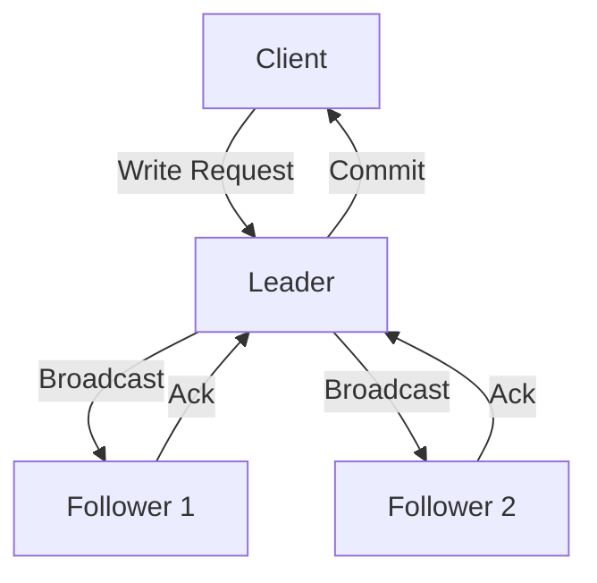

# Zookeeper 与CAP理论

## 介绍

在分布式系统中，CAP理论是一个核心概念，它帮助我们理解系统在面临网络分区时的行为。CAP理论指出，任何分布式系统最多只能同时满足以下三个特性中的两个：

- **一致性（Consistency）**：所有节点在同一时间看到的数据是一致的。
- **可用性（Availability）**：每个请求都能收到一个响应，无论成功或失败。
- **分区容错性（Partition tolerance）**：系统在网络分区的情况下仍能继续运行。

Zookeeper作为一个分布式协调服务，它在CAP理论中的定位是怎样的？本文将深入探讨Zookeeper如何与CAP理论结合，以及它在实际应用中的表现。

## Zookeeper 与CAP理论的关系

Zookeeper在设计上优先考虑了**一致性**和**分区容错性**，这意味着在网络分区的情况下，Zookeeper会牺牲一定的**可用性**来保证数据的一致性。这种设计使得Zookeeper非常适合用于需要强一致性的场景，例如分布式锁、配置管理等。

### Zookeeper 的一致性模型

Zookeeper通过**ZAB协议（Zookeeper Atomic Broadcast）**来实现一致性。ZAB协议确保所有写操作都会按照顺序被广播到所有节点，并且只有在大多数节点确认后，写操作才会被认为是成功的。这种机制保证了数据的一致性。



在上图中，客户端向Zookeeper的Leader节点发送写请求，Leader节点将请求广播给所有Follower节点，并在收到大多数Follower节点的确认后，才向客户端返回成功响应。

### Zookeeper 的可用性

尽管Zookeeper在网络分区的情况下可能会牺牲可用性，但在大多数情况下，它仍然能够提供高可用性。这是因为Zookeeper集群通常由多个节点组成，即使部分节点不可用，只要大多数节点仍然在线，Zookeeper仍然可以继续提供服务。

## 实际应用场景

### 分布式锁

Zookeeper常用于实现分布式锁。通过Zookeeper的临时顺序节点，多个客户端可以竞争锁资源，Zookeeper会确保只有一个客户端能够成功获取锁，从而保证数据的一致性。

```java
// 示例代码：使用Zookeeper实现分布式锁
public class DistributedLock {
    private ZooKeeper zooKeeper;
    private String lockPath;

    public DistributedLock(ZooKeeper zooKeeper, String lockPath) {
        this.zooKeeper = zooKeeper;
        this.lockPath = lockPath;
    }

    public void acquireLock() throws KeeperException, InterruptedException {
        String lockNode = zooKeeper.create(lockPath + "/lock_", new byte[0], ZooDefs.Ids.OPEN_ACL_UNSAFE, CreateMode.EPHEMERAL_SEQUENTIAL);
        // 检查是否获取到锁
        // ...
    }

    public void releaseLock() throws KeeperException, InterruptedException {
        zooKeeper.delete(lockPath, -1);
    }
}
```

### 配置管理

Zookeeper还可以用于分布式系统的配置管理。通过将配置信息存储在Zookeeper的节点中，所有客户端都可以实时获取最新的配置信息，并且Zookeeper会确保所有客户端看到的数据是一致的。

```java
// 示例代码：使用Zookeeper进行配置管理
public class ConfigManager {
    private ZooKeeper zooKeeper;
    private String configPath;

    public ConfigManager(ZooKeeper zooKeeper, String configPath) {
        this.zooKeeper = zooKeeper;
        this.configPath = configPath;
    }

    public String getConfig() throws KeeperException, InterruptedException {
        byte[] data = zooKeeper.getData(configPath, false, null);
        return new String(data);
    }

    public void updateConfig(String newConfig) throws KeeperException, InterruptedException {
        zooKeeper.setData(configPath, newConfig.getBytes(), -1);
    }
}
```

## 总结

Zookeeper作为一个分布式协调服务，它在CAP理论中优先考虑了**一致性**和**分区容错性**，这使得它非常适合用于需要强一致性的场景。尽管在网络分区的情况下，Zookeeper可能会牺牲一定的可用性，但在大多数情况下，它仍然能够提供高可用性。

通过本文的介绍，你应该对Zookeeper与CAP理论的关系有了更深入的理解。如果你希望进一步学习Zookeeper的使用，可以参考以下资源：

- [Zookeeper官方文档](https://zookeeper.apache.org/doc/current/)
- [分布式系统设计与实现](https://example.com/distributed-systems)

:::tip
**练习**：尝试在你的本地环境中搭建一个Zookeeper集群，并使用Zookeeper实现一个简单的分布式锁或配置管理系统。
:::