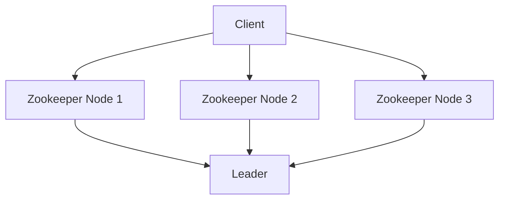

## 介绍

Apache Zookeeper 是一个开源的分布式协调服务，广泛用于管理分布式系统中的配置信息、命名服务、分布式同步和组服务。Zookeeper 的设计目标是提供一个简单且可靠的分布式协调机制，帮助开发者构建高可用、高性能的分布式应用。

Zookeeper 的核心特性包括高可用性、一致性、顺序性和原子性。这些特性使得 Zookeeper 成为分布式系统中不可或缺的组件。本文将详细介绍 Zookeeper 的特性与优势，并通过实际案例展示其应用场景。

## Zookeeper 的核心特性

### 1. 高可用性

Zookeeper 通过多节点集群的方式实现高可用性。即使部分节点发生故障，Zookeeper 仍然可以继续提供服务。Zookeeper 集群中的每个节点都维护一份数据副本，并通过 Zab 协议（Zookeeper Atomic Broadcast）保证数据的一致性。



:::note
Zookeeper 集群通常由奇数个节点组成，以确保在选举 Leader 时能够达成多数共识。
:::

### 2. 一致性

Zookeeper 提供了强一致性保证，即所有客户端在任何时刻都能看到相同的数据视图。Zookeeper 通过 Zab 协议确保所有写操作按顺序执行，并且所有节点最终都会达到一致状态。

### 3. 顺序性

Zookeeper 保证所有写操作的顺序性。每个写操作都会被分配一个全局唯一的递增事务 ID（zxid），客户端可以根据 zxid 来判断操作的先后顺序。

### 4. 原子性

Zookeeper 的所有写操作都是原子的，即一个写操作要么成功，要么失败，不会出现部分成功的情况。这确保了数据的一致性。

## Zookeeper 的优势

### 1. 简化分布式系统开发

Zookeeper 提供了一组简单的 API，开发者可以通过这些 API 实现分布式锁、选举、配置管理等功能，而无需自己实现复杂的分布式算法。

### 2. 高性能

Zookeeper 的设计目标是高性能，它通过内存数据模型和高效的协议实现快速的数据访问和更新。

### 3. 可扩展性

Zookeeper 支持水平扩展，可以通过增加节点来提高系统的处理能力和容错能力。

### 4. 可靠性

Zookeeper 通过多节点集群和 Zab 协议保证了系统的高可靠性和数据的一致性。

## 实际案例

### 分布式锁

在分布式系统中，多个进程可能需要竞争同一个资源。Zookeeper 可以用来实现分布式锁，确保同一时刻只有一个进程能够访问该资源。

```java
// 创建分布式锁
InterProcessMutex lock = new InterProcessMutex(client, "/locks/my-lock");
try {
    if (lock.acquire(10, TimeUnit.SECONDS)) {
        // 获取锁成功，执行业务逻辑
    }
} finally {
    lock.release();
}
```

:::tip
Zookeeper 的分布式锁实现基于临时顺序节点，确保锁的公平性和可靠性。
:::

### 配置管理

Zookeeper 可以用来管理分布式系统的配置信息。当配置发生变化时，Zookeeper 可以通知所有客户端更新配置。

```java
// 监听配置变化
CuratorFramework client = CuratorFrameworkFactory.newClient("localhost:2181", new RetryNTimes(3, 1000));
client.start();
PathChildrenCache cache = new PathChildrenCache(client, "/config", true);
cache.start();
cache.getListenable().addListener((client1, event) -> {
    // 处理配置变化事件
});
```

:::caution
在使用 Zookeeper 进行配置管理时，需要注意配置的版本控制，避免配置冲突。
:::

## 总结

Zookeeper 是一个功能强大的分布式协调服务，具有高可用性、一致性、顺序性和原子性等核心特性。它简化了分布式系统的开发，提供了高性能、可扩展性和可靠性。通过实际案例，我们可以看到 Zookeeper 在分布式锁、配置管理等场景中的广泛应用。

## 附加资源

- [Zookeeper 官方文档](https://zookeeper.apache.org/doc/current/)
- [Zookeeper 源码](https://github.com/apache/zookeeper)
- [Zookeeper 实战指南](https://www.oreilly.com/library/view/zookeeper/9781449361297/)

## 练习

1. 搭建一个 Zookeeper 集群，并测试其高可用性。
2. 使用 Zookeeper 实现一个简单的分布式锁。
3. 使用 Zookeeper 管理一个分布式系统的配置信息，并测试配置变化的通知机制。