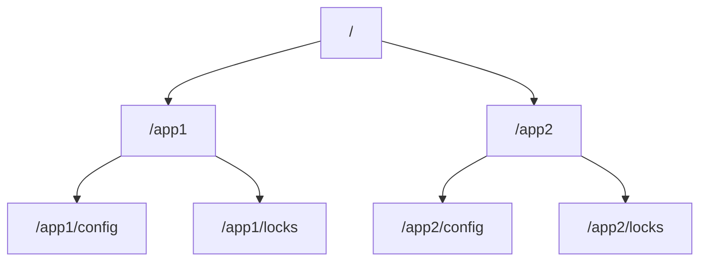

## 介绍

Zookeeper 是一个分布式协调服务，广泛用于分布式系统中管理配置信息、命名服务、分布式锁等。Zookeeper 的核心是其数据模型，它决定了数据如何存储和组织。理解 Zookeeper 的数据模型是掌握其工作原理的关键。

Zookeeper 的数据模型类似于文件系统的树形结构，称为 **ZNode 树**。每个节点（ZNode）可以存储数据，并且可以有子节点。与文件系统不同的是，Zookeeper 的节点既可以存储数据，也可以作为路径标识符。

## ZNode 树结构

Zookeeper 的数据模型是一个层次化的命名空间，类似于文件系统的目录树。每个节点称为 **ZNode**，它可以存储数据，并且可以有子节点。ZNode 的路径是唯一的，类似于文件系统中的路径。



在上面的示例中，`/` 是根节点，`/app1` 和 `/app2` 是其子节点。每个子节点可以进一步包含子节点，例如 `/app1/config` 和 `/app1/locks`。

## ZNode 的类型

Zookeeper 中的 ZNode 有以下几种类型：

1. **持久节点（Persistent Node）**：持久节点在创建后会一直存在，直到显式删除。即使创建该节点的客户端断开连接，节点仍然存在。
2. **临时节点（Ephemeral Node）**：临时节点的生命周期与客户端会话绑定。当客户端会话结束时，临时节点会自动删除。
3. **顺序节点（Sequential Node）**：顺序节点在创建时会在节点名称后附加一个单调递增的数字。顺序节点可以是持久的或临时的。

:::tip
临时节点非常适合用于实现分布式锁或临时配置管理，因为它们会在客户端断开连接时自动清理。
:::

## ZNode 的数据

每个 ZNode 都可以存储数据，数据以字节数组的形式存储。Zookeeper 并不限制数据的格式，你可以存储任何类型的数据，例如 JSON、XML 或二进制数据。

```bash
# 创建一个 ZNode 并存储数据
create /app1/config '{"key": "value"}'
```

在上面的示例中，我们创建了一个名为 `/app1/config` 的 ZNode，并存储了一个 JSON 格式的数据。

## ZNode 的版本控制

Zookeeper 为每个 ZNode 维护一个版本号，用于实现乐观锁机制。每次对 ZNode 的数据进行更新时，版本号都会递增。客户端在更新数据时可以指定版本号，只有当版本号匹配时，更新才会成功。

```bash
# 更新 ZNode 数据并指定版本号
set /app1/config '{"key": "new_value"}' 1
```

在上面的示例中，我们尝试更新 `/app1/config` 的数据，并指定版本号为 `1`。如果当前版本号不是 `1`，更新操作将失败。

## 实际应用场景

### 分布式配置管理

Zookeeper 常用于分布式系统中的配置管理。通过将配置信息存储在 ZNode 中，所有客户端都可以实时获取最新的配置。

```bash
# 存储配置信息
create /app1/config '{"timeout": 5000, "retries": 3}'
```

### 分布式锁

Zookeeper 的临时顺序节点非常适合用于实现分布式锁。客户端可以创建一个临时顺序节点，并检查自己是否是最小的节点。如果是最小的节点，则获得锁。

```bash
# 创建临时顺序节点
create -e -s /app1/locks/lock-
```

:::caution
在使用分布式锁时，务必处理客户端崩溃的情况，确保锁能够正确释放。
:::

## 总结

Zookeeper 的数据模型是一个层次化的 ZNode 树，每个 ZNode 可以存储数据，并且可以有子节点。ZNode 的类型包括持久节点、临时节点和顺序节点。Zookeeper 的版本控制机制确保了数据的一致性。Zookeeper 的数据模型在分布式系统中有着广泛的应用，例如配置管理、分布式锁等。

## 附加资源

- [Zookeeper 官方文档](https://zookeeper.apache.org/doc/current/)
- [Zookeeper 数据模型详解](https://zookeeper.apache.org/doc/current/zookeeperOver.html#sc_dataModelNameSpace)

## 练习

1. 使用 Zookeeper 命令行工具创建一个持久节点 `/myapp/config`，并存储一些配置数据。
2. 创建一个临时节点 `/myapp/locks/lock-`，并观察当客户端断开连接时节点的行为。
3. 尝试更新一个 ZNode 的数据，并指定版本号，观察版本号不匹配时的行为。
