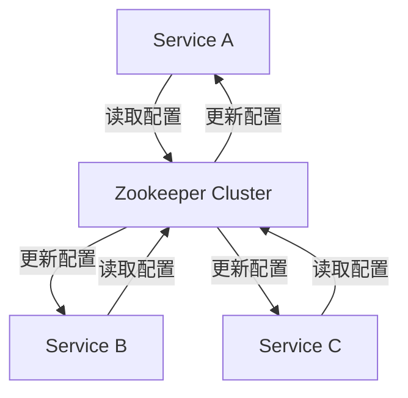

# Zookeeper 集群模式安装

## 介绍

Zookeeper 是一个分布式的、开源的协调服务，广泛用于分布式系统中，用于管理配置信息、命名服务、分布式同步和组服务等。Zookeeper 的集群模式（也称为复制模式）通过多个节点协同工作，提供了高可用性和数据一致性。

在本教程中，我们将逐步讲解如何在集群模式下安装和配置 Zookeeper，并通过实际案例展示其应用场景。

## 前置条件

在开始之前，请确保你已经具备以下条件：

- 至少三台服务器（可以是虚拟机或物理机）。
- 每台服务器上已安装 Java 运行环境（JRE 或 JDK）。
- 每台服务器之间可以通过网络互相通信。

## 步骤 1: 下载并解压 Zookeeper

首先，在所有服务器上下载并解压 Zookeeper。

```bash
wget https://downloads.apache.org/zookeeper/zookeeper-3.7.0/apache-zookeeper-3.7.0-bin.tar.gz
tar -xzf apache-zookeeper-3.7.0-bin.tar.gz
cd apache-zookeeper-3.7.0-bin
```

## 步骤 2: 配置 Zookeeper

在每台服务器上，进入 Zookeeper 的配置目录，并创建一个名为 `zoo.cfg` 的配置文件。

```bash
cd conf
cp zoo_sample.cfg zoo.cfg
```

编辑 `zoo.cfg` 文件，添加以下内容：

```ini
tickTime=2000
initLimit=10
syncLimit=5
dataDir=/var/lib/zookeeper
clientPort=2181
server.1=192.168.1.101:2888:3888
server.2=192.168.1.102:2888:3888
server.3=192.168.1.103:2888:3888
```

:::note
- `tickTime`：Zookeeper 使用的基本时间单位（以毫秒为单位）。
- `initLimit`：Zookeeper 集群中的 follower 节点与 leader 节点初始连接时的最大 tick 数。
- `syncLimit`：Zookeeper 集群中的 follower 节点与 leader 节点同步时的最大 tick 数。
- `dataDir`：Zookeeper 存储数据的目录。
- `clientPort`：客户端连接的端口。
- `server.X`：Zookeeper 集群中的服务器列表，`X` 是服务器的 ID，`192.168.1.101` 是服务器的 IP 地址，`2888` 是用于 follower 节点与 leader 节点通信的端口，`3888` 是用于选举的端口。
:::

## 步骤 3: 配置 myid 文件

在每台服务器的 `dataDir` 目录下创建一个名为 `myid` 的文件，并在文件中写入该服务器的 ID。

```bash
echo 1 > /var/lib/zookeeper/myid  # 在第一台服务器上
echo 2 > /var/lib/zookeeper/myid  # 在第二台服务器上
echo 3 > /var/lib/zookeeper/myid  # 在第三台服务器上
```

## 步骤 4: 启动 Zookeeper 集群

在每台服务器上启动 Zookeeper 服务。

```bash
bin/zkServer.sh start
```

:::caution
如果启动失败，请检查日志文件 `zookeeper.out` 以获取更多信息。
:::

## 步骤 5: 验证集群状态

使用以下命令检查 Zookeeper 集群的状态：

```bash
bin/zkServer.sh status
```

你应该会看到类似以下的输出：

```plaintext
Mode: follower
```

或者

```plaintext
Mode: leader
```

:::tip
如果所有节点都成功启动并且有一个节点被选为 leader，说明 Zookeeper 集群已经成功配置。
:::

## 实际案例

假设我们有一个分布式系统，需要管理多个服务的配置信息。我们可以使用 Zookeeper 集群来存储这些配置信息，并确保所有服务都能实时获取最新的配置。



在这个案例中，Zookeeper 集群充当了配置中心的角色，确保所有服务都能获取到一致的配置信息。

## 总结

通过本教程，你已经学会了如何在集群模式下安装和配置 Zookeeper。Zookeeper 集群模式为分布式系统提供了高可用性和数据一致性，是构建可靠分布式系统的重要组件。

## 附加资源

- [Zookeeper 官方文档](https://zookeeper.apache.org/doc/current/)
- [Zookeeper 集群配置指南](https://zookeeper.apache.org/doc/current/zookeeperAdmin.html#sc_zkMulitServerSetup)

## 练习

1. 尝试在三台服务器上配置 Zookeeper 集群，并验证其状态。
2. 修改 `zoo.cfg` 文件中的 `tickTime` 参数，观察集群行为的变化。
3. 模拟一个节点故障，观察 Zookeeper 集群如何重新选举 leader。

希望本教程对你理解 Zookeeper 集群模式有所帮助！如果你有任何问题，欢迎在评论区留言。