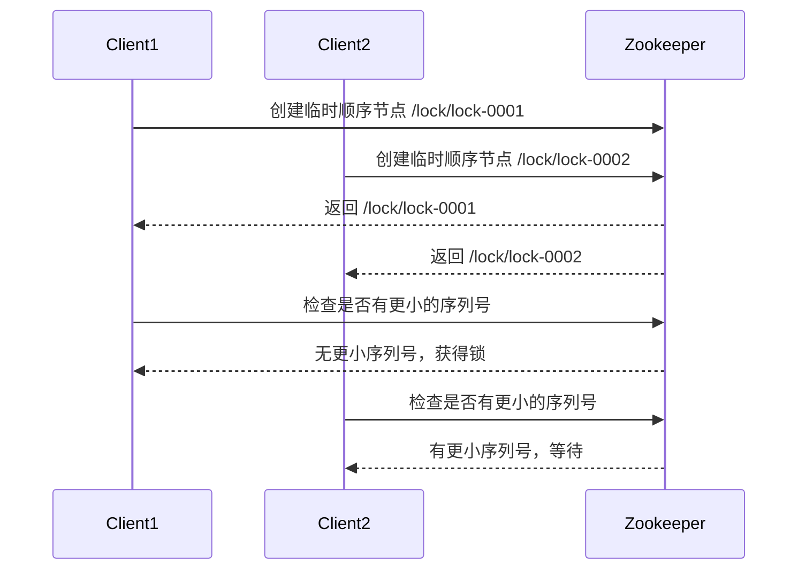

# Zookeeper 命令行工具

Zookeeper是一个分布式协调服务，广泛用于分布式系统中。它提供了一个简单的命令行工具，允许用户与Zookeeper集群进行交互。本文将介绍如何使用Zookeeper命令行工具进行基本操作，并展示一些实际应用场景。

## 介绍

Zookeeper命令行工具（`zkCli.sh`）是一个交互式工具，允许用户连接到Zookeeper服务器并执行各种操作。通过这个工具，你可以创建、读取、更新和删除Zookeeper中的节点（znodes），以及监控节点的变化。

## 启动Zookeeper命令行工具

要启动Zookeeper命令行工具，首先需要确保Zookeeper服务器正在运行。然后，在终端中运行以下命令：

```bash
./zkCli.sh -server localhost:2181
```

这将连接到本地运行的Zookeeper服务器。如果Zookeeper服务器运行在不同的主机或端口上，请相应地调整`-server`参数。

## 基本操作

### 创建节点

使用`create`命令可以在Zookeeper中创建一个新的节点。例如，创建一个名为`/myapp`的节点：

```bash
create /myapp "myapp data"
```

输出：

```bash
Created /myapp
```

### 读取节点

使用`get`命令可以读取节点的数据和元数据。例如，读取`/myapp`节点的数据：

```bash
get /myapp
```

输出：

```bash
myapp data
cZxid = 0x2
ctime = Tue Oct 10 12:34:56 UTC 2023
mZxid = 0x2
mtime = Tue Oct 10 12:34:56 UTC 2023
pZxid = 0x2
cversion = 0
dataVersion = 0
aclVersion = 0
ephemeralOwner = 0x0
dataLength = 10
numChildren = 0
```

### 更新节点

使用`set`命令可以更新节点的数据。例如，更新`/myapp`节点的数据：

```bash
set /myapp "updated data"
```

输出：

```bash
cZxid = 0x2
ctime = Tue Oct 10 12:34:56 UTC 2023
mZxid = 0x3
mtime = Tue Oct 10 12:35:00 UTC 2023
pZxid = 0x2
cversion = 0
dataVersion = 1
aclVersion = 0
ephemeralOwner = 0x0
dataLength = 13
numChildren = 0
```

### 删除节点

使用`delete`命令可以删除一个节点。例如，删除`/myapp`节点：

```bash
delete /myapp
```

输出：

```bash
Deleted /myapp
```

:::note
如果节点有子节点，使用`delete`命令会失败。你需要使用`rmr`命令递归删除节点及其子节点。
:::

## 实际应用场景

### 分布式锁

Zookeeper可以用于实现分布式锁。通过创建一个临时顺序节点，多个客户端可以竞争锁。获得锁的客户端将拥有最小的序列号。



### 配置管理

Zookeeper可以用于集中管理分布式系统的配置。例如，将数据库连接字符串存储在Zookeeper中，所有客户端都可以从Zookeeper读取最新的配置。

```bash
create /config/db "jdbc:mysql://localhost:3306/mydb"
```

客户端可以通过`get`命令读取配置：

```bash
get /config/db
```

## 总结

Zookeeper命令行工具是一个强大的工具，允许用户与Zookeeper集群进行交互。通过本文，你学会了如何使用命令行工具创建、读取、更新和删除节点，并了解了Zookeeper在分布式锁和配置管理中的应用。

## 附加资源

- [Zookeeper官方文档](https://zookeeper.apache.org/doc/current/)
- [Zookeeper命令行工具参考](https://zookeeper.apache.org/doc/current/zookeeperCLI.html)

## 练习

1. 使用Zookeeper命令行工具创建一个名为`/test`的节点，并设置数据为`"test data"`。
2. 读取`/test`节点的数据，并更新数据为`"updated test data"`。
3. 删除`/test`节点。
4. 尝试使用Zookeeper实现一个简单的分布式锁。
