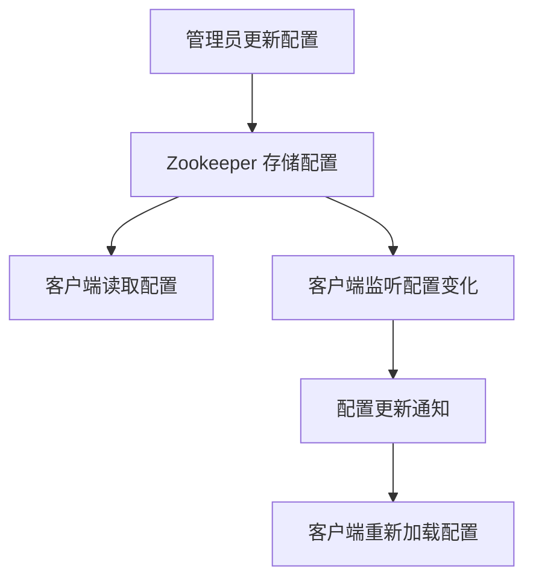

# Zookeeper 配置中心

Zookeeper 是一个分布式协调服务，广泛用于分布式系统中的配置管理、服务发现、分布式锁等场景。其中，**配置中心**是 Zookeeper 的一个重要应用场景。本文将详细介绍 Zookeeper 作为配置中心的工作原理、实际应用案例以及如何通过代码实现配置管理。

---

## 什么是 Zookeeper 配置中心？

在分布式系统中，多个服务实例可能需要共享相同的配置信息，例如数据库连接字符串、缓存配置、服务地址等。将这些配置信息集中管理，可以避免在每个服务中重复配置，同时方便动态更新。Zookeeper 提供了一个高可用、强一致性的存储系统，非常适合作为配置中心。

Zookeeper 配置中心的核心思想是将配置信息存储在 Zookeeper 的节点（ZNode）中，客户端通过监听这些节点的变化来动态获取最新的配置。

---

## Zookeeper 配置中心的工作原理

Zookeeper 配置中心的工作流程如下：

1. **配置存储**：将配置信息存储在 Zookeeper 的某个 ZNode 中，例如 `/config/app`。
2. **配置读取**：客户端启动时从 Zookeeper 读取配置信息。
3. **配置监听**：客户端监听 ZNode 的变化，当配置更新时，Zookeeper 会通知客户端。
4. **配置更新**：管理员更新 ZNode 中的数据，客户端收到通知后重新加载配置。

以下是一个简单的流程图：



---

## 代码示例：使用 Zookeeper 实现配置中心

以下是一个使用 Java 和 Zookeeper 客户端库（Curator）实现配置中心的示例。

### 1. 添加依赖

首先，在 `pom.xml` 中添加 Curator 依赖：

```xml
<dependency>
    <groupId>org.apache.curator</groupId>
    <artifactId>curator-framework</artifactId>
    <version>5.4.0</version>
</dependency>
<dependency>
    <groupId>org.apache.curator</groupId>
    <artifactId>curator-recipes</artifactId>
    <version>5.4.0</version>
</dependency>
```

### 2. 初始化 Zookeeper 客户端

```java
import org.apache.curator.framework.CuratorFramework;
import org.apache.curator.framework.CuratorFrameworkFactory;
import org.apache.curator.retry.ExponentialBackoffRetry;

public class ZookeeperConfigCenter {
    private static final String ZK_ADDRESS = "localhost:2181";
    private static final String CONFIG_PATH = "/config/app";

    public static void main(String[] args) throws Exception {
        CuratorFramework client = CuratorFrameworkFactory.newClient(ZK_ADDRESS, new ExponentialBackoffRetry(1000, 3));
        client.start();

        // 创建配置节点
        if (client.checkExists().forPath(CONFIG_PATH) == null) {
            client.create().creatingParentsIfNeeded().forPath(CONFIG_PATH, "initial_config".getBytes());
        }

        // 读取配置
        byte[] configData = client.getData().forPath(CONFIG_PATH);
        System.out.println("Initial config: " + new String(configData));

        // 监听配置变化
        client.getData().watched().forPath(CONFIG_PATH).addListener((client, event) -> {
            System.out.println("Config updated: " + new String(event.getData()));
        });

        // 模拟配置更新
        client.setData().forPath(CONFIG_PATH, "updated_config".getBytes());

        Thread.sleep(1000); // 等待监听器触发
        client.close();
    }
}
```

### 3. 运行结果

运行上述代码后，输出如下：

```
Initial config: initial_config
Config updated: updated_config
```

:::tip
在实际应用中，可以将配置信息解析为 JSON 或 Properties 格式，方便客户端使用。
:::

---

## 实际应用场景

### 场景 1：微服务配置管理

在微服务架构中，多个服务实例需要共享相同的配置信息。通过 Zookeeper 配置中心，可以集中管理这些配置，并在配置更新时动态通知所有服务实例。

### 场景 2：动态调整系统参数

某些系统参数（如线程池大小、超时时间等）可能需要根据系统负载动态调整。将这些参数存储在 Zookeeper 中，可以方便地实现动态调整。

---

## 总结

Zookeeper 配置中心是分布式系统中配置管理的理想解决方案。它提供了高可用性、强一致性和动态更新能力，非常适合用于微服务架构和动态参数调整等场景。

通过本文的学习，你应该已经掌握了 Zookeeper 配置中心的基本概念、工作原理以及如何通过代码实现配置管理。

---

## 附加资源与练习

1. **官方文档**：阅读 [Zookeeper 官方文档](https://zookeeper.apache.org/doc/current/) 以深入了解其功能。
2. **练习**：尝试将 Zookeeper 配置中心集成到一个简单的 Spring Boot 项目中，实现动态配置更新。
3. **扩展学习**：了解其他配置中心工具（如 Nacos、Consul）与 Zookeeper 的异同。

:::caution
在实际生产环境中，请确保 Zookeeper 集群的高可用性和数据备份，以避免单点故障。
:::