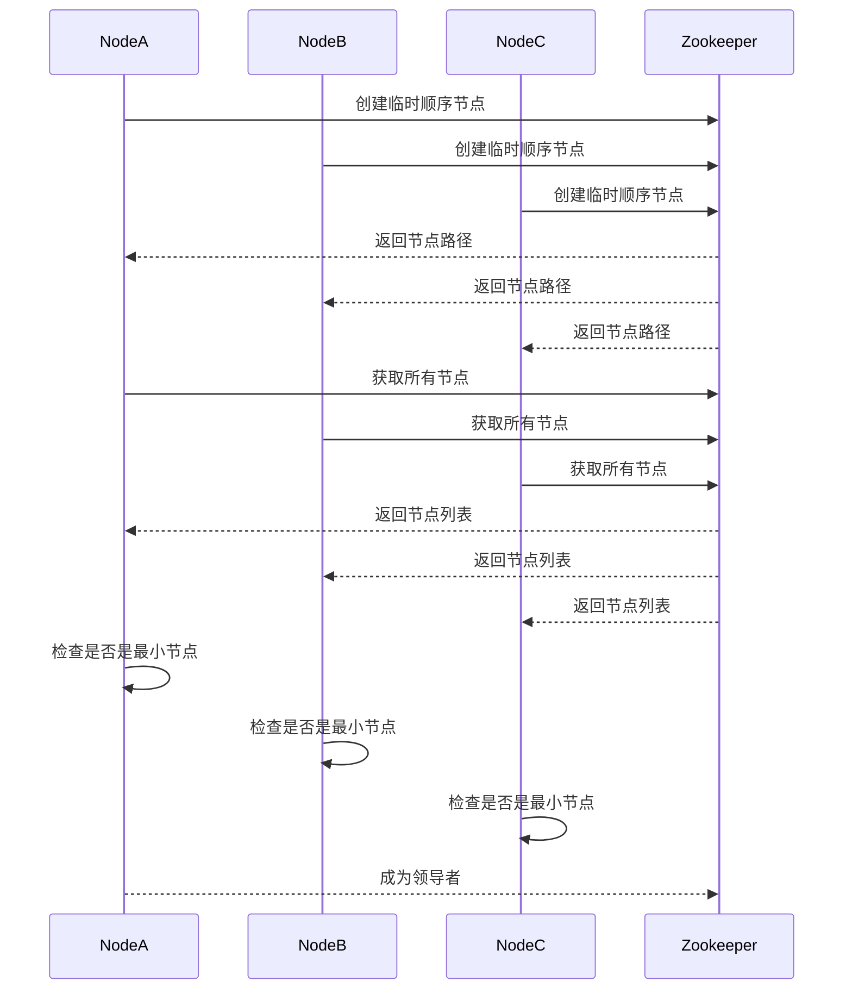

# Zookeeper 选举机制

在分布式系统中，领导者选举（Leader Election）是一个常见的需求。Zookeeper 作为一个分布式协调服务，提供了强大的工具来实现这一功能。本文将详细介绍 Zookeeper 的选举机制，并通过实际案例帮助你理解其工作原理。

## 什么是 Zookeeper 选举机制？

Zookeeper 选举机制是指在分布式系统中，多个节点通过 Zookeeper 协调服务选举出一个领导者（Leader）的过程。领导者负责协调系统中的其他节点，确保系统的一致性和可靠性。

### 为什么需要领导者选举？

在分布式系统中，多个节点需要协同工作。为了避免冲突和确保一致性，通常需要一个领导者来协调这些节点。领导者选举机制确保了在领导者失效时，系统能够快速选举出新的领导者，从而保证系统的持续运行。

## Zookeeper 选举机制的工作原理

Zookeeper 使用 ZAB（Zookeeper Atomic Broadcast）协议来实现领导者选举。ZAB 协议确保在领导者选举过程中，所有节点能够达成一致。

### 选举过程

1. **节点启动**：当 Zookeeper 集群中的节点启动时，每个节点都会尝试成为领导者。
2. **投票**：每个节点会向其他节点发送投票请求，并等待其他节点的响应。
3. **选举结果**：当一个节点获得多数票时，它将成为领导者。其他节点将成为追随者（Follower）。

### 代码示例

以下是一个简单的 Zookeeper 选举机制的代码示例：

```java
import org.apache.zookeeper.ZooKeeper;
import org.apache.zookeeper.Watcher;
import org.apache.zookeeper.CreateMode;
import org.apache.zookeeper.ZooDefs.Ids;
import org.apache.zookeeper.KeeperException;

public class LeaderElection {
    private static final String ZOOKEEPER_ADDRESS = "localhost:2181";
    private static final int SESSION_TIMEOUT = 3000;
    private static final String ELECTION_NAMESPACE = "/election";

    private ZooKeeper zooKeeper;

    public void connectToZookeeper() throws Exception {
        this.zooKeeper = new ZooKeeper(ZOOKEEPER_ADDRESS, SESSION_TIMEOUT, event -> {
            if (event.getState() == Watcher.Event.KeeperState.SyncConnected) {
                System.out.println("Connected to Zookeeper");
            }
        });
    }

    public void volunteerForLeadership() throws KeeperException, InterruptedException {
        String znodePrefix = ELECTION_NAMESPACE + "/c_";
        String znodeFullPath = zooKeeper.create(znodePrefix, new byte[]{}, Ids.OPEN_ACL_UNSAFE, CreateMode.EPHEMERAL_SEQUENTIAL);

        System.out.println("znode name: " + znodeFullPath);
    }

    public static void main(String[] args) throws Exception {
        LeaderElection leaderElection = new LeaderElection();
        leaderElection.connectToZookeeper();
        leaderElection.volunteerForLeadership();
    }
}
```

### 输入和输出

- **输入**：节点启动并连接到 Zookeeper。
- **输出**：节点创建一个临时顺序节点，并尝试成为领导者。

## 实际案例

假设我们有一个分布式系统，包含三个节点：Node A、Node B 和 Node C。当系统启动时，这三个节点会通过 Zookeeper 进行领导者选举。



在这个案例中，Node A 创建了最小的节点路径，因此它被选为领导者。

## 总结

Zookeeper 的选举机制是分布式系统中实现领导者选举的关键技术。通过 ZAB 协议，Zookeeper 确保了选举过程的一致性和可靠性。本文通过代码示例和实际案例，帮助你理解了 Zookeeper 选举机制的工作原理。

## 附加资源

- [Zookeeper 官方文档](https://zookeeper.apache.org/doc/current/)
- [分布式系统设计与实践](https://www.oreilly.com/library/view/distributed-systems-principles/9780128182004/)

## 练习

1. 尝试在本地搭建一个 Zookeeper 集群，并实现领导者选举。
2. 修改代码示例，使其在领导者失效时能够自动选举新的领导者。

:::tip
在实践过程中，如果遇到问题，可以参考 Zookeeper 的官方文档或社区论坛。
:::