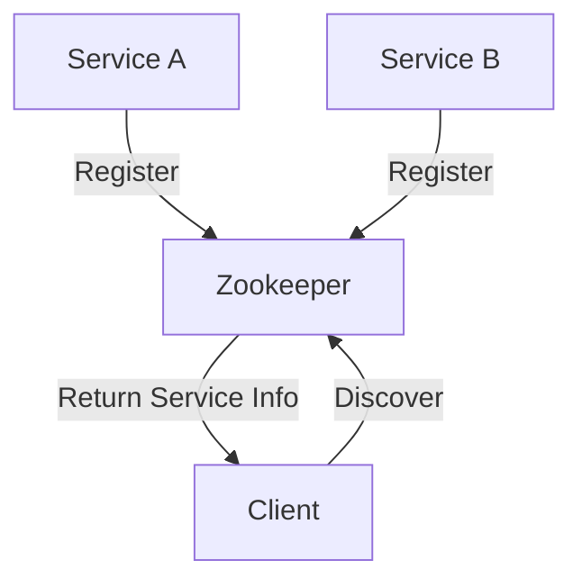
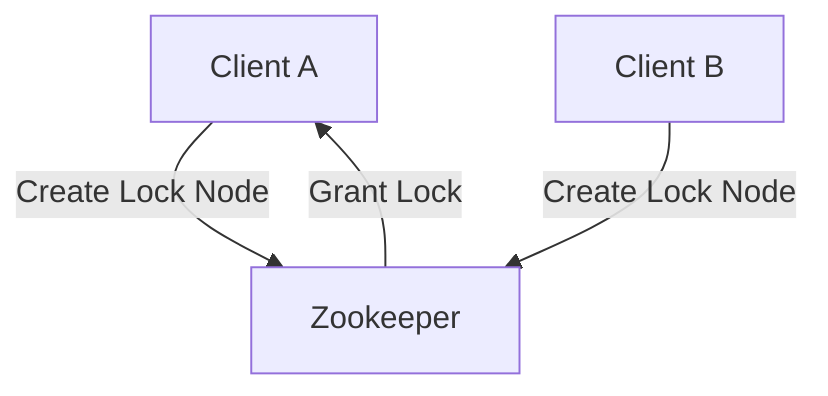

# Zookeeper 命名服务

Zookeeper 是一个分布式协调服务，广泛用于分布式系统中的配置管理、命名服务、分布式锁等场景。命名服务是 Zookeeper 的一个重要应用场景之一，它允许分布式系统中的各个节点通过唯一的名称来标识和定位资源。

## 什么是命名服务？

命名服务（Naming Service）是一种将名称映射到资源的服务。在分布式系统中，资源可以是服务器、服务、对象或其他任何需要被唯一标识的实体。命名服务的主要目的是提供一个统一的、易于理解的名称，以便客户端可以通过这个名称来访问资源。

在 Zookeeper 中，命名服务通过创建一个层次化的命名空间来实现。每个节点（ZNode）都可以存储数据，并且可以通过路径来唯一标识。客户端可以通过路径来查找和访问这些节点。

## Zookeeper 命名服务的工作原理

Zookeeper 的命名服务基于其层次化的命名空间。每个节点都有一个唯一的路径，类似于文件系统中的目录结构。客户端可以通过路径来创建、读取、更新和删除节点。

### 1. 创建节点

在 Zookeeper 中，可以通过 `create` 命令来创建一个节点。例如，创建一个名为 `/services/service1` 的节点：

```bash
create /services/service1 "Service 1"
```

### 2. 读取节点

客户端可以通过 `get` 命令来读取节点的数据。例如，读取 `/services/service1` 节点的数据：

```bash
get /services/service1
```

输出：

```bash
Service 1
```

### 3. 更新节点

客户端可以通过 `set` 命令来更新节点的数据。例如，更新 `/services/service1` 节点的数据：

```bash
set /services/service1 "Updated Service 1"
```

### 4. 删除节点

客户端可以通过 `delete` 命令来删除节点。例如，删除 `/services/service1` 节点：

```bash
delete /services/service1
```

## 实际应用场景

### 1. 服务注册与发现

在微服务架构中，服务注册与发现是一个常见的需求。Zookeeper 可以用来实现服务注册与发现的功能。每个服务在启动时，会在 Zookeeper 中注册自己的信息（如 IP 地址、端口号等），其他服务可以通过 Zookeeper 来查找和访问这些服务。



### 2. 分布式锁

Zookeeper 还可以用来实现分布式锁。多个客户端可以通过在 Zookeeper 中创建临时节点来竞争锁，只有成功创建节点的客户端才能获得锁。



## 总结

Zookeeper 的命名服务为分布式系统提供了一个统一的、层次化的命名空间，使得客户端可以通过路径来唯一标识和访问资源。命名服务在服务注册与发现、分布式锁等场景中有着广泛的应用。

:::tip
如果你对 Zookeeper 的命名服务感兴趣，可以尝试在本地搭建一个 Zookeeper 集群，并实践上述的代码示例。
:::

## 附加资源

- [Zookeeper 官方文档](https://zookeeper.apache.org/doc/current/)
- [Zookeeper 入门教程](https://www.tutorialspoint.com/zookeeper/index.htm)

## 练习

1. 在本地 Zookeeper 集群中创建一个名为 `/myapp/config` 的节点，并存储一些配置数据。
2. 编写一个简单的客户端程序，使用 Zookeeper 的 API 来读取和更新 `/myapp/config` 节点的数据。
3. 尝试实现一个简单的服务注册与发现机制，使用 Zookeeper 来管理服务的注册和发现。