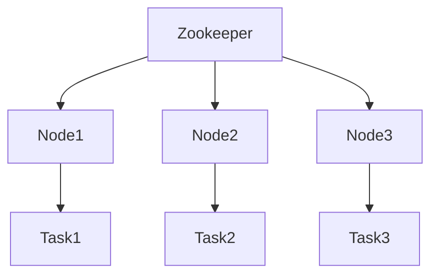

# Zookeeper 集群管理

Zookeeper 是一个分布式协调服务，广泛用于分布式系统中的集群管理。它提供了一种可靠的方式来管理集群中的节点状态、配置信息和分布式锁等。本文将详细介绍 Zookeeper 在集群管理中的应用，并通过实际案例和代码示例帮助初学者理解其工作原理。

## 什么是 Zookeeper 集群管理？

Zookeeper 集群管理是指使用 Zookeeper 来协调和管理分布式系统中的多个节点。通过 Zookeeper，我们可以实现以下功能：

- **节点注册与发现**：集群中的节点可以注册到 Zookeeper，并动态发现其他节点的状态。
- **配置管理**：集中管理集群的配置信息，确保所有节点使用相同的配置。
- **领导者选举**：在分布式系统中选举一个领导者节点，负责协调其他节点的工作。
- **分布式锁**：实现分布式锁，确保在多个节点之间同步访问共享资源。

## Zookeeper 集群管理的基本概念

### 1. ZNode

Zookeeper 使用一种类似于文件系统的树形结构来存储数据，每个节点称为 ZNode。ZNode 可以存储数据，并且可以包含子节点。ZNode 的类型包括：

- **持久节点（Persistent Node）**：一旦创建，除非显式删除，否则会一直存在。
- **临时节点（Ephemeral Node）**：与客户端会话绑定，会话结束时节点自动删除。
- **顺序节点（Sequential Node）**：在创建时，Zookeeper 会自动在节点名称后追加一个递增的数字。

### 2. Watcher

Watcher 是 Zookeeper 提供的一种机制，允许客户端监听 ZNode 的变化。当 ZNode 的状态发生变化时（如数据更新、子节点变化等），Zookeeper 会通知客户端。

### 3. 集群角色

在 Zookeeper 集群中，每个节点可以扮演以下角色之一：

- **Leader**：负责处理所有写请求，并将写操作广播给其他节点。
- **Follower**：处理读请求，并将写请求转发给 Leader。
- **Observer**：与 Follower 类似，但不参与选举过程，主要用于扩展读性能。

## Zookeeper 集群管理的实际应用

### 1. 节点注册与发现

在分布式系统中，节点需要动态注册和发现其他节点的状态。Zookeeper 可以通过临时节点来实现这一功能。

```java
// 创建 Zookeeper 客户端
ZooKeeper zk = new ZooKeeper("localhost:2181", 3000, null);

// 注册节点
String nodePath = "/services/service1";
byte[] data = "service1_data".getBytes();
zk.create(nodePath, data, ZooDefs.Ids.OPEN_ACL_UNSAFE, CreateMode.EPHEMERAL);

// 监听节点变化
zk.getChildren("/services", new Watcher() {
    @Override
    public void process(WatchedEvent event) {
        System.out.println("Node changed: " + event.getPath());
    }
});
```

### 2. 配置管理

Zookeeper 可以用于集中管理集群的配置信息。所有节点都可以从 Zookeeper 中读取配置，并在配置发生变化时自动更新。

```java
// 读取配置
byte[] configData = zk.getData("/config", new Watcher() {
    @Override
    public void process(WatchedEvent event) {
        System.out.println("Config changed: " + event.getPath());
    }
}, null);

String config = new String(configData);
System.out.println("Current config: " + config);
```

### 3. 领导者选举

在分布式系统中，通常需要选举一个领导者节点来协调其他节点的工作。Zookeeper 可以通过顺序临时节点来实现领导者选举。

```java
// 创建顺序临时节点
String leaderPath = "/election/leader";
String createdPath = zk.create(leaderPath, "candidate1".getBytes(), ZooDefs.Ids.OPEN_ACL_UNSAFE, CreateMode.EPHEMERAL_SEQUENTIAL);

// 检查是否为最小节点
List<String> children = zk.getChildren("/election", false);
Collections.sort(children);
if (createdPath.endsWith(children.get(0))) {
    System.out.println("I am the leader!");
} else {
    System.out.println("I am a follower.");
}
```

### 4. 分布式锁

Zookeeper 可以用于实现分布式锁，确保在多个节点之间同步访问共享资源。

```java
// 创建锁节点
String lockPath = "/locks/resource1";
String lockNode = zk.create(lockPath, "lock".getBytes(), ZooDefs.Ids.OPEN_ACL_UNSAFE, CreateMode.EPHEMERAL_SEQUENTIAL);

// 尝试获取锁
List<String> locks = zk.getChildren("/locks", false);
Collections.sort(locks);
if (lockNode.endsWith(locks.get(0))) {
    System.out.println("Lock acquired!");
} else {
    System.out.println("Waiting for lock...");
}
```

## 实际案例：分布式任务调度系统

假设我们有一个分布式任务调度系统，多个节点需要协调执行任务。我们可以使用 Zookeeper 来实现以下功能：

1. **节点注册与发现**：每个节点在启动时注册到 Zookeeper，并监听其他节点的状态。
2. **领导者选举**：选举一个领导者节点，负责分配任务。
3. **任务分配**：领导者节点将任务分配给其他节点，并确保任务不会重复执行。



## 总结

Zookeeper 是一个强大的分布式协调工具，特别适用于集群管理。通过 Zookeeper，我们可以实现节点注册与发现、配置管理、领导者选举和分布式锁等功能。本文通过实际案例和代码示例，帮助初学者理解 Zookeeper 在集群管理中的应用。

## 附加资源与练习

- **练习 1**：尝试在本地搭建一个 Zookeeper 集群，并使用 Java 客户端实现节点注册与发现。
- **练习 2**：实现一个简单的分布式锁，并测试多个客户端同时获取锁的情况。
- **附加资源**：
  - [Zookeeper 官方文档](https://zookeeper.apache.org/doc/current/)
  - [Zookeeper 入门教程](https://www.tutorialspoint.com/zookeeper/index.htm)

:::tip
如果你在练习中遇到问题，可以参考 Zookeeper 的官方文档或社区论坛，获取更多帮助。
:::