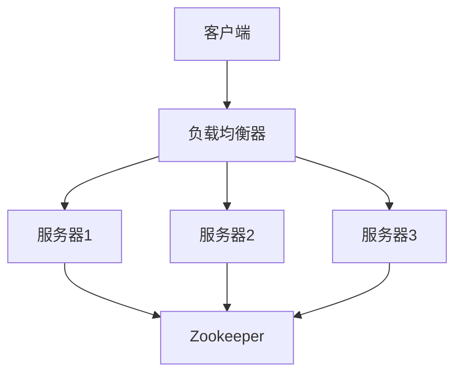

# Zookeeper 负载均衡

在分布式系统中，负载均衡是一个关键的概念，它确保系统中的工作负载能够均匀地分配到多个服务器上，从而提高系统的性能和可靠性。Zookeeper 作为一个分布式协调服务，可以用于实现负载均衡。本文将详细介绍 Zookeeper 在负载均衡中的应用，并通过实际案例帮助你理解其工作原理。

## 什么是负载均衡？

负载均衡是一种将工作负载分配到多个计算资源（如服务器、网络链接等）的技术，目的是优化资源使用、最大化吞吐量、最小化响应时间，并避免任何单一资源的过载。在分布式系统中，负载均衡通常用于分配客户端请求到多个服务器上。

## Zookeeper 如何实现负载均衡？

Zookeeper 本身并不直接提供负载均衡功能，但它可以通过维护一个动态的服务器列表，并结合其他工具或算法来实现负载均衡。具体来说，Zookeeper 可以用于：

1. **服务发现**：Zookeeper 可以维护一个服务注册表，客户端可以通过 Zookeeper 获取当前可用的服务器列表。
2. **动态负载均衡**：通过监控服务器的状态变化，Zookeeper 可以动态调整负载均衡策略。

### 服务发现

在分布式系统中，服务发现是负载均衡的基础。Zookeeper 可以作为一个服务注册中心，服务提供者将自己的信息注册到 Zookeeper 中，服务消费者则从 Zookeeper 中获取可用的服务列表。

```java
// 示例：服务提供者注册到 Zookeeper
ZooKeeper zk = new ZooKeeper("localhost:2181", 3000, null);
String path = "/services/service1";
String data = "192.168.1.1:8080";
zk.create(path, data.getBytes(), ZooDefs.Ids.OPEN_ACL_UNSAFE, CreateMode.EPHEMERAL);
```

```java
// 示例：服务消费者从 Zookeeper 获取服务列表
ZooKeeper zk = new ZooKeeper("localhost:2181", 3000, null);
List<String> services = zk.getChildren("/services", false);
for (String service : services) {
    byte[] data = zk.getData("/services/" + service, false, null);
    System.out.println("Service: " + new String(data));
}
```

### 动态负载均衡

Zookeeper 可以监控服务器的状态变化（如服务器上线、下线），并根据这些变化动态调整负载均衡策略。例如，当一个新的服务器上线时，Zookeeper 可以通知负载均衡器将其加入到可用服务器列表中。



## 实际案例

假设我们有一个分布式 Web 服务，由多个服务器组成。我们可以使用 Zookeeper 来实现动态负载均衡。以下是一个简单的流程：

1. **服务注册**：每个 Web 服务器启动时，将自己的地址注册到 Zookeeper 中。
2. **服务发现**：负载均衡器从 Zookeeper 中获取当前可用的服务器列表。
3. **负载均衡**：负载均衡器根据某种算法（如轮询、随机等）将客户端请求分配到不同的服务器上。
4. **动态调整**：当有服务器下线或上线时，Zookeeper 会通知负载均衡器更新服务器列表。

:::note
在实际应用中，负载均衡器通常会结合 Zookeeper 的 Watcher 机制来实时监控服务器状态的变化。
:::

## 总结

Zookeeper 在负载均衡中的应用主要体现在服务发现和动态调整上。通过维护一个动态的服务器列表，Zookeeper 可以帮助负载均衡器实时调整策略，从而提高系统的可用性和性能。虽然 Zookeeper 本身不直接提供负载均衡功能，但它在分布式系统中的协调作用使其成为实现负载均衡的重要工具。

## 附加资源

- [Zookeeper 官方文档](https://zookeeper.apache.org/doc/current/)
- [分布式系统中的负载均衡策略](https://en.wikipedia.org/wiki/Load_balancing_(computing))

## 练习

1. 尝试使用 Zookeeper 实现一个简单的服务注册与发现系统。
2. 结合 Zookeeper 和负载均衡算法（如轮询、随机等），实现一个动态负载均衡器。
