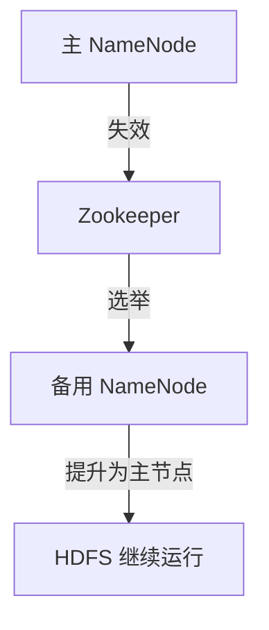

## 介绍

Zookeeper 是一个分布式协调服务，广泛用于管理分布式系统中的配置信息、命名服务、分布式同步和组服务。在 Hadoop 生态系统中，Zookeeper 扮演着至关重要的角色，尤其是在高可用性（HA）和分布式锁等场景中。

Hadoop 是一个用于存储和处理大规模数据的分布式系统，而 Zookeeper 则为 Hadoop 提供了可靠的协调服务，确保集群中的各个组件能够高效、一致地工作。

## Zookeeper 的核心功能

Zookeeper 提供了以下核心功能，这些功能在 Hadoop 中得到了广泛应用：

1. **配置管理**：Zookeeper 可以存储和管理分布式系统的配置信息，确保所有节点都能访问到一致的配置。
2. **命名服务**：Zookeeper 可以为分布式系统中的资源提供唯一的命名服务。
3. **分布式锁**：Zookeeper 可以帮助实现分布式锁，确保在分布式环境中资源的互斥访问。
4. **领导者选举**：Zookeeper 可以用于选举集群中的领导者，确保在领导者失效时能够快速选出新的领导者。

## Zookeeper 在 Hadoop 中的应用场景

### 1. Hadoop 高可用性（HA）

在 Hadoop 中，NameNode 是 HDFS（Hadoop 分布式文件系统）的核心组件，负责管理文件系统的元数据。为了确保 NameNode 的高可用性，Hadoop 引入了 Zookeeper 来实现自动故障转移。

当主 NameNode 失效时，Zookeeper 会检测到这一情况，并自动将备用 NameNode 提升为新的主节点，从而确保 HDFS 的持续可用性。



### 2. YARN 资源管理

在 Hadoop 的 YARN（Yet Another Resource Negotiator）中，Zookeeper 用于管理 ResourceManager 的高可用性。ResourceManager 负责集群资源的分配和管理，Zookeeper 确保在 ResourceManager 失效时能够快速切换到备用节点。

### 3. HBase 分布式锁

HBase 是 Hadoop 生态系统中的一个分布式数据库，它使用 Zookeeper 来管理分布式锁和协调 RegionServer 的状态。Zookeeper 确保在 HBase 集群中，多个 RegionServer 能够协调一致地访问数据。

## 代码示例：使用 Zookeeper 实现分布式锁

以下是一个简单的 Java 示例，展示了如何使用 Zookeeper 实现分布式锁。

```java
import org.apache.zookeeper.CreateMode;
import org.apache.zookeeper.WatchedEvent;
import org.apache.zookeeper.Watcher;
import org.apache.zookeeper.ZooDefs;
import org.apache.zookeeper.ZooKeeper;
import org.apache.zookeeper.data.Stat;

public class DistributedLock {
    private static final String LOCK_ROOT_PATH = "/locks";
    private static final String LOCK_NODE_NAME = LOCK_ROOT_PATH + "/lock_";

    private ZooKeeper zooKeeper;
    private String lockPath;

    public DistributedLock(ZooKeeper zooKeeper) {
        this.zooKeeper = zooKeeper;
    }

    public void acquireLock() throws Exception {
        // 创建临时顺序节点
        lockPath = zooKeeper.create(LOCK_NODE_NAME, new byte[0], ZooDefs.Ids.OPEN_ACL_UNSAFE, CreateMode.EPHEMERAL_SEQUENTIAL);

        // 检查是否获得锁
        while (true) {
            // 获取所有锁节点
            java.util.List<String> children = zooKeeper.getChildren(LOCK_ROOT_PATH, false);
            java.util.Collections.sort(children);

            // 如果当前节点是最小的节点，则获得锁
            if (lockPath.endsWith(children.get(0))) {
                System.out.println("Lock acquired: " + lockPath);
                return;
            } else {
                // 否则，等待前一个节点释放锁
                String previousNode = children.get(java.util.Collections.binarySearch(children, lockPath.substring(LOCK_ROOT_PATH.length() + 1)) - 1);
                Stat stat = zooKeeper.exists(LOCK_ROOT_PATH + "/" + previousNode, true);
                if (stat != null) {
                    synchronized (this) {
                        wait();
                    }
                }
            }
        }
    }

    public void releaseLock() throws Exception {
        if (lockPath != null) {
            zooKeeper.delete(lockPath, -1);
            System.out.println("Lock released: " + lockPath);
            lockPath = null;
        }
    }
}
```

:::note
**注意**：在实际生产环境中，建议使用成熟的分布式锁库，如 Apache Curator，它提供了更高级的抽象和更健壮的实现。
:::

## 实际案例：Hadoop 高可用性配置

以下是一个实际的 Hadoop 高可用性配置示例，展示了如何配置 Zookeeper 以实现 NameNode 的自动故障转移。

```xml
<configuration>
    <property>
        <name>dfs.nameservices</name>
        <value>mycluster</value>
    </property>
    <property>
        <name>dfs.ha.namenodes.mycluster</name>
        <value>nn1,nn2</value>
    </property>
    <property>
        <name>dfs.namenode.rpc-address.mycluster.nn1</name>
        <value>namenode1:8020</value>
    </property>
    <property>
        <name>dfs.namenode.rpc-address.mycluster.nn2</name>
        <value>namenode2:8020</value>
    </property>
    <property>
        <name>dfs.namenode.shared.edits.dir</name>
        <value>qjournal://journalnode1:8485;journalnode2:8485;journalnode3:8485/mycluster</value>
    </property>
    <property>
        <name>dfs.client.failover.proxy.provider.mycluster</name>
        <value>org.apache.hadoop.hdfs.server.namenode.ha.ConfiguredFailoverProxyProvider</value>
    </property>
    <property>
        <name>dfs.ha.fencing.methods</name>
        <value>sshfence</value>
    </property>
    <property>
        <name>dfs.ha.fencing.ssh.private-key-files</name>
        <value>/home/hadoop/.ssh/id_rsa</value>
    </property>
    <property>
        <name>dfs.ha.automatic-failover.enabled</name>
        <value>true</value>
    </property>
    <property>
        <name>ha.zookeeper.quorum</name>
        <value>zk1:2181,zk2:2181,zk3:2181</value>
    </property>
</configuration>
```

:::tip
**提示**：在配置 Hadoop 高可用性时，确保 Zookeeper 集群的稳定性和高可用性，因为 Zookeeper 是整个高可用性架构的核心。
:::

## 总结

Zookeeper 在 Hadoop 生态系统中扮演着至关重要的角色，尤其是在高可用性、分布式锁和领导者选举等场景中。通过使用 Zookeeper，Hadoop 能够实现更高效、更可靠的分布式系统管理。

## 附加资源

- [Apache Zookeeper 官方文档](https://zookeeper.apache.org/doc/current/)
- [Hadoop 高可用性配置指南](https://hadoop.apache.org/docs/stable/hadoop-project-dist/hadoop-hdfs/HDFSHighAvailabilityWithQJM.html)
- [Apache Curator 分布式锁示例](https://curator.apache.org/curator-recipes/distributed-lock.html)

## 练习

1. 尝试在本地搭建一个 Zookeeper 集群，并使用 Java 客户端实现一个简单的分布式锁。
2. 配置一个 Hadoop 高可用性集群，观察 Zookeeper 在 NameNode 故障转移中的作用。

通过以上内容，你应该对 Zookeeper 在 Hadoop 中的应用有了更深入的理解。继续探索和实践，你将能够更好地掌握分布式系统的协调和管理。