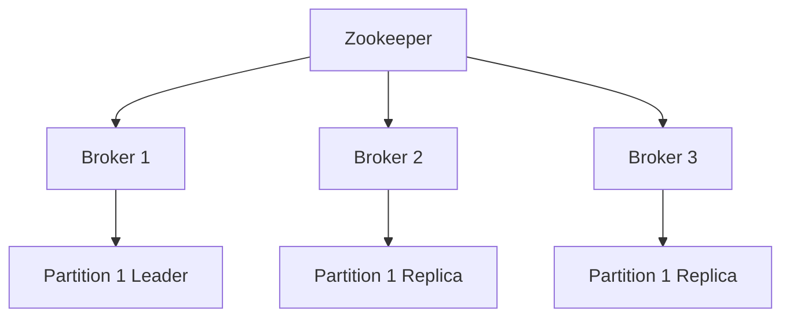

# Zookeeper 在 Kafka 中的应用

## 介绍

Apache Kafka 是一个分布式流处理平台，广泛用于构建实时数据管道和流应用程序。Kafka 的设计目标是高吞吐量、低延迟和高可用性。为了实现这些目标，Kafka 依赖于 Apache Zookeeper 来管理集群元数据、协调分布式系统中的各个节点以及处理故障恢复。

Zookeeper 是一个分布式协调服务，它为分布式系统提供了可靠的配置管理、命名服务、分布式同步和组服务。在 Kafka 中，Zookeeper 扮演着至关重要的角色，帮助 Kafka 集群实现高可用性和一致性。

## Zookeeper 在 Kafka 中的角色

在 Kafka 集群中，Zookeeper 主要负责以下几个方面：

1. **Broker 注册与发现**：Kafka 的 Broker（服务器节点）在启动时会向 Zookeeper 注册自己。Zookeeper 维护了一个 Broker 列表，客户端可以通过 Zookeeper 发现可用的 Broker。

2. **Topic 分区管理**：Kafka 的 Topic 被划分为多个分区，每个分区可以有多个副本。Zookeeper 负责管理这些分区的元数据，包括分区的领导者（Leader）和副本（Replicas）信息。

3. **领导者选举**：当某个分区的领导者 Broker 发生故障时，Zookeeper 会协调其他副本进行领导者选举，确保分区的高可用性。

4. **消费者组管理**：Kafka 的消费者组通过 Zookeeper 来协调消费者之间的负载均衡和偏移量（Offset）管理。

## Zookeeper 与 Kafka 的交互

为了更好地理解 Zookeeper 在 Kafka 中的作用，让我们通过一个简单的例子来展示 Kafka 与 Zookeeper 的交互。

### 示例：Kafka Broker 注册

当一个 Kafka Broker 启动时，它会向 Zookeeper 注册自己。以下是一个简化的代码示例，展示了 Kafka Broker 如何向 Zookeeper 注册：

```java
// Kafka Broker 启动时向 Zookeeper 注册
ZooKeeper zk = new ZooKeeper("localhost:2181", 3000, null);
String brokerId = "1";
String brokerInfo = "localhost:9092";
zk.create("/brokers/ids/" + brokerId, brokerInfo.getBytes(), ZooDefs.Ids.OPEN_ACL_UNSAFE, CreateMode.EPHEMERAL);
```

在这个例子中，Kafka Broker 在 Zookeeper 的 `/brokers/ids/` 路径下创建了一个临时节点，节点名称是 Broker 的 ID，节点数据是 Broker 的地址信息。Zookeeper 会维护这个节点的生命周期，当 Broker 下线时，节点会自动删除。

### 示例：消费者组管理

Kafka 的消费者组通过 Zookeeper 来协调消费者之间的负载均衡。以下是一个简化的代码示例，展示了消费者如何通过 Zookeeper 加入消费者组：

```java
// 消费者加入消费者组
ZooKeeper zk = new ZooKeeper("localhost:2181", 3000, null);
String groupId = "my-consumer-group";
String consumerId = "consumer-1";
zk.create("/consumers/" + groupId + "/ids/" + consumerId, "".getBytes(), ZooDefs.Ids.OPEN_ACL_UNSAFE, CreateMode.EPHEMERAL);
```

在这个例子中，消费者在 Zookeeper 的 `/consumers/[group-id]/ids/` 路径下创建了一个临时节点，节点名称是消费者的 ID。Zookeeper 会维护这个节点的生命周期，当消费者下线时，节点会自动删除。

## 实际应用场景

### 场景：Kafka 集群的高可用性

假设我们有一个 Kafka 集群，包含三个 Broker（Broker 1、Broker 2 和 Broker 3）。每个 Topic 的分区有多个副本，分布在不同的 Broker 上。Zookeeper 负责管理这些分区的元数据，并在某个 Broker 发生故障时进行领导者选举。



在这个场景中，如果 Broker 1 发生故障，Zookeeper 会检测到 Broker 1 下线，并协调其他副本进行领导者选举。假设 Broker 2 被选为新的领导者，Zookeeper 会更新分区的元数据，确保 Kafka 集群继续正常运行。

## 总结

Zookeeper 在 Kafka 中扮演着至关重要的角色，帮助 Kafka 实现高可用性、一致性和分布式协调。通过管理 Broker 注册、Topic 分区、领导者选举和消费者组，Zookeeper 确保了 Kafka 集群的稳定运行。

对于初学者来说，理解 Zookeeper 在 Kafka 中的应用是掌握分布式系统设计的关键一步。通过本文的介绍和示例，希望你能对 Zookeeper 在 Kafka 中的作用有更深入的理解。

## 附加资源与练习

- **官方文档**：阅读 [Apache Kafka 官方文档](https://kafka.apache.org/documentation/) 和 [Apache Zookeeper 官方文档](https://zookeeper.apache.org/doc/current/)，深入了解 Kafka 和 Zookeeper 的工作原理。
- **练习**：尝试搭建一个简单的 Kafka 集群，并使用 Zookeeper 进行 Broker 注册和消费者组管理。观察 Zookeeper 在集群中的作用。

:::tip
如果你对 Zookeeper 和 Kafka 的交互机制感兴趣，可以进一步研究 Zookeeper 的分布式一致性算法（如 ZAB 协议），以及 Kafka 如何利用这些算法实现高可用性。
:::