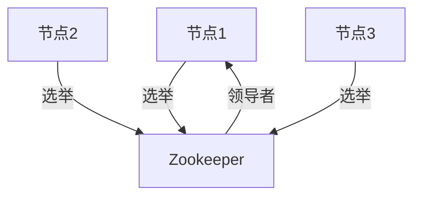

# Zookeeper 在云原生环境中的应用

## 介绍

Zookeeper 是一个开源的分布式协调服务，广泛用于管理分布式系统的配置、命名、分布式同步和组服务。在云原生环境中，Zookeeper 的作用尤为重要，因为它能够帮助系统在动态、可扩展的环境中保持一致性。

云原生环境通常由多个微服务组成，这些服务需要高效地协调和通信。Zookeeper 通过提供可靠的分布式锁、配置管理和服务发现机制，使得这些微服务能够在复杂的分布式环境中稳定运行。

## Zookeeper 的核心功能

Zookeeper 提供了以下几个核心功能，这些功能在云原生环境中尤为重要：

1. **配置管理**：Zookeeper 可以存储和管理分布式系统的配置信息，确保所有节点都能访问到最新的配置。
2. **服务发现**：Zookeeper 可以帮助服务动态地发现和注册其他服务的位置。
3. **分布式锁**：Zookeeper 提供了分布式锁机制，确保在分布式环境中资源的互斥访问。
4. **领导者选举**：Zookeeper 可以用于在分布式系统中选举领导者，确保系统的高可用性。

## Zookeeper 在云原生环境中的应用场景

### 1. 配置管理

在云原生环境中，配置管理是一个关键问题。Zookeeper 可以作为一个集中式的配置存储，确保所有服务都能访问到最新的配置信息。

```java
// 示例：使用 Zookeeper 获取配置
ZooKeeper zk = new ZooKeeper("localhost:2181", 3000, null);
byte[] configData = zk.getData("/config", false, null);
String config = new String(configData);
System.out.println("配置信息: " + config);
```

### 2. 服务发现

在微服务架构中，服务发现是一个重要的功能。Zookeeper 可以帮助服务动态地发现和注册其他服务的位置。

```java
// 示例：使用 Zookeeper 注册服务
ZooKeeper zk = new ZooKeeper("localhost:2181", 3000, null);
zk.create("/services/service1", "localhost:8080".getBytes(), ZooDefs.Ids.OPEN_ACL_UNSAFE, CreateMode.EPHEMERAL);
```

### 3. 分布式锁

在分布式系统中，确保资源的互斥访问是一个常见问题。Zookeeper 提供了分布式锁机制，可以确保在多个节点之间只有一个节点能够访问某个资源。

```java
// 示例：使用 Zookeeper 实现分布式锁
ZooKeeper zk = new ZooKeeper("localhost:2181", 3000, null);
String lockPath = zk.create("/locks/resource1", new byte[0], ZooDefs.Ids.OPEN_ACL_UNSAFE, CreateMode.EPHEMERAL_SEQUENTIAL);
// 检查是否获得锁
List<String> locks = zk.getChildren("/locks", false);
Collections.sort(locks);
if (lockPath.endsWith(locks.get(0))) {
    System.out.println("获得锁");
} else {
    System.out.println("未获得锁");
}
```

### 4. 领导者选举

在分布式系统中，领导者选举是一个常见的需求。Zookeeper 可以用于在多个节点之间选举领导者，确保系统的高可用性。



## 实际案例

### 案例：Kafka 中的 Zookeeper

Kafka 是一个广泛使用的分布式消息系统，它依赖于 Zookeeper 来管理集群的元数据、领导者选举和配置管理。在 Kafka 集群中，Zookeeper 负责存储和同步所有 Broker 的元数据，确保集群的高可用性和一致性。

:::note
Kafka 从 2.8.0 版本开始，逐步引入了基于 Raft 协议的 KRaft 模式，以减少对 Zookeeper 的依赖。但在许多生产环境中，Zookeeper 仍然是 Kafka 集群的重要组成部分。
:::

## 总结

Zookeeper 在云原生环境中扮演着至关重要的角色，特别是在配置管理、服务发现、分布式锁和领导者选举等方面。通过使用 Zookeeper，分布式系统能够在动态、可扩展的环境中保持高可用性和一致性。

## 附加资源与练习

- **练习**：尝试在一个简单的分布式系统中使用 Zookeeper 实现配置管理和服务发现。
- **资源**：
  - [Zookeeper 官方文档](https://zookeeper.apache.org/doc/current/)
  - [Kafka 与 Zookeeper 集成指南](https://kafka.apache.org/documentation/#zk)

:::tip
建议初学者从简单的 Zookeeper 配置管理开始，逐步深入到更复杂的分布式锁和领导者选举机制。
:::