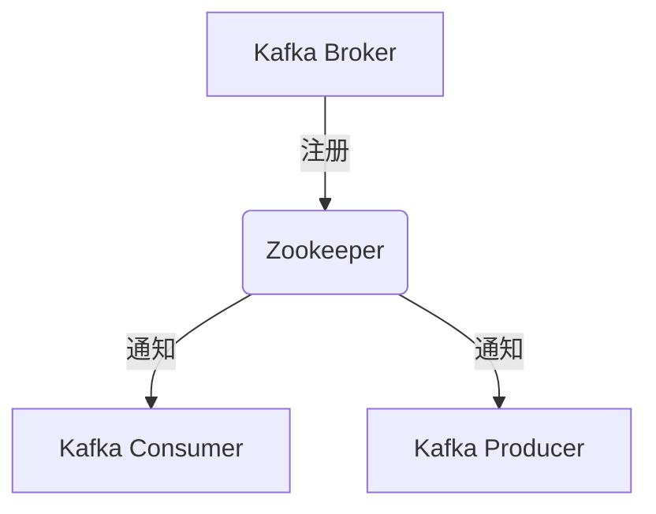
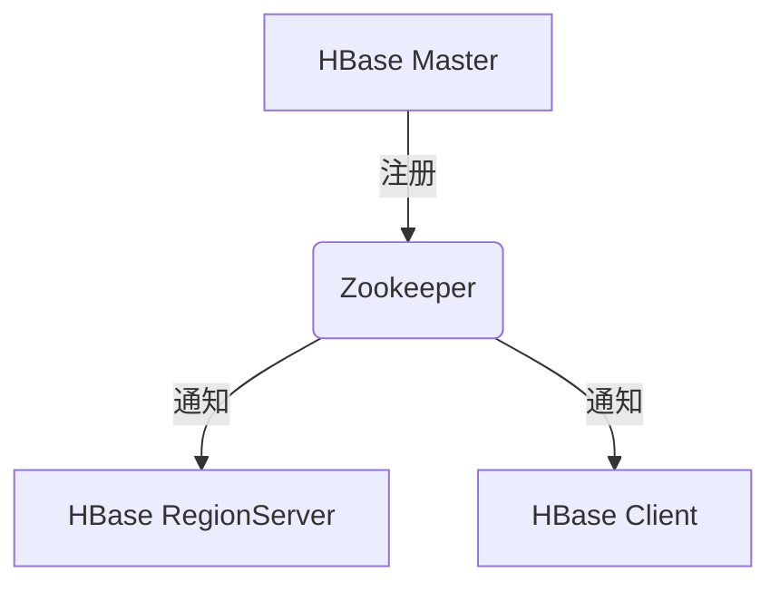

# Zookeeper 在大数据平台中的角色

## 介绍

在大数据平台中，分布式系统的协调和管理是一个复杂且关键的任务。Zookeeper 作为一个分布式协调服务，为这些系统提供了高效、可靠的解决方案。它通过维护一个分布式的、分层的命名空间，帮助系统实现配置管理、命名服务、分布式同步和组服务等功能。

Zookeeper 的核心设计目标是简单性和高性能。它通过一种类似于文件系统的树形结构（称为 ZNode）来存储数据，并通过 Watcher 机制实现事件通知。这使得 Zookeeper 成为许多大数据框架（如 Hadoop、Kafka 和 HBase）的核心组件。

## Zookeeper 的核心功能

### 1. 配置管理

在大数据平台中，配置管理是一个常见的需求。Zookeeper 可以存储和管理分布式系统的配置信息，并在配置发生变化时通知所有相关节点。例如，Hadoop 使用 Zookeeper 来管理其集群的配置信息。

```java
// 示例：使用 Zookeeper 获取配置信息
ZooKeeper zk = new ZooKeeper("localhost:2181", 3000, null);
byte[] configData = zk.getData("/config/hadoop", false, null);
System.out.println(new String(configData));
```

### 2. 命名服务

Zookeeper 提供了一个分布式的命名服务，允许系统通过唯一的路径名称来标识资源。这在分布式系统中非常有用，尤其是在需要动态分配资源时。

```java
// 示例：使用 Zookeeper 创建唯一路径
String uniquePath = zk.create("/services/service-", null, ZooDefs.Ids.OPEN_ACL_UNSAFE, CreateMode.EPHEMERAL_SEQUENTIAL);
System.out.println("Created unique path: " + uniquePath);
```

### 3. 分布式锁

在分布式系统中，多个节点可能需要同时访问共享资源。Zookeeper 提供了一种实现分布式锁的机制，确保同一时间只有一个节点可以访问资源。

```java
// 示例：使用 Zookeeper 实现分布式锁
InterProcessMutex lock = new InterProcessMutex(zk, "/locks/resource");
lock.acquire();
try {
    // 访问共享资源
} finally {
    lock.release();
}
```

### 4. 领导者选举

在大数据平台中，某些任务需要由一个领导者节点来协调。Zookeeper 提供了一种机制，允许节点通过竞争来选举领导者。

```java
// 示例：使用 Zookeeper 进行领导者选举
LeaderLatch leaderLatch = new LeaderLatch(zk, "/leader-election");
leaderLatch.start();
leaderLatch.await();
if (leaderLatch.hasLeadership()) {
    // 当前节点是领导者
}
```

## 实际案例

### 案例 1：Kafka 中的 Zookeeper

Kafka 是一个分布式流处理平台，广泛用于实时数据管道和流应用。Kafka 使用 Zookeeper 来管理其集群的元数据、领导选举和配置信息。例如，Kafka 的 Broker 和 Topic 的元数据都存储在 Zookeeper 中。



### 案例 2：HBase 中的 Zookeeper

HBase 是一个分布式的、面向列的数据库，通常用于存储大规模数据。HBase 使用 Zookeeper 来管理其 RegionServer 的状态、HMaster 的选举以及集群的配置信息。



## 总结

Zookeeper 在大数据平台中扮演着至关重要的角色。它通过提供配置管理、命名服务、分布式锁和领导者选举等功能，帮助分布式系统实现高效、可靠的协调和管理。无论是 Kafka 还是 HBase，Zookeeper 都是其核心组件之一。

## 附加资源与练习

- **练习 1**：尝试在本地安装 Zookeeper，并使用 Java API 实现一个简单的配置管理应用。
- **练习 2**：研究 Kafka 或 HBase 的源码，了解它们是如何使用 Zookeeper 的。
- **资源**：阅读 [Zookeeper 官方文档](https://zookeeper.apache.org/doc/current/) 以深入了解其内部机制和高级功能。

:::tip
Zookeeper 是一个强大的工具，但在实际使用中需要注意其性能和可用性问题。确保你的 Zookeeper 集群具有足够的冗余和高可用性。
:::