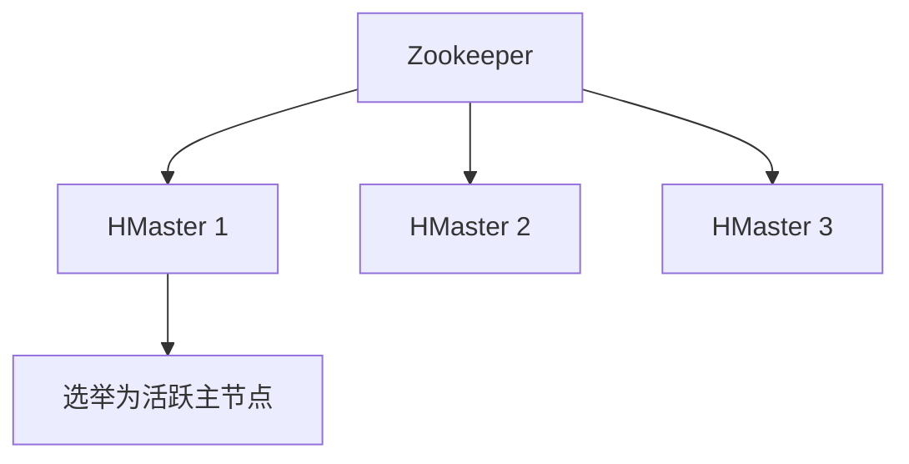

# Zookeeper 在 HBase 中的应用

## 介绍

Zookeeper 是一个分布式协调服务，广泛用于管理分布式系统中的配置信息、命名服务、分布式同步和组服务。HBase 是一个分布式的、面向列的数据库，构建在 Hadoop 之上。HBase 依赖 Zookeeper 来实现其分布式协调功能，例如主节点选举、元数据管理和集群状态监控。

本文将详细介绍 Zookeeper 在 HBase 中的作用，并通过实际案例展示其应用场景。

---

## Zookeeper 在 HBase 中的核心作用

### 1. 主节点选举

在 HBase 中，主节点（HMaster）负责管理集群的元数据、区域分配和故障恢复。Zookeeper 用于选举主节点，确保集群中始终有一个活跃的主节点。



### 2. 元数据管理

HBase 的元数据（如表结构、区域信息）存储在 Zookeeper 中。客户端通过 Zookeeper 获取元数据信息，从而定位数据存储的位置。

### 3. 分布式锁和同步

Zookeeper 提供了分布式锁机制，确保多个客户端或节点在访问共享资源时不会发生冲突。例如，HBase 使用 Zookeeper 来协调对表的写操作。

### 4. 集群状态监控

Zookeeper 监控 HBase 集群中各个节点的状态。如果某个节点失效，Zookeeper 会通知 HMaster 进行故障恢复。

---

## 实际案例：HBase 如何使用 Zookeeper

假设我们有一个 HBase 集群，包含一个主节点和多个区域服务器（RegionServer）。以下是 Zookeeper 在其中的具体应用：

1. **主节点选举**：当主节点失效时，Zookeeper 会从备用主节点中选举一个新的主节点。
2. **元数据存储**：Zookeeper 存储了 HBase 的表结构和区域信息。客户端通过 Zookeeper 获取这些信息以定位数据。
3. **故障恢复**：如果某个 RegionServer 失效，Zookeeper 会通知 HMaster，HMaster 会重新分配失效节点的区域。

---

## 代码示例：HBase 客户端如何通过 Zookeeper 获取元数据

以下是一个简单的 Java 示例，展示 HBase 客户端如何通过 Zookeeper 获取元数据：

```java
import org.apache.hadoop.hbase.HBaseConfiguration;
import org.apache.hadoop.hbase.client.Connection;
import org.apache.hadoop.hbase.client.ConnectionFactory;
import org.apache.hadoop.hbase.client.Table;
import org.apache.hadoop.hbase.client.Get;
import org.apache.hadoop.hbase.util.Bytes;

public class HBaseClientExample {
    public static void main(String[] args) throws Exception {
        // 配置 HBase 连接
        org.apache.hadoop.conf.Configuration config = HBaseConfiguration.create();
        config.set("hbase.zookeeper.quorum", "zk1.example.com,zk2.example.com,zk3.example.com");

        // 创建连接
        try (Connection connection = ConnectionFactory.createConnection(config);
             Table table = connection.getTable(TableName.valueOf("my_table"))) {

            // 获取数据
            Get get = new Get(Bytes.toBytes("row1"));
            Result result = table.get(get);
            System.out.println("Data: " + result);
        }
    }
}
```

:::note
在上面的代码中，`hbase.zookeeper.quorum` 指定了 Zookeeper 集群的地址。HBase 客户端通过这些地址连接到 Zookeeper，获取元数据并定位数据存储的位置。
:::

---

## 总结

Zookeeper 在 HBase 中扮演着至关重要的角色，帮助 HBase 实现分布式协调、主节点选举、元数据管理和故障恢复等功能。通过 Zookeeper，HBase 能够构建一个高可用、高性能的分布式数据库系统。

---

## 附加资源与练习

### 附加资源
- [Zookeeper 官方文档](https://zookeeper.apache.org/doc/current/)
- [HBase 官方文档](https://hbase.apache.org/book.html)

### 练习
1. 搭建一个简单的 HBase 集群，并观察 Zookeeper 的日志，了解其如何参与主节点选举。
2. 修改 HBase 客户端的 Zookeeper 配置，观察其对连接和元数据获取的影响。
3. 尝试在 Zookeeper 中手动查看 HBase 存储的元数据信息。

:::tip
通过动手实践，您可以更深入地理解 Zookeeper 在 HBase 中的作用。
:::