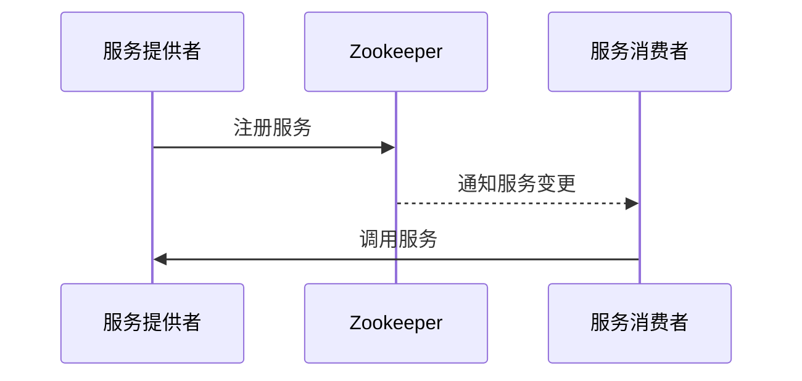

# Zookeeper 在Dubbo中的应用

## 介绍

在分布式系统中，服务注册与发现是一个核心问题。Dubbo 是一个高性能的 Java RPC 框架，广泛用于构建分布式服务架构。而 Zookeeper 是一个分布式协调服务，常用于服务注册与发现、配置管理等场景。本文将详细介绍 Zookeeper 在 Dubbo 中的应用，帮助你理解如何通过 Zookeeper 实现服务的动态注册与发现。

## Zookeeper 的基本概念

Zookeeper 是一个分布式的、开源的协调服务，它为分布式应用提供了高效且可靠的分布式协调服务。Zookeeper 的核心功能包括：

- **分布式锁**：用于控制多个进程对共享资源的访问。
- **配置管理**：集中管理分布式系统的配置信息。
- **服务注册与发现**：用于动态管理服务的注册与发现。

在 Dubbo 中，Zookeeper 主要用于服务注册与发现。Dubbo 服务提供者将服务注册到 Zookeeper，服务消费者从 Zookeeper 中获取服务提供者的地址，从而实现服务的动态调用。

## Dubbo 与 Zookeeper 的集成

### 1. 服务注册

在 Dubbo 中，服务提供者启动时会将服务信息注册到 Zookeeper。Zookeeper 会将这些信息存储在它的节点中。服务信息通常包括服务接口、服务地址、服务端口等。

```java
// Dubbo 服务提供者配置
<dubbo:application name="demo-provider" />
<dubbo:registry address="zookeeper://127.0.0.1:2181" />
<dubbo:protocol name="dubbo" port="20880" />
<dubbo:service interface="com.example.DemoService" ref="demoService" />
```

在上述配置中，`<dubbo:registry>` 标签指定了 Zookeeper 的地址，Dubbo 会将服务注册到该 Zookeeper 实例中。

### 2. 服务发现

服务消费者启动时，会从 Zookeeper 中获取服务提供者的地址列表。Dubbo 会根据这些地址进行负载均衡，选择合适的服务提供者进行调用。

```java
// Dubbo 服务消费者配置
<dubbo:application name="demo-consumer" />
<dubbo:registry address="zookeeper://127.0.0.1:2181" />
<dubbo:reference id="demoService" interface="com.example.DemoService" />
```

在上述配置中，`<dubbo:reference>` 标签指定了要调用的服务接口，Dubbo 会从 Zookeeper 中获取该服务的提供者地址。

### 3. 服务动态更新

Zookeeper 的另一个重要特性是能够实时感知服务的变化。当服务提供者上线或下线时，Zookeeper 会通知服务消费者，从而实现服务的动态更新。



在上图中，服务提供者注册服务到 Zookeeper，Zookeeper 会通知服务消费者服务的变化，服务消费者根据最新的服务列表进行调用。

## 实际案例

假设我们有一个简单的分布式系统，包含一个服务提供者和一个服务消费者。服务提供者提供一个简单的 `HelloService` 接口，服务消费者调用该接口并输出结果。

### 1. 服务提供者

```java
public interface HelloService {
    String sayHello(String name);
}

public class HelloServiceImpl implements HelloService {
    @Override
    public String sayHello(String name) {
        return "Hello, " + name;
    }
}
```

### 2. 服务消费者

```java
public class Consumer {
    public static void main(String[] args) {
        ClassPathXmlApplicationContext context = new ClassPathXmlApplicationContext("consumer.xml");
        context.start();
        HelloService helloService = (HelloService) context.getBean("helloService");
        String result = helloService.sayHello("World");
        System.out.println(result);
    }
}
```

### 3. 配置文件

服务提供者的配置文件 `provider.xml`：

```xml
<beans xmlns="http://www.springframework.org/schema/beans"
       xmlns:xsi="http://www.w3.org/2001/XMLSchema-instance"
       xmlns:dubbo="http://dubbo.apache.org/schema/dubbo"
       xsi:schemaLocation="http://www.springframework.org/schema/beans
       http://www.springframework.org/schema/beans/spring-beans.xsd
       http://dubbo.apache.org/schema/dubbo
       http://dubbo.apache.org/schema/dubbo/dubbo.xsd">

    <dubbo:application name="hello-provider" />
    <dubbo:registry address="zookeeper://127.0.0.1:2181" />
    <dubbo:protocol name="dubbo" port="20880" />
    <dubbo:service interface="com.example.HelloService" ref="helloService" />
    <bean id="helloService" class="com.example.HelloServiceImpl" />
</beans>
```

服务消费者的配置文件 `consumer.xml`：

```xml
<beans xmlns="http://www.springframework.org/schema/beans"
       xmlns:xsi="http://www.w3.org/2001/XMLSchema-instance"
       xmlns:dubbo="http://dubbo.apache.org/schema/dubbo"
       xsi:schemaLocation="http://www.springframework.org/schema/beans
       http://www.springframework.org/schema/beans/spring-beans.xsd
       http://dubbo.apache.org/schema/dubbo
       http://dubbo.apache.org/schema/dubbo/dubbo.xsd">

    <dubbo:application name="hello-consumer" />
    <dubbo:registry address="zookeeper://127.0.0.1:2181" />
    <dubbo:reference id="helloService" interface="com.example.HelloService" />
</beans>
```

## 总结

通过本文的学习，你应该已经了解了 Zookeeper 在 Dubbo 中的应用。Zookeeper 作为分布式协调服务，在 Dubbo 中扮演了服务注册与发现的关键角色。通过 Zookeeper，Dubbo 能够实现服务的动态注册、发现和更新，从而构建高效的分布式系统。

:::tip 提示
如果你对 Zookeeper 或 Dubbo 还不熟悉，建议先学习 Zookeeper 的基本使用和 Dubbo 的基础知识，这将帮助你更好地理解本文内容。
:::

## 附加资源

- [Zookeeper 官方文档](https://zookeeper.apache.org/doc/current/)
- [Dubbo 官方文档](https://dubbo.apache.org/zh/docs/)
- [Dubbo 与 Zookeeper 集成示例](https://github.com/apache/dubbo-samples)

## 练习

1. 尝试在本地的 Zookeeper 和 Dubbo 环境中实现一个简单的服务注册与发现。
2. 修改服务提供者的配置文件，使其注册到不同的 Zookeeper 集群，观察服务消费者的行为变化。
3. 研究 Dubbo 的其他注册中心（如 Nacos、Consul），并比较它们与 Zookeeper 的异同。