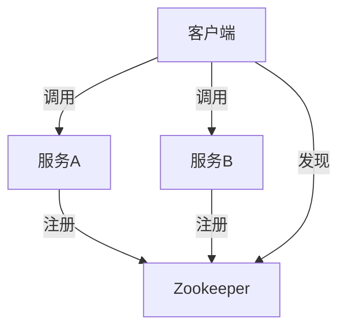

# Zookeeper 在 Spring Cloud 中的应用

在现代分布式系统中，服务注册与发现是一个至关重要的功能。Zookeeper 作为一个分布式协调服务，能够帮助我们在 Spring Cloud 中实现这一功能。本文将详细介绍 Zookeeper 的核心概念，并展示如何在 Spring Cloud 中集成 Zookeeper 来实现服务注册与发现。

## 什么是 Zookeeper？

Zookeeper 是一个开源的分布式协调服务，主要用于维护配置信息、命名服务、分布式同步和组服务。它通过一个简单的文件系统树结构来存储数据，并提供高效的分布式锁和通知机制。

:::note
Zookeeper 的核心功能包括：
- **配置管理**：集中管理分布式系统的配置信息。
- **命名服务**：为分布式系统中的节点提供唯一的名称。
- **分布式锁**：确保在分布式环境中资源的互斥访问。
- **服务发现**：帮助客户端动态发现服务实例。
:::

## Zookeeper 在 Spring Cloud 中的作用

在 Spring Cloud 中，Zookeeper 主要用于服务注册与发现。通过将服务实例注册到 Zookeeper 中，其他服务可以通过 Zookeeper 发现并调用这些服务实例。

### 服务注册与发现的基本流程

1. **服务注册**：当一个服务启动时，它会将自己的信息（如 IP 地址、端口号等）注册到 Zookeeper 中。
2. **服务发现**：其他服务可以通过查询 Zookeeper 来获取已注册的服务实例信息。
3. **服务调用**：客户端根据获取到的服务实例信息，发起服务调用。



## 在 Spring Cloud 中集成 Zookeeper

接下来，我们将通过一个简单的示例来展示如何在 Spring Cloud 中集成 Zookeeper。

### 1. 添加依赖

首先，在 `pom.xml` 中添加 Spring Cloud Zookeeper 的依赖：

```xml
<dependency>
    <groupId>org.springframework.cloud</groupId>
    <artifactId>spring-cloud-starter-zookeeper-discovery</artifactId>
</dependency>
```

### 2. 配置 Zookeeper 连接信息

在 `application.yml` 中配置 Zookeeper 的连接信息：

```yaml
spring:
  cloud:
    zookeeper:
      connect-string: localhost:2181
```

### 3. 启用服务注册与发现

在 Spring Boot 应用的启动类上添加 `@EnableDiscoveryClient` 注解，以启用服务注册与发现功能：

```java
@SpringBootApplication
@EnableDiscoveryClient
public class MyApplication {
    public static void main(String[] args) {
        SpringApplication.run(MyApplication.class, args);
    }
}
```

### 4. 注册服务

当应用启动时，它会自动将自身注册到 Zookeeper 中。你可以通过 Zookeeper 的命令行工具或图形化界面查看已注册的服务实例。

### 5. 服务发现与调用

在客户端应用中，你可以通过 `DiscoveryClient` 来获取已注册的服务实例信息，并调用这些服务：

```java
@RestController
public class MyController {

    @Autowired
    private DiscoveryClient discoveryClient;

    @GetMapping("/services")
    public List<String> getServices() {
        return discoveryClient.getServices();
    }

    @GetMapping("/service-instances/{serviceId}")
    public List<ServiceInstance> getServiceInstances(@PathVariable String serviceId) {
        return discoveryClient.getInstances(serviceId);
    }
}
```

## 实际应用场景

假设我们有一个微服务架构的电商系统，其中包含订单服务、库存服务和支付服务。通过 Zookeeper，我们可以实现以下功能：

1. **订单服务**：当订单服务启动时，它会将自己的信息注册到 Zookeeper 中。
2. **库存服务**：库存服务可以通过 Zookeeper 发现订单服务，并调用其接口来获取订单信息。
3. **支付服务**：支付服务也可以通过 Zookeeper 发现订单服务，并调用其接口来完成支付操作。

:::tip
在实际生产环境中，Zookeeper 还可以用于实现分布式锁、配置管理等功能，确保系统的稳定性和一致性。
:::

## 总结

通过本文，我们了解了 Zookeeper 在 Spring Cloud 中的核心作用，并学习了如何通过 Zookeeper 实现服务注册与发现。Zookeeper 作为一个强大的分布式协调服务，能够帮助我们在复杂的分布式系统中实现高效的服务管理。

## 附加资源

- [Zookeeper 官方文档](https://zookeeper.apache.org/doc/current/)
- [Spring Cloud Zookeeper 官方文档](https://spring.io/projects/spring-cloud-zookeeper)
- [微服务架构设计模式](https://microservices.io/)

## 练习

1. 尝试在本地搭建一个 Zookeeper 集群，并在 Spring Cloud 中集成它。
2. 编写一个简单的微服务应用，使用 Zookeeper 实现服务注册与发现。
3. 探索 Zookeeper 的其他功能，如分布式锁和配置管理，并在 Spring Cloud 中实现它们。

通过以上练习，你将更深入地理解 Zookeeper 在分布式系统中的应用，并能够将其应用于实际项目中。