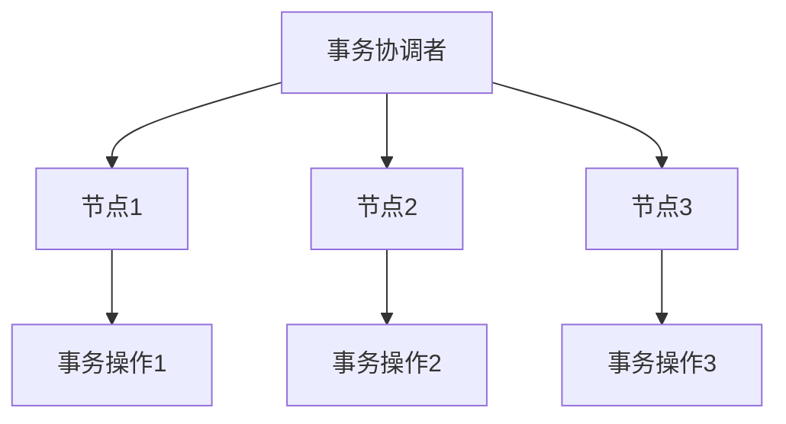
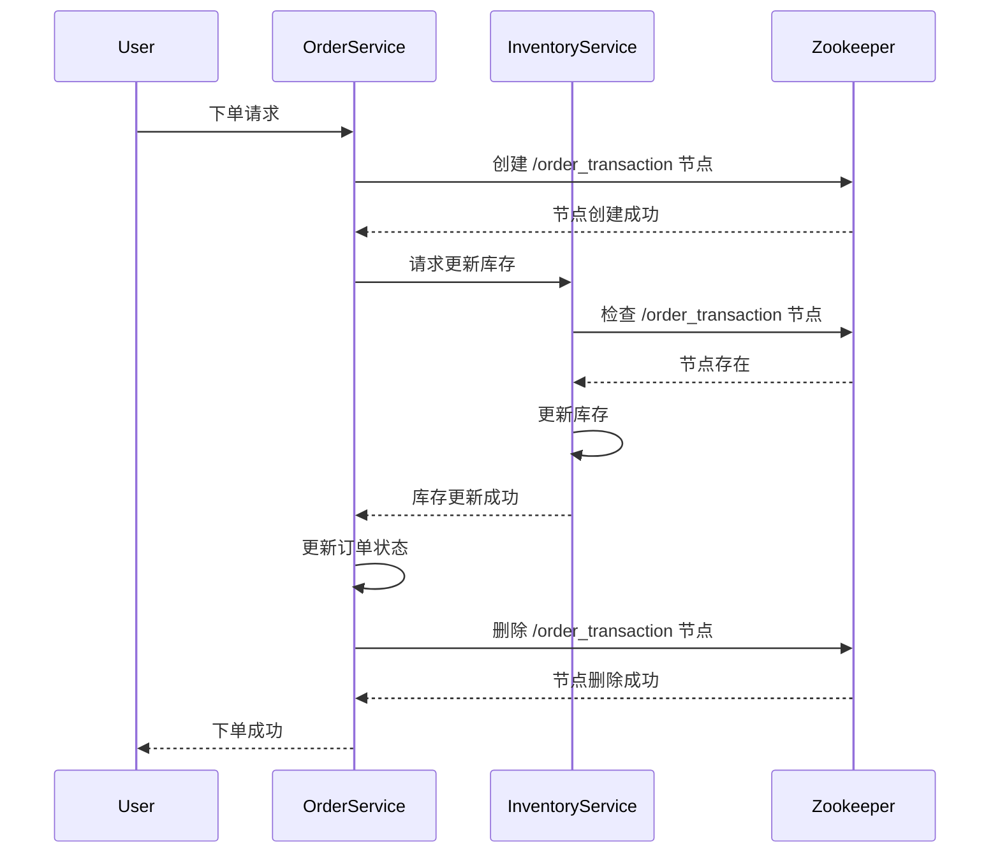

# Zookeeper 在分布式事务中的应用

在分布式系统中，事务管理是一个复杂且关键的问题。Zookeeper 作为一个分布式协调服务，能够帮助开发者实现分布式事务的协调和管理。本文将详细介绍 Zookeeper 在分布式事务中的应用，并通过代码示例和实际案例帮助初学者理解这一概念。

## 什么是分布式事务？

分布式事务是指跨越多个分布式节点的事务操作。与单机事务不同，分布式事务需要确保所有参与节点的事务操作要么全部成功，要么全部失败。这种一致性要求使得分布式事务的管理变得非常复杂。

## Zookeeper 简介

Zookeeper 是一个开源的分布式协调服务，主要用于维护配置信息、命名服务、分布式同步和组服务。Zookeeper 的核心是一个分布式的、层次化的文件系统，它能够存储小量的数据，并且能够保证数据的一致性和高可用性。

## Zookeeper 在分布式事务中的作用

Zookeeper 在分布式事务中主要起到协调和监控的作用。通过 Zookeeper，分布式系统中的各个节点可以共享状态信息，协调事务的执行顺序，并在事务失败时进行回滚。

### 1. 事务协调

在分布式事务中，Zookeeper 可以作为一个协调者，负责协调各个参与节点的事务操作。Zookeeper 通过创建临时节点（Ephemeral Nodes）来监控参与节点的状态，并在所有节点都准备好后，触发事务的提交或回滚。



### 2. 分布式锁

Zookeeper 还可以用于实现分布式锁，确保在分布式系统中同一时间只有一个节点能够执行关键事务操作。通过创建有序临时节点（Sequential Ephemeral Nodes），Zookeeper 可以实现公平锁，避免死锁和饥饿问题。

```java
// 示例：使用 Zookeeper 实现分布式锁
public class DistributedLock {
    private ZooKeeper zooKeeper;
    private String lockPath;

    public DistributedLock(ZooKeeper zooKeeper, String lockPath) {
        this.zooKeeper = zooKeeper;
        this.lockPath = lockPath;
    }

    public void acquireLock() throws KeeperException, InterruptedException {
        zooKeeper.create(lockPath, new byte[0], ZooDefs.Ids.OPEN_ACL_UNSAFE, CreateMode.EPHEMERAL_SEQUENTIAL);
    }

    public void releaseLock() throws KeeperException, InterruptedException {
        zooKeeper.delete(lockPath, -1);
    }
}
```

### 3. 事务状态监控

Zookeeper 可以实时监控分布式事务的状态。通过监听 Zookeeper 节点的变化，开发者可以及时了解事务的执行情况，并在事务失败时采取相应的措施。

```java
// 示例：监听 Zookeeper 节点变化
public class TransactionWatcher implements Watcher {
    @Override
    public void process(WatchedEvent event) {
        if (event.getType() == Event.EventType.NodeDataChanged) {
            System.out.println("Transaction state changed: " + event.getPath());
        }
    }
}
```

## 实际案例：分布式订单系统

假设我们有一个分布式订单系统，用户下单后需要同时更新库存和订单状态。为了保证数据一致性，我们可以使用 Zookeeper 来协调这两个操作。

1. **创建事务协调节点**：在 Zookeeper 中创建一个临时节点 `/order_transaction`，用于协调订单和库存的更新操作。
2. **更新库存**：库存服务在更新库存前，先检查 `/order_transaction` 节点是否存在。如果存在，则执行库存更新操作。
3. **更新订单状态**：订单服务在更新订单状态前，同样检查 `/order_transaction` 节点是否存在。如果存在，则执行订单状态更新操作。
4. **提交事务**：当库存和订单状态都更新成功后，删除 `/order_transaction` 节点，表示事务提交成功。
5. **回滚事务**：如果任何一个操作失败，则删除 `/order_transaction` 节点，并回滚已执行的操作。



## 总结

Zookeeper 在分布式事务中扮演着至关重要的角色。通过 Zookeeper，我们可以实现事务的协调、分布式锁和状态监控，确保分布式系统中的数据一致性和高可用性。本文通过代码示例和实际案例，帮助初学者理解 Zookeeper 在分布式事务中的应用。

## 附加资源

- [Zookeeper 官方文档](https://zookeeper.apache.org/doc/current/)
- [分布式系统设计与实践](https://www.oreilly.com/library/view/designing-distributed-systems/9781491983638/)
- [Zookeeper 实战](https://www.manning.com/books/zookeeper)

## 练习

1. 尝试使用 Zookeeper 实现一个简单的分布式锁。
2. 设计一个分布式事务场景，并使用 Zookeeper 进行协调。
3. 研究 Zookeeper 的其他应用场景，如配置管理和命名服务。

:::tip
在学习和实践过程中，建议使用 Zookeeper 的本地开发环境进行测试，以避免对生产环境造成影响。
:::