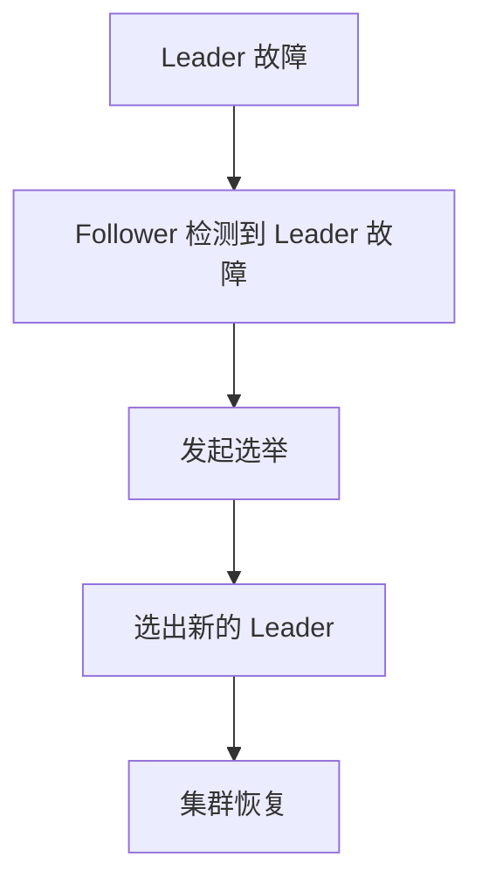

# Zookeeper 灾备与高可用

## 介绍

Zookeeper 是一个分布式协调服务，广泛用于分布式系统中的配置管理、命名服务、分布式锁和集群管理。由于其核心功能对分布式系统的稳定性至关重要，因此 Zookeeper 的高可用性和灾备机制是运维中不可忽视的部分。

高可用性（High Availability, HA）指的是系统能够在出现故障时继续提供服务的能力。灾备（Disaster Recovery, DR）则是指在灾难性故障发生后，系统能够快速恢复并继续运行的能力。Zookeeper 通过其分布式架构和选举机制，实现了高可用性和灾备。

## Zookeeper 的高可用性

Zookeeper 的高可用性依赖于其集群模式。一个 Zookeeper 集群通常由多个节点组成，这些节点分为 Leader 和 Follower 两种角色。Leader 负责处理写请求，而 Follower 负责处理读请求并参与 Leader 选举。

### 集群配置

要配置一个高可用的 Zookeeper 集群，至少需要三个节点。以下是一个简单的 `zoo.cfg` 配置文件示例：

```ini
tickTime=2000
initLimit=10
syncLimit=5
dataDir=/var/lib/zookeeper
clientPort=2181
server.1=zoo1:2888:3888
server.2=zoo2:2888:3888
server.3=zoo3:2888:3888
```

在这个配置中，`server.X` 表示集群中的每个节点，`X` 是节点的唯一标识符。`2888` 是节点间通信的端口，`3888` 是选举端口。

### Leader 选举

当 Leader 节点发生故障时，Zookeeper 会通过选举机制选出一个新的 Leader。选举过程基于 ZAB（Zookeeper Atomic Broadcast）协议，确保集群中只有一个 Leader。



### 读写分离

Zookeeper 的读写分离机制进一步提高了系统的可用性。客户端可以直接从 Follower 节点读取数据，而不需要每次都访问 Leader 节点，从而减轻了 Leader 的负载。

## Zookeeper 的灾备机制

灾备机制的目标是在发生灾难性故障时，能够快速恢复服务。Zookeeper 通过数据备份和恢复策略来实现灾备。

### 数据备份

Zookeeper 的数据存储在 `dataDir` 指定的目录中。定期备份这些数据是灾备的基础。可以使用简单的脚本将数据备份到远程存储：

```bash
#!/bin/bash
BACKUP_DIR=/backup/zookeeper
DATA_DIR=/var/lib/zookeeper
rsync -avz $DATA_DIR $BACKUP_DIR
```

### 数据恢复

当发生数据丢失或损坏时，可以从备份中恢复数据。恢复过程包括停止 Zookeeper 服务、替换数据目录中的文件，然后重新启动服务。

```bash
#!/bin/bash
BACKUP_DIR=/backup/zookeeper
DATA_DIR=/var/lib/zookeeper
service zookeeper stop
rsync -avz $BACKUP_DIR $DATA_DIR
service zookeeper start
```

## 实际案例

假设一个电商平台的订单系统使用 Zookeeper 来管理分布式锁。某天，Zookeeper 集群的 Leader 节点突然宕机，导致订单系统无法处理新的订单请求。由于 Zookeeper 的高可用性机制，集群迅速选举出新的 Leader，订单系统在几秒钟内恢复正常。

## 总结

Zookeeper 的高可用性和灾备机制是确保分布式系统稳定运行的关键。通过合理的集群配置、数据备份和恢复策略，可以有效应对各种故障场景。

:::tip
建议定期进行灾备演练，确保在实际故障发生时能够快速恢复服务。
:::

## 附加资源

- [Zookeeper 官方文档](https://zookeeper.apache.org/doc/current/)
- [Zookeeper 高可用性配置指南](https://zookeeper.apache.org/doc/current/zookeeperAdmin.html#sc_highAvailability)
- [Zookeeper 灾备策略](https://zookeeper.apache.org/doc/current/zookeeperAdmin.html#sc_disasterRecovery)

## 练习

1. 配置一个三节点的 Zookeeper 集群，并模拟 Leader 故障，观察集群的选举过程。
2. 编写一个脚本，定期备份 Zookeeper 数据，并在模拟数据丢失的情况下进行恢复。
