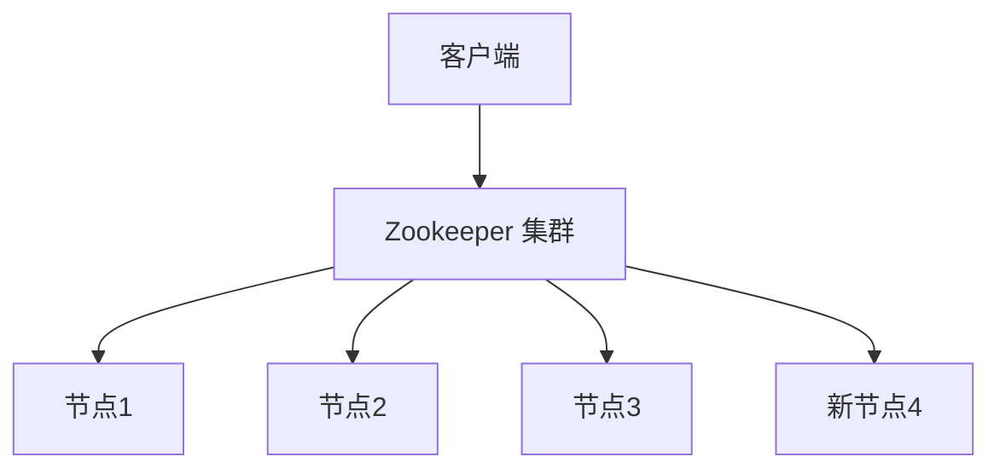
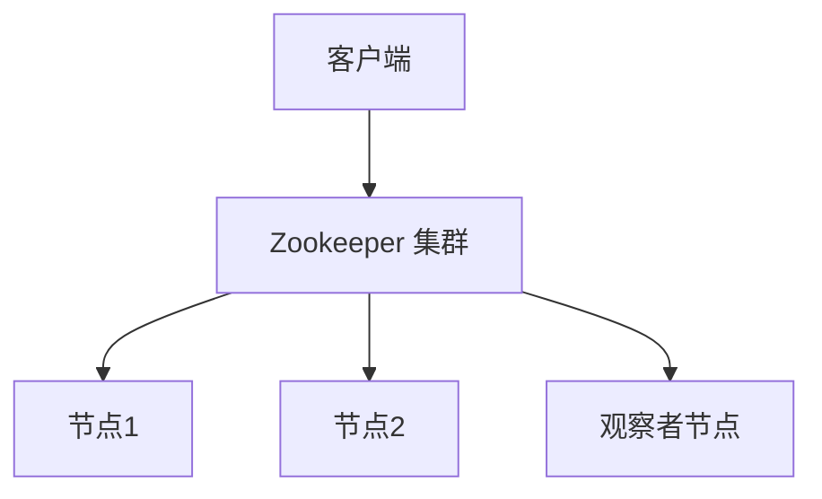

## 介绍

Apache Zookeeper 是一个分布式协调服务，广泛应用于分布式系统中，用于管理配置信息、命名服务、分布式同步和组服务等。随着 Zookeeper 的不断发展，新版本引入了许多高级特性，进一步提升了其性能和功能。本文将详细介绍这些新特性，并通过实际案例展示其应用场景。

## 新特性概览

### 1. 动态重新配置

Zookeeper 3.5.0 引入了动态重新配置功能，允许在不重启集群的情况下更改集群的配置。这对于需要频繁调整集群规模的系统来说非常有用。

#### 代码示例

```bash
# 添加新节点
zkCli.sh -server localhost:2181 reconfig -add server.4=localhost:2888:3888:participant;2181
```

```bash
# 删除节点
zkCli.sh -server localhost:2181 reconfig -remove server.3
```

### 2. 观察者模式

观察者模式允许客户端在不参与投票的情况下接收更新。这可以提高读取性能，特别是在大规模集群中。

#### 代码示例

```java
Watcher watcher = new Watcher() {
    public void process(WatchedEvent event) {
        System.out.println("Event: " + event.getType());
    }
};
ZooKeeper zk = new ZooKeeper("localhost:2181", 3000, watcher);
```

### 3. 持久化 Watcher

Zookeeper 3.6.0 引入了持久化 Watcher，允许客户端在断开连接后重新连接时继续接收事件通知。

#### 代码示例

```java
Watcher watcher = new Watcher() {
    public void process(WatchedEvent event) {
        System.out.println("Event: " + event.getType());
    }
};
ZooKeeper zk = new ZooKeeper("localhost:2181", 3000, watcher);
zk.exists("/myPath", true);
```

### 4. 多线程支持

Zookeeper 3.5.0 改进了多线程支持，允许客户端在多线程环境中更高效地使用 Zookeeper。

#### 代码示例

```java
ExecutorService executor = Executors.newFixedThreadPool(10);
for (int i = 0; i < 10; i++) {
    executor.submit(() -> {
        ZooKeeper zk = new ZooKeeper("localhost:2181", 3000, watcher);
        // 执行 Zookeeper 操作
    });
}
```

## 实际案例

### 案例 1：动态扩展集群

假设我们有一个在线购物网站，随着用户量的增加，需要动态扩展 Zookeeper 集群以处理更多的请求。通过动态重新配置功能，我们可以在不中断服务的情况下添加新的 Zookeeper 节点。



### 案例 2：高可用性配置

在一个分布式系统中，配置信息需要高可用性。通过使用 Zookeeper 的观察者模式，我们可以确保即使某些节点不可用，客户端仍然可以读取配置信息。



## 总结

Zookeeper 的新版特性为分布式系统提供了更强大的功能和更高的性能。通过动态重新配置、观察者模式、持久化 Watcher 和多线程支持，Zookeeper 能够更好地满足现代分布式系统的需求。

## 附加资源

- [Zookeeper 官方文档](https://zookeeper.apache.org/doc/current/)
- [Zookeeper 动态重新配置指南](https://zookeeper.apache.org/doc/r3.5.0/zookeeperReconfig.html)
- [Zookeeper 观察者模式详解](https://zookeeper.apache.org/doc/r3.5.0/zookeeperObservers.html)

## 练习

1. 尝试在你的本地环境中配置一个 Zookeeper 集群，并使用动态重新配置功能添加和删除节点。
2. 编写一个 Java 程序，使用 Zookeeper 的持久化 Watcher 功能来监控一个节点的变化。
3. 研究 Zookeeper 的多线程支持，并尝试在多线程环境中执行 Zookeeper 操作。

:::tip
在完成练习时，可以参考 Zookeeper 的官方文档和社区资源，以获得更多帮助和指导。
:::