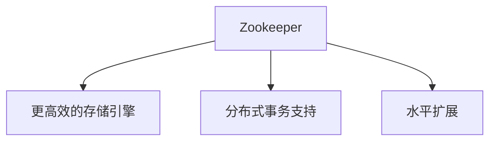
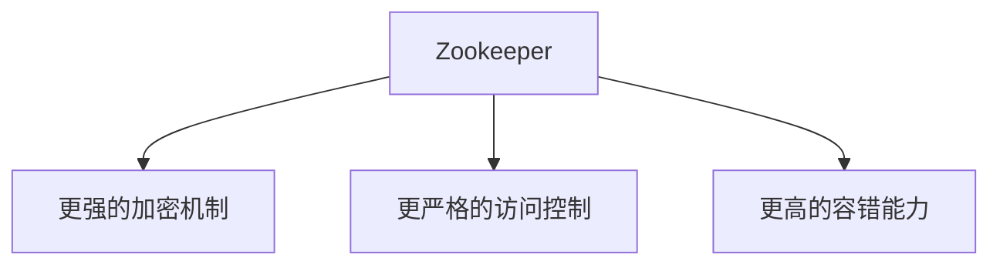
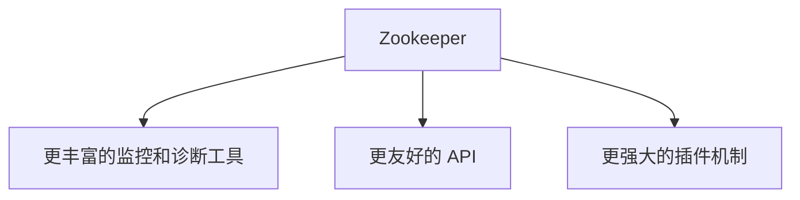

# Zookeeper 未来发展趋势

## 介绍

Zookeeper 是一个分布式协调服务，广泛应用于分布式系统中，用于管理配置信息、命名服务、分布式同步和组服务。随着分布式系统的复杂性不断增加，Zookeeper 也在不断演进，以满足新的需求和挑战。本文将探讨 Zookeeper 的未来发展趋势，帮助初学者了解其发展方向和潜在应用。

## Zookeeper 的当前状态

Zookeeper 目前已经是一个非常成熟的分布式协调服务，广泛应用于各种分布式系统中。它的核心功能包括：

- **配置管理**：集中管理分布式系统的配置信息。
- **命名服务**：提供分布式系统中的命名服务。
- **分布式锁**：实现分布式系统中的互斥锁。
- **领导选举**：在分布式系统中选举领导者。

尽管 Zookeeper 已经非常强大，但随着分布式系统的不断发展，Zookeeper 也在不断演进，以满足新的需求和挑战。

## Zookeeper 未来发展趋势

### 1. 更高的性能和可扩展性

随着分布式系统的规模不断扩大，Zookeeper 需要提供更高的性能和更好的可扩展性。未来的 Zookeeper 可能会引入以下改进：

- **更高效的存储引擎**：使用更高效的存储引擎来提高读写性能。
- **分布式事务支持**：提供对分布式事务的支持，以满足更复杂的业务需求。
- **水平扩展**：通过水平扩展来提高系统的吞吐量和容量。



### 2. 更强的安全性和可靠性

随着分布式系统的安全性要求不断提高，Zookeeper 也需要提供更强的安全性和可靠性。未来的 Zookeeper 可能会引入以下改进：

- **更强的加密机制**：提供更强的加密机制来保护数据的安全。
- **更严格的访问控制**：提供更严格的访问控制机制，防止未经授权的访问。
- **更高的容错能力**：通过改进容错机制来提高系统的可靠性。



### 3. 更丰富的功能和更友好的 API

为了满足更复杂的业务需求，Zookeeper 可能会引入更丰富的功能和更友好的 API。未来的 Zookeeper 可能会引入以下改进：

- **更丰富的监控和诊断工具**：提供更丰富的监控和诊断工具，帮助用户更好地管理和维护系统。
- **更友好的 API**：提供更友好的 API，降低开发者的使用门槛。
- **更强大的插件机制**：通过插件机制扩展 Zookeeper 的功能。



## 实际案例

### 案例 1：分布式配置管理

在一个大型分布式系统中，配置管理是一个非常重要的任务。Zookeeper 可以用于集中管理分布式系统的配置信息。例如，一个微服务架构的系统可以使用 Zookeeper 来存储和管理各个微服务的配置信息。

```java
// 示例代码：使用 Zookeeper 获取配置信息
ZooKeeper zk = new ZooKeeper("localhost:2181", 3000, null);
byte[] configData = zk.getData("/config/service1", false, null);
String config = new String(configData);
System.out.println("Service1 config: " + config);
```

**输出：**
```
Service1 config: {"timeout":5000,"retry":3}
```

### 案例 2：分布式锁

在分布式系统中，分布式锁是一个常见的需求。Zookeeper 可以用于实现分布式锁，确保在分布式环境下的互斥访问。

```java
// 示例代码：使用 Zookeeper 实现分布式锁
InterProcessMutex lock = new InterProcessMutex(zkClient, "/locks/resource1");
lock.acquire();
try {
    // 执行需要互斥访问的操作
} finally {
    lock.release();
}
```

## 总结

Zookeeper 作为一个成熟的分布式协调服务，已经在分布式系统中发挥了重要作用。随着分布式系统的不断发展，Zookeeper 也在不断演进，以满足新的需求和挑战。未来的 Zookeeper 可能会在性能、安全性、功能和 API 等方面进行改进，以更好地服务于分布式系统。

## 附加资源

- [Zookeeper 官方文档](https://zookeeper.apache.org/doc/current/)
- [Zookeeper 源码](https://github.com/apache/zookeeper)
- [Zookeeper 教程](https://www.tutorialspoint.com/zookeeper/index.htm)

## 练习

1. 使用 Zookeeper 实现一个简单的分布式配置管理系统。
2. 使用 Zookeeper 实现一个分布式锁，并测试其互斥访问的效果。
3. 研究 Zookeeper 的监控和诊断工具，并尝试在实际项目中使用。

:::tip
建议初学者在学习 Zookeeper 时，先从基础概念入手，逐步深入理解其高级特性和未来发展趋势。
:::