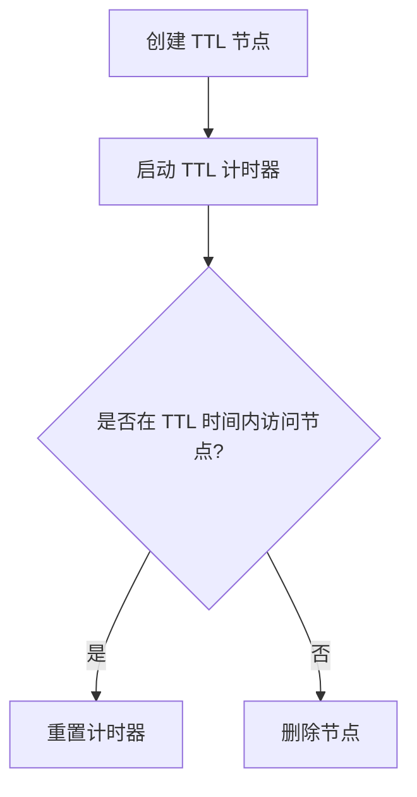

# Zookeeper TTL节点

Zookeeper 是一个分布式协调服务，广泛用于分布式系统中的配置管理、命名服务、分布式锁等场景。Zookeeper 的 TTL（Time-To-Live）节点是一种特殊类型的节点，它允许开发者为节点设置一个生存时间（TTL），当节点超过该时间未被访问时，Zookeeper 会自动删除该节点。这一特性在某些场景下非常有用，例如临时数据的存储或缓存管理。

## 什么是 TTL 节点？

TTL 节点是 Zookeeper 3.6.0 版本引入的一个新特性。它允许开发者为持久节点（Persistent Node）设置一个生存时间（TTL）。与临时节点（Ephemeral Node）不同，TTL 节点不会因为客户端会话的断开而被删除，而是根据设置的 TTL 时间自动删除。

:::note
TTL 节点仅适用于持久节点，临时节点不支持 TTL 设置。
:::

## 如何创建 TTL 节点？

在 Zookeeper 中，创建 TTL 节点需要使用 `create` 命令，并指定 `-t` 参数来设置 TTL 时间（以毫秒为单位）。以下是一个示例：

```bash
create /my-ttl-node "my data" -t 5000
```

上述命令创建了一个名为 `/my-ttl-node` 的节点，并设置了 5000 毫秒（即 5 秒）的 TTL。如果在 5 秒内没有对该节点进行任何操作（如读取或写入），Zookeeper 将自动删除该节点。

:::tip
TTL 节点的删除是基于最后一次访问时间的。如果在 TTL 时间内对节点进行了操作，TTL 计时器会重置。
:::

## TTL 节点的工作原理

TTL 节点的工作原理可以简单概括为以下几个步骤：

1. **创建节点**：开发者通过 `create` 命令创建 TTL 节点，并指定 TTL 时间。
2. **计时器启动**：Zookeeper 启动一个计时器，开始倒计时。
3. **访问节点**：如果在 TTL 时间内对节点进行了访问（如读取或写入），计时器会重置。
4. **节点删除**：如果 TTL 时间内没有对节点进行任何操作，Zookeeper 会自动删除该节点。



## 实际应用场景

TTL 节点在以下场景中非常有用：

1. **缓存管理**：在分布式系统中，TTL 节点可以用于存储临时缓存数据。当缓存数据超过 TTL 时间未被访问时，Zookeeper 会自动清理这些数据，避免缓存堆积。
2. **临时配置**：某些配置信息可能只在特定时间段内有效。使用 TTL 节点可以确保这些配置信息在过期后自动删除，避免手动清理的麻烦。
3. **分布式锁**：在分布式锁的实现中，TTL 节点可以用于设置锁的超时时间。如果锁持有者在 TTL 时间内未释放锁，Zookeeper 会自动删除锁节点，防止死锁。

## 示例：使用 TTL 节点实现缓存清理

假设我们有一个分布式系统，需要缓存一些临时数据。我们可以使用 TTL 节点来实现自动清理功能：

```bash
# 创建 TTL 节点，设置 TTL 为 10 秒
create /cache/data1 "cached data 1" -t 10000
create /cache/data2 "cached data 2" -t 10000
```

在上述示例中，`/cache/data1` 和 `/cache/data2` 是两个缓存节点，它们的 TTL 时间为 10 秒。如果在 10 秒内没有对这些节点进行访问，Zookeeper 会自动删除它们。

## 总结

Zookeeper 的 TTL 节点是一个非常有用的特性，特别适用于需要自动清理临时数据的场景。通过设置 TTL 时间，开发者可以确保节点在超过指定时间未被访问时自动删除，从而简化了分布式系统中的资源管理。

:::caution
需要注意的是，TTL 节点的删除是基于最后一次访问时间的。如果节点在 TTL 时间内被频繁访问，它可能永远不会被删除。
:::

## 附加资源

- [Zookeeper 官方文档](https://zookeeper.apache.org/doc/current/zookeeperProgrammers.html)
- [Zookeeper TTL 节点示例代码](https://github.com/apache/zookeeper/tree/master/src/recipes/ttl)

## 练习

1. 使用 Zookeeper 命令行工具创建一个 TTL 节点，并观察其自动删除的过程。
2. 编写一个简单的 Java 程序，使用 Zookeeper 客户端 API 创建和访问 TTL 节点。
3. 思考并设计一个分布式锁的实现，利用 TTL 节点来防止死锁。
