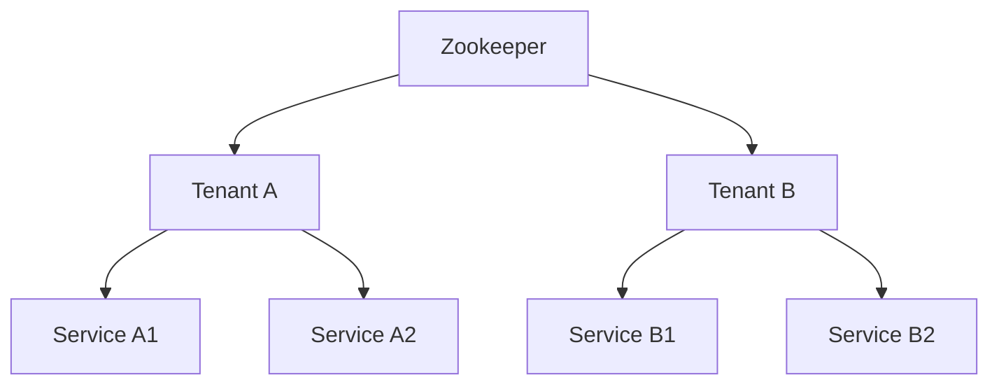

# Zookeeper 多租户

## 介绍

Zookeeper 是一个分布式协调服务，广泛用于分布式系统中的配置管理、命名服务、分布式锁等场景。随着分布式系统的复杂性增加，多租户（Multi-tenancy）成为了一个重要的需求。多租户允许多个用户或应用程序共享同一个 Zookeeper 实例，同时保持彼此之间的隔离性。

在 Zookeeper 中，多租户的实现通常通过命名空间（Namespace）和权限控制（ACL）来实现。每个租户可以拥有自己的命名空间，并通过 ACL 控制对数据的访问权限。

## 命名空间

命名空间是 Zookeeper 中实现多租户的基础。通过为每个租户创建独立的路径（Path），可以确保不同租户的数据不会相互干扰。

### 示例：创建命名空间

假设我们有两个租户：`tenantA` 和 `tenantB`。我们可以为每个租户创建独立的命名空间：

```bash
# 创建 tenantA 的命名空间
create /tenants/tenantA ""
create /tenants/tenantA/config ""
create /tenants/tenantA/data ""

# 创建 tenantB 的命名空间
create /tenants/tenantB ""
create /tenants/tenantB/config ""
create /tenants/tenantB/data ""
```

### 访问命名空间

租户可以通过指定完整的路径来访问自己的命名空间。例如，`tenantA` 可以访问 `/tenants/tenantA/config`，而 `tenantB` 可以访问 `/tenants/tenantB/config`。

## 权限控制（ACL）

Zookeeper 提供了细粒度的权限控制机制（ACL），可以确保每个租户只能访问自己的数据。ACL 可以基于 IP 地址、用户名、密码等进行配置。

### 示例：设置 ACL

假设我们希望 `tenantA` 只能访问 `/tenants/tenantA` 下的数据，我们可以设置如下 ACL：

```bash
# 设置 tenantA 的 ACL
setAcl /tenants/tenantA auth:tenantA:password:cdrwa
setAcl /tenants/tenantA/config auth:tenantA:password:cdrwa
setAcl /tenants/tenantA/data auth:tenantA:password:cdrwa
```

### 验证 ACL

当 `tenantA` 尝试访问 `/tenants/tenantB` 时，Zookeeper 会拒绝访问：

```bash
# tenantA 尝试访问 tenantB 的数据
get /tenants/tenantB/config
# 输出：Authentication is not valid : /tenants/tenantB/config
```

## 实际案例

### 案例：多租户的微服务架构

在一个微服务架构中，多个团队可能共享同一个 Zookeeper 实例来管理各自的配置和服务发现。通过多租户机制，每个团队可以独立管理自己的配置，而不会影响其他团队。



在这个案例中，`Tenant A` 和 `Tenant B` 分别管理自己的服务，彼此之间完全隔离。

## 总结

Zookeeper 的多租户机制通过命名空间和权限控制实现了多个租户之间的隔离。这种机制在分布式系统中非常有用，特别是在微服务架构中，多个团队可以共享同一个 Zookeeper 实例，同时保持彼此之间的独立性。

## 附加资源

- [Zookeeper 官方文档](https://zookeeper.apache.org/doc/current/)
- [Zookeeper ACL 详解](https://zookeeper.apache.org/doc/current/zookeeperProgrammers.html#sc_ZooKeeperAccessControl)
- [Zookeeper 多租户最佳实践](https://zookeeper.apache.org/doc/current/zookeeperMultitenancy.html)

## 练习

1. 创建一个 Zookeeper 实例，并为其添加两个租户：`tenantX` 和 `tenantY`。
2. 为每个租户设置独立的命名空间和 ACL。
3. 尝试从一个租户访问另一个租户的数据，验证 ACL 是否生效。
