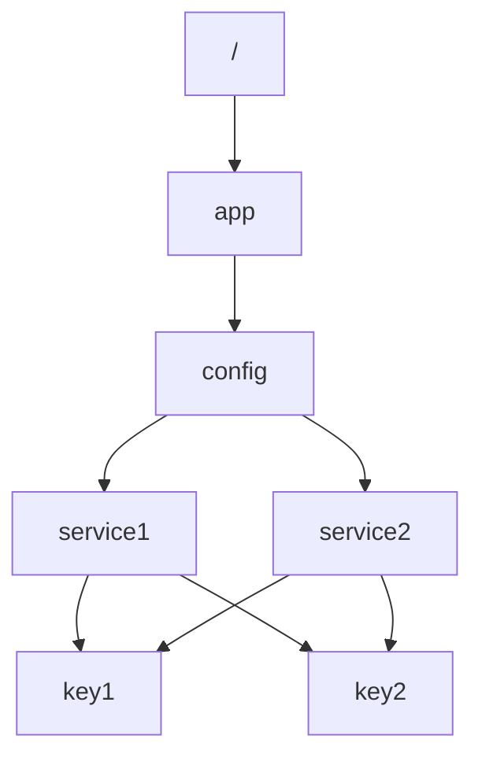

# Zookeeper 数据模型设计

Zookeeper 是一个分布式协调服务，广泛用于分布式系统中的配置管理、命名服务、分布式锁和集群管理。Zookeeper 的核心是其数据模型，理解并正确设计 Zookeeper 的数据模型是构建高效、可靠分布式系统的关键。

## 什么是 Zookeeper 数据模型？

Zookeeper 的数据模型类似于文件系统的树形结构，称为 **ZNode 树**。每个节点（ZNode）可以存储数据，并且可以有子节点。ZNode 树的设计直接影响 Zookeeper 的性能和可用性，因此需要仔细规划。

### ZNode 的基本特性

- **路径**：每个 ZNode 都有一个唯一的路径，类似于文件系统中的路径。例如，`/app/config`。
- **数据**：ZNode 可以存储少量数据（默认最大 1MB）。
- **类型**：ZNode 可以是持久的（PERSISTENT）或临时的（EPHEMERAL）。临时节点在客户端会话结束时自动删除。
- **版本**：每个 ZNode 都有一个版本号，用于实现乐观锁机制。

## ZNode 树的设计原则

在设计 ZNode 树时，遵循以下原则可以提高系统的性能和可维护性：

1. **层次化设计**：将 ZNode 树设计为层次化结构，类似于文件系统的目录结构。例如，`/app/config` 和 `/app/locks`。
2. **避免过深的层级**：过深的层级会增加路径查找的复杂性，建议层级不超过 10 层。
3. **合理使用临时节点**：临时节点适用于会话相关的数据，例如客户端注册信息。
4. **数据最小化**：ZNode 存储的数据应尽可能小，避免影响性能。

## 实际案例：分布式配置管理

假设我们有一个分布式系统，需要管理多个服务的配置。我们可以使用 Zookeeper 来存储这些配置。

### 设计 ZNode 树



在这个设计中，`/app/config` 是配置的根节点，`service1` 和 `service2` 是服务的配置节点，`key1` 和 `key2` 是具体的配置项。

### 代码示例

以下是一个使用 Zookeeper Java 客户端创建和读取配置的示例：

```java
import org.apache.zookeeper.CreateMode;
import org.apache.zookeeper.ZooDefs;
import org.apache.zookeeper.ZooKeeper;

public class ZookeeperConfigManager {
    private ZooKeeper zooKeeper;

    public ZookeeperConfigManager(String connectString) throws Exception {
        this.zooKeeper = new ZooKeeper(connectString, 3000, null);
    }

    public void createConfig(String path, String data) throws Exception {
        zooKeeper.create(path, data.getBytes(), ZooDefs.Ids.OPEN_ACL_UNSAFE, CreateMode.PERSISTENT);
    }

    public String getConfig(String path) throws Exception {
        byte[] data = zooKeeper.getData(path, false, null);
        return new String(data);
    }

    public static void main(String[] args) throws Exception {
        ZookeeperConfigManager manager = new ZookeeperConfigManager("localhost:2181");
        manager.createConfig("/app/config/service1/key1", "value1");
        String value = manager.getConfig("/app/config/service1/key1");
        System.out.println("Config value: " + value);
    }
}
```

### 输入和输出

- **输入**：创建路径 `/app/config/service1/key1`，并设置数据为 `value1`。
- **输出**：读取路径 `/app/config/service1/key1` 的数据，输出为 `value1`。

:::tip
在实际应用中，建议使用 Zookeeper 的监听机制（Watcher）来实时获取配置变更。
:::

## 总结

Zookeeper 的数据模型设计是构建高效分布式系统的基础。通过层次化设计、合理使用临时节点和数据最小化等原则，可以确保 Zookeeper 的性能和可维护性。在实际应用中，Zookeeper 常用于分布式配置管理、命名服务和分布式锁等场景。

## 附加资源

- [Zookeeper 官方文档](https://zookeeper.apache.org/doc/current/)
- [Zookeeper 编程指南](https://zookeeper.apache.org/doc/current/zookeeperProgrammers.html)

## 练习

1. 设计一个 ZNode 树，用于管理一个分布式任务调度系统的任务队列。
2. 编写代码实现 Zookeeper 的监听机制，实时获取配置变更。
