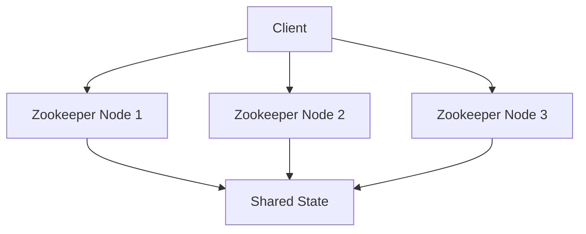
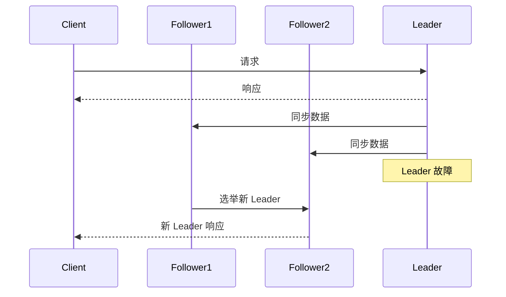

# Zookeeper 高可用最佳实践

Zookeeper 是一个分布式协调服务，广泛用于分布式系统中管理配置信息、命名服务、分布式锁和集群管理。为了确保 Zookeeper 服务的高可用性，必须遵循一些最佳实践。本文将详细介绍这些实践，帮助初学者理解和实现 Zookeeper 的高可用性。

## 什么是 Zookeeper 高可用性？

高可用性（High Availability, HA）是指系统能够在预定的时间内持续提供服务的能力。对于 Zookeeper 来说，高可用性意味着即使在部分节点发生故障的情况下，Zookeeper 集群仍能继续正常运行，确保服务的连续性和数据的完整性。

## Zookeeper 高可用性的关键要素

### 1. 集群配置

Zookeeper 的高可用性依赖于其集群配置。一个 Zookeeper 集群通常由多个节点组成，这些节点共同维护一个共享的状态。为了确保高可用性，建议至少配置 **3 个或 5 个节点**。



:::tip
奇数个节点有助于在选举过程中避免“脑裂”问题。
:::

### 2. 数据目录和日志目录分离

为了提高性能和数据安全性，建议将 Zookeeper 的数据目录（`dataDir`）和事务日志目录（`dataLogDir`）分别存储在不同的磁盘上。这样可以减少 I/O 竞争，提高写入性能。

```ini
# zookeeper.conf
dataDir=/path/to/dataDir
dataLogDir=/path/to/dataLogDir
```

### 3. 监控和告警

实时监控 Zookeeper 集群的状态是确保高可用性的关键。可以使用 Zookeeper 自带的四字命令（如 `stat`、`mntr`）或第三方监控工具（如 Prometheus）来监控集群的健康状况。

```bash
echo stat | nc localhost 2181
```

:::note
`stat` 命令可以返回 Zookeeper 节点的状态信息，包括连接数、延迟等。
:::

### 4. 自动故障转移

Zookeeper 通过 Zab 协议（Zookeeper Atomic Broadcast）实现自动故障转移。当 Leader 节点发生故障时，集群会自动选举新的 Leader，确保服务的连续性。



### 5. 备份和恢复

定期备份 Zookeeper 的数据目录和事务日志是确保数据安全的重要措施。可以使用 `zkServer.sh` 脚本或手动复制数据目录来进行备份。

```bash
zkServer.sh start
zkServer.sh stop
cp -r /path/to/dataDir /backup/dataDir
cp -r /path/to/dataLogDir /backup/dataLogDir
```

:::caution
在备份过程中，确保 Zookeeper 服务已停止，以避免数据不一致。
:::

## 实际案例

假设我们有一个分布式系统，使用 Zookeeper 来管理配置信息和分布式锁。为了确保系统的高可用性，我们配置了一个由 5 个节点组成的 Zookeeper 集群，并将数据目录和日志目录分别存储在不同的磁盘上。我们还设置了监控和告警系统，实时监控集群的健康状况。

```ini
# zookeeper.conf
server.1=node1:2888:3888
server.2=node2:2888:3888
server.3=node3:2888:3888
server.4=node4:2888:3888
server.5=node5:2888:3888
```

:::warning
确保每个节点的 `myid` 文件与配置文件中的 `server.x` 匹配。
:::

## 总结

通过遵循上述最佳实践，可以显著提高 Zookeeper 集群的高可用性，确保分布式系统的稳定性和可靠性。关键点包括合理配置集群、分离数据目录和日志目录、实时监控、自动故障转移以及定期备份。

## 附加资源

- [Zookeeper 官方文档](https://zookeeper.apache.org/doc/current/)
- [Zookeeper 监控指南](https://prometheus.io/docs/guides/zookeeper/)
- [Zookeeper 备份和恢复指南](https://zookeeper.apache.org/doc/current/zookeeperAdmin.html#sc_backingUp)

## 练习

1. 配置一个由 3 个节点组成的 Zookeeper 集群，并测试其高可用性。
2. 使用 `stat` 命令监控 Zookeeper 节点的状态，并记录结果。
3. 模拟 Leader 节点故障，观察集群如何自动选举新的 Leader。

通过完成这些练习，您将更深入地理解 Zookeeper 高可用性的实现原理和最佳实践。