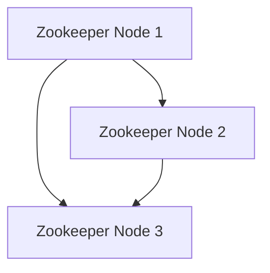

# Zookeeper 运维最佳实践

Zookeeper 是一个分布式协调服务，广泛应用于分布式系统中。它通过提供分布式锁、配置管理、命名服务等功能，帮助系统实现高可用性和一致性。然而，要确保 Zookeeper 集群的稳定运行，需要遵循一些最佳实践。本文将逐步介绍这些实践，并通过实际案例展示其应用。

## 1. 集群规划与部署

### 1.1 集群规模

Zookeeper 集群通常由奇数个节点组成，以确保在发生网络分区时能够进行选举。常见的集群规模为 3、5 或 7 个节点。节点数量越多，集群的容错能力越强，但也会增加网络通信的开销。

### 1.2 硬件配置

Zookeeper 对磁盘 I/O 和网络延迟非常敏感，因此建议使用高性能的 SSD 磁盘和低延迟的网络设备。此外，确保每个节点有足够的内存和 CPU 资源，以应对高并发请求。

### 1.3 部署策略

在部署 Zookeeper 集群时，建议将节点分布在不同的物理机或数据中心，以避免单点故障。例如，可以将三个节点分别部署在三个不同的机架上。



## 2. 配置优化

### 2.1 数据目录与日志目录

Zookeeper 的数据目录和日志目录应分别配置在不同的磁盘上，以避免 I/O 竞争。例如：

```bash
dataDir=/data/zookeeper/data
dataLogDir=/data/zookeeper/logs
```

### 2.2 内存与快照配置

Zookeeper 会将所有数据存储在内存中，因此需要根据数据量调整 `-Xmx` 参数。此外，定期清理快照和日志文件，以防止磁盘空间耗尽。

```bash
# 设置 JVM 最大内存
export JVMFLAGS="-Xmx4G"
```

### 2.3 客户端连接数

Zookeeper 默认的最大客户端连接数为 60，可以通过调整 `maxClientCnxns` 参数来增加连接数。例如：

```bash
maxClientCnxns=1000
```

## 3. 监控与报警

### 3.1 监控指标

Zookeeper 提供了丰富的监控指标，包括连接数、请求延迟、节点状态等。可以使用 Prometheus 或 Zabbix 等工具进行监控。

```bash
# 使用四字命令查看 Zookeeper 状态
echo stat | nc localhost 2181
```

### 3.2 报警策略

根据监控指标设置报警策略，例如当连接数超过阈值或节点状态异常时，及时通知运维人员。

:::tip
建议设置多个报警渠道，如邮件、短信和即时通讯工具，以确保报警信息能够及时传达。
:::

## 4. 备份与恢复

### 4.1 数据备份

定期备份 Zookeeper 的数据目录和日志目录，以防止数据丢失。可以使用 `rsync` 或 `scp` 等工具进行备份。

```bash
# 使用 rsync 备份数据目录
rsync -avz /data/zookeeper/data backup-server:/backup/zookeeper/data
```

### 4.2 数据恢复

在数据丢失或损坏时，可以从备份中恢复数据。首先停止 Zookeeper 服务，然后替换数据目录和日志目录，最后重启服务。

:::caution
在恢复数据时，确保所有节点的数据一致，以避免集群分裂。
:::

## 5. 实际案例

### 5.1 案例一：集群扩容

某公司 Zookeeper 集群最初由 3 个节点组成，随着业务增长，连接数逐渐增加，导致性能下降。运维团队决定将集群扩容到 5 个节点。

1. 部署两个新的 Zookeeper 节点。
2. 修改现有节点的配置文件，添加新节点的信息。
3. 依次重启所有节点，确保新节点成功加入集群。

### 5.2 案例二：磁盘空间不足

某 Zookeeper 集群由于日志文件未及时清理，导致磁盘空间不足，服务中断。运维团队采取了以下措施：

1. 清理旧的快照和日志文件。
2. 设置定期清理任务，防止问题再次发生。
3. 增加磁盘空间，并监控磁盘使用情况。

## 6. 总结

Zookeeper 的运维需要从集群规划、配置优化、监控报警、备份恢复等多个方面进行综合考虑。通过遵循本文介绍的最佳实践，可以有效提高 Zookeeper 集群的稳定性和性能。

## 7. 附加资源与练习

- **官方文档**: [Zookeeper 官方文档](https://zookeeper.apache.org/doc/current/)
- **练习**: 尝试部署一个 3 节点的 Zookeeper 集群，并配置监控和报警系统。

:::note
如果你在练习中遇到问题，可以参考官方文档或社区论坛，寻求帮助。
:::