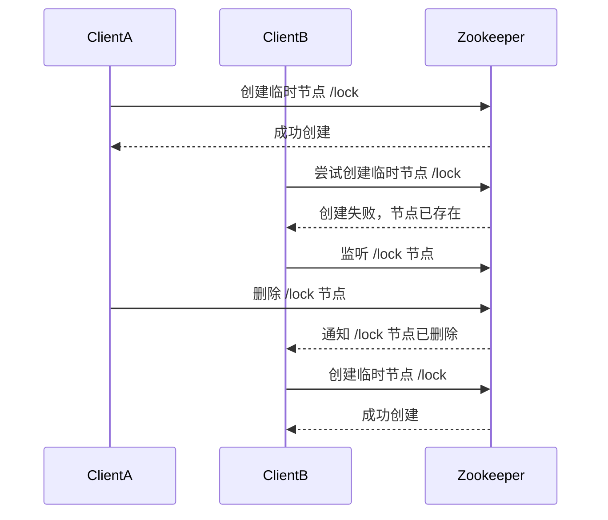

# Zookeeper 原子操作

## 介绍

Zookeeper是一个分布式协调服务，广泛用于分布式系统中的配置管理、命名服务、分布式锁等场景。在分布式系统中，数据的一致性和可靠性至关重要。Zookeeper通过提供**原子操作**来确保这些特性。

**原子操作**是指一个操作要么完全执行，要么完全不执行，不会出现部分执行的情况。在Zookeeper中，原子操作保证了在并发环境下，多个客户端对同一数据的操作不会产生冲突或数据不一致的问题。

## Zookeeper 中的原子操作

Zookeeper提供了多种原子操作，主要包括：

1. **创建节点（Create）**：原子性地创建一个节点。
2. **删除节点（Delete）**：原子性地删除一个节点。
3. **设置数据（SetData）**：原子性地更新节点的数据。
4. **检查并设置（Check-and-Set, CAS）**：在更新节点数据时，先检查节点的版本号，如果版本号匹配，则更新数据。

### 创建节点（Create）

创建一个节点时，Zookeeper会确保该操作是原子性的。如果创建成功，节点会被立即添加到Zookeeper的树结构中；如果失败，则不会创建任何节点。

```java
// 示例：使用Zookeeper客户端创建一个节点
String path = "/example";
byte[] data = "Hello, Zookeeper!".getBytes();
CreateMode mode = CreateMode.PERSISTENT;
String createdPath = zk.create(path, data, ZooDefs.Ids.OPEN_ACL_UNSAFE, mode);
System.out.println("Created path: " + createdPath);
```

**输出：**
```
Created path: /example
```

### 删除节点（Delete）

删除节点时，Zookeeper会确保该操作是原子性的。如果删除成功，节点会立即从Zookeeper的树结构中移除；如果失败，则节点不会被删除。

```java
// 示例：使用Zookeeper客户端删除一个节点
String path = "/example";
int version = -1; // -1表示忽略版本号
zk.delete(path, version);
System.out.println("Deleted path: " + path);
```

**输出：**
```
Deleted path: /example
```

### 设置数据（SetData）

设置节点数据时，Zookeeper会确保该操作是原子性的。如果设置成功，节点的数据会被立即更新；如果失败，则数据不会被修改。

```java
// 示例：使用Zookeeper客户端设置节点数据
String path = "/example";
byte[] newData = "Updated data".getBytes();
int version = -1; // -1表示忽略版本号
Stat stat = zk.setData(path, newData, version);
System.out.println("Data updated at version: " + stat.getVersion());
```

**输出：**
```
Data updated at version: 2
```

### 检查并设置（Check-and-Set, CAS）

CAS操作是一种常见的原子操作，它允许在更新数据之前先检查数据的版本号。如果版本号匹配，则更新数据；否则，操作失败。

```java
// 示例：使用Zookeeper客户端进行CAS操作
String path = "/example";
byte[] newData = "CAS updated data".getBytes();
int expectedVersion = 2; // 期望的版本号
Stat stat = zk.setData(path, newData, expectedVersion);
System.out.println("CAS updated at version: " + stat.getVersion());
```

**输出：**
```
CAS updated at version: 3
```

## 实际应用场景

### 分布式锁

在分布式系统中，Zookeeper的原子操作常用于实现分布式锁。通过创建一个临时节点，多个客户端可以竞争锁。只有成功创建节点的客户端才能获得锁，其他客户端则需要等待。



### 配置管理

Zookeeper的原子操作还可以用于配置管理。多个客户端可以同时读取和更新配置数据，Zookeeper会确保这些操作的原子性，从而避免配置数据的不一致。

## 总结

Zookeeper的原子操作是确保分布式系统中数据一致性和可靠性的关键。通过创建、删除、设置数据以及CAS操作，Zookeeper能够在并发环境下提供强大的协调能力。掌握这些操作对于构建可靠的分布式系统至关重要。

## 附加资源

- [Zookeeper官方文档](https://zookeeper.apache.org/doc/current/)
- [Zookeeper编程指南](https://zookeeper.apache.org/doc/current/zookeeperProgrammers.html)

## 练习

1. 使用Zookeeper客户端实现一个简单的分布式锁。
2. 尝试使用CAS操作更新一个节点的数据，并观察版本号的变化。
3. 在Zookeeper中创建一个临时节点，并观察其生命周期。

:::tip
在练习过程中，建议使用Zookeeper的本地开发环境，以便更好地理解和调试代码。
:::