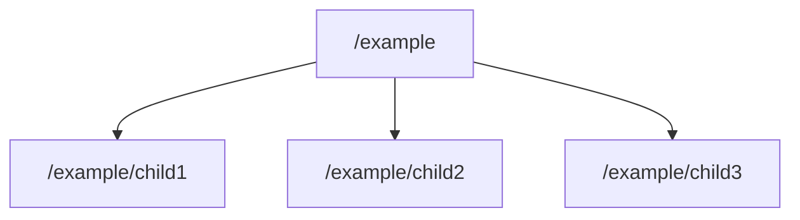

# Zookeeper 节点子节点获取

Zookeeper是一个分布式协调服务，广泛用于分布式系统中的配置管理、命名服务、分布式锁等场景。在Zookeeper中，数据以节点的形式存储，节点可以包含子节点。获取节点的子节点是Zookeeper操作中的一个基本功能，本文将详细介绍如何实现这一操作。

## 什么是Zookeeper节点子节点获取？

在Zookeeper中，每个节点都可以包含多个子节点。子节点获取操作是指获取某个特定节点的所有直接子节点的名称。这个操作在需要遍历Zookeeper树结构时非常有用，例如在查找某个路径下的所有子节点时。

## 基本操作

Zookeeper提供了`getChildren`方法来获取某个节点的子节点。这个方法返回一个包含子节点名称的列表。

### 代码示例

以下是一个使用Java API获取Zookeeper节点子节点的示例：

```java
import org.apache.zookeeper.ZooKeeper;
import org.apache.zookeeper.KeeperException;
import java.io.IOException;
import java.util.List;

public class ZookeeperExample {
    public static void main(String[] args) throws IOException, KeeperException, InterruptedException {
        // 连接到Zookeeper服务器
        ZooKeeper zooKeeper = new ZooKeeper("localhost:2181", 3000, null);

        // 获取节点"/example"的子节点
        List<String> children = zooKeeper.getChildren("/example", false);

        // 打印子节点名称
        for (String child : children) {
            System.out.println(child);
        }

        // 关闭连接
        zooKeeper.close();
    }
}
```

### 输入和输出

假设Zookeeper中存在以下节点结构：



运行上述代码后，输出将是：

```
child1
child2
child3
```

## 逐步讲解

1. **连接到Zookeeper服务器**：首先，我们需要创建一个`ZooKeeper`对象，并连接到Zookeeper服务器。`localhost:2181`是Zookeeper服务器的地址，`3000`是会话超时时间。

2. **获取子节点**：使用`getChildren`方法获取指定节点的子节点。第一个参数是节点路径，第二个参数是一个布尔值，表示是否监视该节点的子节点变化。

3. **处理子节点列表**：`getChildren`方法返回一个包含子节点名称的列表。我们可以遍历这个列表，并对每个子节点进行处理。

4. **关闭连接**：操作完成后，记得关闭Zookeeper连接以释放资源。

## 实际应用场景

### 配置管理

在分布式系统中，Zookeeper常用于存储配置信息。例如，一个分布式系统可能有多个服务实例，每个实例都需要获取相同的配置。通过将配置存储在Zookeeper节点中，并使用`getChildren`方法获取所有配置项，可以轻松实现配置的动态更新和同步。

### 服务发现

在微服务架构中，服务发现是一个重要功能。Zookeeper可以用于存储服务的注册信息。通过获取某个路径下的所有子节点，可以动态发现当前可用的服务实例。

## 总结

获取Zookeeper节点的子节点是一个基本但非常重要的操作。通过`getChildren`方法，我们可以轻松获取某个节点的所有子节点，并在分布式系统中实现配置管理、服务发现等功能。

:::tip
在实际应用中，建议对Zookeeper操作进行异常处理，以应对网络波动或节点不存在等情况。
:::

## 附加资源

- [Zookeeper官方文档](https://zookeeper.apache.org/doc/current/)
- [Zookeeper Java API文档](https://zookeeper.apache.org/doc/current/api/index.html)

## 练习

1. 尝试在本地搭建一个Zookeeper服务器，并创建一些节点和子节点。
2. 编写一个程序，使用`getChildren`方法获取某个节点的子节点，并打印出来。
3. 修改程序，使其能够监视子节点的变化，并在子节点发生变化时打印出新的子节点列表。
