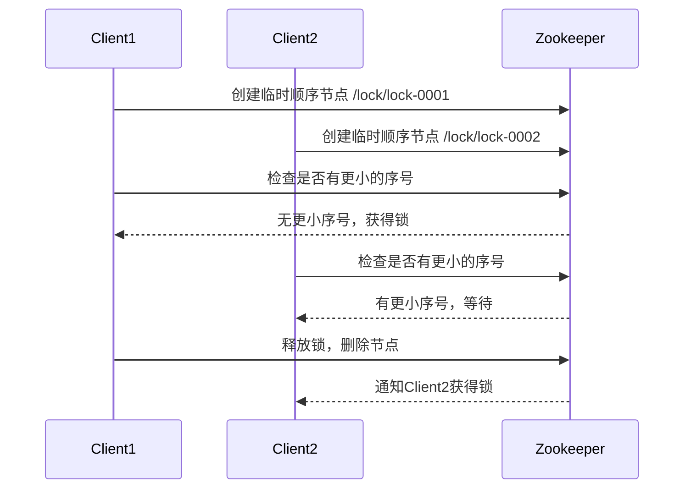

## 介绍

Zookeeper是一个分布式协调服务，广泛用于分布式系统中。它的核心是一个层次化的命名空间，类似于文件系统的目录结构。Zookeeper的数据模型是其功能的基础，理解并遵循最佳实践可以帮助你更好地利用Zookeeper进行分布式协调。

## Zookeeper 数据模型概述

Zookeeper的数据模型是一个树形结构，每个节点称为一个“znode”。每个znode可以存储数据，并且可以有子节点。znode的类型决定了它的行为和生命周期。

### Znode类型

Zookeeper中有以下几种znode类型：

1. **持久节点（Persistent）**：持久节点在创建后会一直存在，直到显式删除。
2. **临时节点（Ephemeral）**：临时节点的生命周期与客户端会话绑定，会话结束时节点会被自动删除。
3. **顺序节点（Sequential）**：顺序节点在创建时会被分配一个唯一的递增序号。

### Znode路径

每个znode都有一个唯一的路径，路径由斜杠（`/`）分隔。例如，`/app/config` 是一个有效的znode路径。

## 最佳实践

### 1. 合理设计Znode路径

设计znode路径时，应遵循以下原则：

- **层次化**：使用层次化的路径结构，类似于文件系统的目录结构。例如，`/app/config/database` 和 `/app/config/cache`。
- **简洁**：避免过长的路径，保持路径简洁易读。
- **一致性**：在整个系统中保持路径命名的一致性。

### 2. 选择合适的Znode类型

根据应用场景选择合适的znode类型：

- **持久节点**：适用于存储配置信息、元数据等需要长期保存的数据。
- **临时节点**：适用于表示临时状态，如会话信息、临时锁等。
- **顺序节点**：适用于需要唯一标识的场景，如分布式锁、队列等。

### 3. 避免大Znode

Zookeeper的设计初衷是存储小量数据，因此应避免在znode中存储大量数据。通常，znode的数据大小应控制在1MB以内。

### 4. 使用Watcher机制

Zookeeper提供了Watcher机制，可以在znode发生变化时通知客户端。合理使用Watcher机制可以减少轮询开销，提高系统效率。

```java
// 示例：使用Watcher监听znode变化
Watcher watcher = new Watcher() {
    public void process(WatchedEvent event) {
        System.out.println("Znode changed: " + event.getPath());
    }
};
ZooKeeper zooKeeper = new ZooKeeper("localhost:2181", 3000, watcher);
zooKeeper.getData("/app/config", watcher, null);
```

### 5. 处理并发问题

在分布式环境中，多个客户端可能同时访问同一个znode。Zookeeper提供了版本号机制来处理并发问题。每次更新znode时，版本号会递增，客户端在更新znode时需要指定正确的版本号。

```java
// 示例：使用版本号更新znode
Stat stat = zooKeeper.exists("/app/config", false);
zooKeeper.setData("/app/config", "new data".getBytes(), stat.getVersion());
```

### 6. 使用ACL控制访问权限

Zookeeper支持ACL（访问控制列表），可以为每个znode设置访问权限。合理使用ACL可以保护敏感数据，防止未经授权的访问。

```java
// 示例：设置ACL
List<ACL> acl = ZooDefs.Ids.OPEN_ACL_UNSAFE;
zooKeeper.create("/app/config", "data".getBytes(), acl, CreateMode.PERSISTENT);
```

## 实际案例

### 分布式锁

Zookeeper常用于实现分布式锁。通过创建一个临时顺序节点，客户端可以竞争锁。只有持有最小序号的节点才能获得锁。



### 配置管理

Zookeeper可以用于集中管理分布式系统的配置信息。通过监听配置节点的变化，客户端可以实时获取最新的配置。

```java
// 示例：监听配置节点
Watcher configWatcher = new Watcher() {
    public void process(WatchedEvent event) {
        if (event.getType() == Event.EventType.NodeDataChanged) {
            byte[] data = zooKeeper.getData("/app/config", configWatcher, null);
            System.out.println("Config updated: " + new String(data));
        }
    }
};
zooKeeper.getData("/app/config", configWatcher, null);
```

## 总结

Zookeeper的数据模型是分布式协调服务的基础。通过合理设计znode路径、选择合适的znode类型、避免大znode、使用Watcher机制、处理并发问题和使用ACL控制访问权限，可以高效地利用Zookeeper进行分布式协调。

## 附加资源

- [Zookeeper官方文档](https://zookeeper.apache.org/doc/current/)
- [Zookeeper编程指南](https://zookeeper.apache.org/doc/current/zookeeperProgrammers.html)
- [分布式系统设计与实践](https://www.oreilly.com/library/view/designing-distributed-systems/9781491983638/)

## 练习

1. 设计一个Zookeeper路径结构，用于管理一个分布式系统的配置信息。
2. 实现一个简单的分布式锁，使用Zookeeper的临时顺序节点。
3. 编写代码监听一个配置节点的变化，并在配置更新时打印新配置。

通过以上练习，你将更深入地理解Zookeeper数据模型的最佳实践。