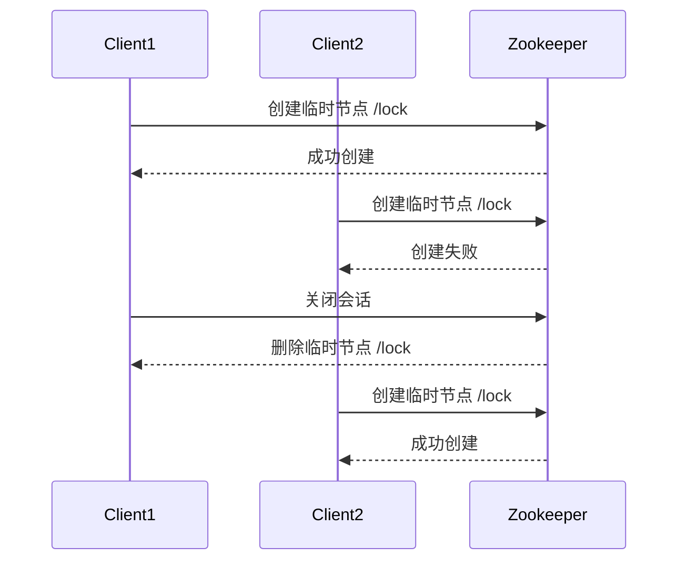

# Zookeeper 临时节点

Zookeeper 是一个分布式协调服务，广泛应用于分布式系统中。在 Zookeeper 的数据模型中，节点（ZNode）是核心概念之一。临时节点（Ephemeral Node）是 Zookeeper 中一种特殊的节点类型，具有独特的生命周期和行为。本文将详细介绍临时节点的概念、特性、使用场景以及如何通过代码创建和管理临时节点。

## 什么是临时节点？

临时节点是 Zookeeper 中的一种节点类型，其生命周期与创建它的客户端会话（Session）绑定。当客户端会话结束时（例如客户端断开连接或会话超时），临时节点会自动被删除。这种特性使得临时节点非常适合用于实现分布式系统中的临时状态管理，例如服务注册与发现、分布式锁等。

### 临时节点的特性

1. **生命周期与会话绑定**：临时节点的生命周期与创建它的客户端会话绑定。当会话结束时，临时节点会被自动删除。
2. **不可有子节点**：临时节点不能有子节点。这意味着临时节点只能是叶子节点。
3. **自动删除**：当客户端会话结束时，临时节点会被 Zookeeper 自动删除。

## 创建临时节点

在 Zookeeper 中，可以通过客户端 API 创建临时节点。以下是一个使用 Java 客户端创建临时节点的示例：

```java
import org.apache.zookeeper.CreateMode;
import org.apache.zookeeper.ZooDefs;
import org.apache.zookeeper.ZooKeeper;

public class ZookeeperExample {
    public static void main(String[] args) throws Exception {
        // 连接到 Zookeeper 服务器
        ZooKeeper zooKeeper = new ZooKeeper("localhost:2181", 3000, null);

        // 创建临时节点
        String path = zooKeeper.create("/ephemeralNode", "data".getBytes(), ZooDefs.Ids.OPEN_ACL_UNSAFE, CreateMode.EPHEMERAL);

        System.out.println("临时节点创建成功，路径为: " + path);

        // 保持会话以观察临时节点的生命周期
        Thread.sleep(60000);

        // 关闭会话
        zooKeeper.close();
    }
}
```

### 代码解释

- `ZooKeeper zooKeeper = new ZooKeeper("localhost:2181", 3000, null);`：连接到 Zookeeper 服务器。
- `zooKeeper.create("/ephemeralNode", "data".getBytes(), ZooDefs.Ids.OPEN_ACL_UNSAFE, CreateMode.EPHEMERAL);`：创建一个临时节点，路径为 `/ephemeralNode`，数据为 `"data"`，权限为 `OPEN_ACL_UNSAFE`，节点类型为 `EPHEMERAL`。
- `Thread.sleep(60000);`：保持会话 60 秒，以便观察临时节点的生命周期。
- `zooKeeper.close();`：关闭会话，临时节点将被自动删除。

## 临时节点的实际应用场景

临时节点在分布式系统中有广泛的应用场景，以下是一些常见的例子：

### 1. 服务注册与发现

在微服务架构中，服务实例需要向服务注册中心注册自己，以便其他服务能够发现并调用它们。临时节点非常适合用于实现服务注册与发现。当服务实例启动时，它会在 Zookeeper 中创建一个临时节点来注册自己。如果服务实例崩溃或下线，临时节点会被自动删除，从而确保服务注册中心的实时性。

```mermaid
graph TD
    A[服务实例1] -->|注册| B[/service/instance1]
    C[服务实例2] -->|注册| D[/service/instance2]
    E[服务实例3] -->|注册| F[/service/instance3]
    G[服务消费者] -->|发现| B
    G -->|发现| D
    G -->|发现| F
```

### 2. 分布式锁

临时节点也可以用于实现分布式锁。多个客户端可以尝试在 Zookeeper 中创建同一个临时节点，只有一个客户端能够成功创建该节点，从而获得锁。当持有锁的客户端会话结束时，临时节点会被删除，其他客户端可以再次尝试获取锁。



## 总结

临时节点是 Zookeeper 中一种非常有用的节点类型，其生命周期与客户端会话绑定，适用于需要临时状态管理的场景。通过本文的介绍，你应该已经了解了临时节点的特性、如何创建临时节点以及它在实际应用中的使用场景。

:::tip 提示
在实际使用中，临时节点的自动删除特性可以帮助你简化分布式系统中的状态管理，但也要注意会话超时等问题，确保系统的稳定性。
:::

## 附加资源与练习

- **练习**：尝试在本地搭建一个 Zookeeper 环境，并使用客户端 API 创建和管理临时节点。
- **资源**：阅读 Zookeeper 官方文档，了解更多关于临时节点和其他节点类型的详细信息。

通过实践和深入学习，你将能够更好地掌握 Zookeeper 临时节点的使用，并在分布式系统中灵活应用。