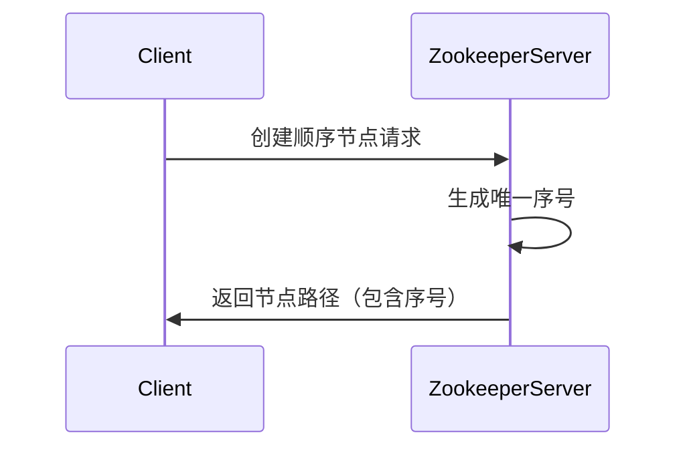

# Zookeeper 顺序节点

Zookeeper是一个分布式协调服务，广泛用于分布式系统中的配置管理、命名服务、分布式锁等场景。在Zookeeper中，**顺序节点（Sequential Node）**是一种特殊的节点类型，它在创建时会自动附加一个单调递增的序号。本文将详细介绍顺序节点的概念、工作原理以及实际应用。

## 什么是顺序节点？

在Zookeeper中，节点（ZNode）是数据模型的基本单元。顺序节点是一种特殊的节点类型，它在创建时会自动在节点名称后附加一个10位的数字序号。这个序号由Zookeeper服务器生成，并且保证在同一个父节点下是唯一的、单调递增的。

顺序节点的主要特点是：
1. **唯一性**：同一个父节点下的顺序节点名称不会重复。
2. **有序性**：序号是单调递增的，可以用于实现分布式队列、分布式锁等场景。

## 如何创建顺序节点？

在Zookeeper中，可以通过API创建顺序节点。以下是一个使用Zookeeper Java客户端创建顺序节点的示例：

```java
import org.apache.zookeeper.CreateMode;
import org.apache.zookeeper.ZooDefs;
import org.apache.zookeeper.ZooKeeper;

public class SequentialNodeExample {
    public static void main(String[] args) throws Exception {
        // 连接到Zookeeper服务器
        ZooKeeper zookeeper = new ZooKeeper("localhost:2181", 3000, null);

        // 创建顺序节点
        String path = zookeeper.create("/myapp/task-", "taskData".getBytes(),
                ZooDefs.Ids.OPEN_ACL_UNSAFE, CreateMode.PERSISTENT_SEQUENTIAL);

        System.out.println("Created sequential node: " + path);
    }
}
```

**输出示例：**
```
Created sequential node: /myapp/task-0000000001
```

在这个示例中，`CreateMode.PERSISTENT_SEQUENTIAL`表示创建一个持久化的顺序节点。Zookeeper会自动在节点名称后附加一个序号（如`0000000001`）。

:::note
顺序节点的序号是10位的数字，从`0000000001`开始递增。如果需要更高的序号位数，可以通过配置Zookeeper服务器进行调整。
:::

## 顺序节点的工作原理

顺序节点的序号是由Zookeeper服务器生成的，保证了在同一个父节点下的唯一性和有序性。以下是顺序节点的工作原理：

1. **客户端请求**：客户端向Zookeeper服务器发送创建顺序节点的请求。
2. **序号生成**：Zookeeper服务器根据当前父节点下的子节点数量生成一个唯一的序号，并将其附加到节点名称后。
3. **节点创建**：Zookeeper服务器创建节点，并返回完整的节点路径（包含序号）给客户端。



## 顺序节点的实际应用

顺序节点在分布式系统中有广泛的应用场景，以下是几个常见的例子：

### 1. 分布式队列

顺序节点可以用于实现分布式队列。每个任务作为一个顺序节点创建，任务的处理顺序可以通过节点的序号来确定。

```java
// 创建任务节点
String taskPath = zookeeper.create("/queue/task-", "taskData".getBytes(),
        ZooDefs.Ids.OPEN_ACL_UNSAFE, CreateMode.PERSISTENT_SEQUENTIAL);

// 获取队列中的第一个任务
List<String> tasks = zookeeper.getChildren("/queue", false);
Collections.sort(tasks); // 按序号排序
String firstTask = tasks.get(0);
```

### 2. 分布式锁

顺序节点也可以用于实现分布式锁。每个客户端尝试获取锁时，创建一个顺序节点。序号最小的节点获得锁，其他节点监听前一个节点的删除事件。

```java
// 创建锁节点
String lockPath = zookeeper.create("/locks/lock-", "lockData".getBytes(),
        ZooDefs.Ids.OPEN_ACL_UNSAFE, CreateMode.EPHEMERAL_SEQUENTIAL);

// 检查是否获得锁
List<String> locks = zookeeper.getChildren("/locks", false);
Collections.sort(locks);
if (lockPath.endsWith(locks.get(0))) {
    System.out.println("Lock acquired");
} else {
    // 监听前一个节点的删除事件
    String previousLock = locks.get(Collections.binarySearch(locks, lockPath) - 1);
    zookeeper.exists("/locks/" + previousLock, new LockWatcher());
}
```

## 总结

顺序节点是Zookeeper中一种强大的特性，能够为分布式系统提供唯一性和有序性支持。通过本文的介绍，你应该已经了解了顺序节点的基本概念、创建方法以及实际应用场景。

:::tip
如果你对Zookeeper的其他特性感兴趣，可以继续学习临时节点、观察者机制等内容。
:::

## 附加资源

- [Zookeeper官方文档](https://zookeeper.apache.org/doc/current/)
- 《从Paxos到Zookeeper：分布式一致性原理与实践》

## 练习

1. 使用Zookeeper Java客户端创建一个顺序节点，并观察其序号的变化。
2. 尝试实现一个简单的分布式队列，使用顺序节点来管理任务顺序。
3. 研究如何使用顺序节点实现分布式锁，并编写代码验证其正确性。