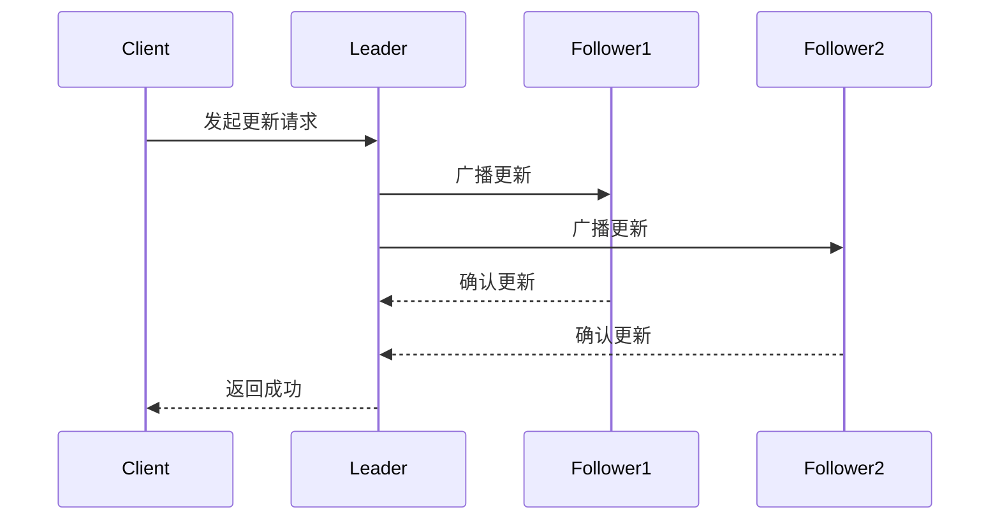
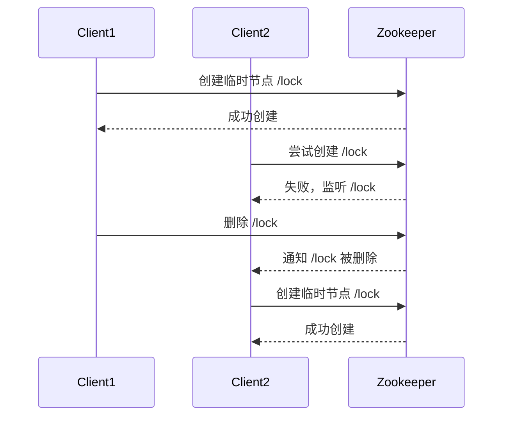

# Zookeeper 数据一致性

Zookeeper 是一个分布式协调服务，广泛用于管理分布式系统中的配置信息、命名服务、分布式锁和集群管理。在分布式系统中，**数据一致性**是一个核心问题。Zookeeper 通过其独特的设计和协议，确保了数据的一致性。本文将详细介绍 Zookeeper 如何实现数据一致性，并通过示例和实际案例帮助你更好地理解这一概念。

---

## 什么是数据一致性？

在分布式系统中，数据一致性指的是多个节点在同一时间对同一份数据的视图保持一致。由于网络延迟、节点故障等原因，分布式系统中的数据可能会出现不一致的情况。Zookeeper 通过其**原子广播协议（Zab）**和**顺序一致性模型**，确保了数据的一致性。

:::note
**顺序一致性**：Zookeeper 保证所有更新操作按照全局顺序执行，客户端看到的更新顺序是一致的。
:::

---

## Zookeeper 的一致性保证

Zookeeper 提供了以下一致性保证：

1. **顺序一致性**：客户端发起的更新操作会按照它们被发送的顺序执行。
2. **原子性**：更新操作要么全部成功，要么全部失败。
3. **单一系统映像**：无论客户端连接到哪个 Zookeeper 服务器，都会看到相同的数据视图。
4. **可靠性**：一旦一个更新操作被应用，它将一直保持，直到被另一个更新操作覆盖。
5. **及时性**：客户端在一定时间内能够看到最新的数据。

---

## Zookeeper 如何实现一致性？

Zookeeper 通过以下机制实现数据一致性：

### 1. Zab 协议
Zab（Zookeeper Atomic Broadcast）是 Zookeeper 的核心协议，用于在集群中广播状态更新。它确保所有更新操作按照相同的顺序应用到所有节点。



### 2. 领导者选举
Zookeeper 集群中有一个领导者（Leader），负责处理所有写请求。其他节点是追随者（Followers），负责同步领导者的数据。如果领导者宕机，Zookeeper 会通过选举机制选出新的领导者。

### 3. 事务日志和快照
Zookeeper 将所有更新操作记录在事务日志中，并定期生成快照。这确保了即使发生故障，数据也可以从日志和快照中恢复。

---

## 代码示例

以下是一个简单的 Zookeeper 客户端代码示例，展示了如何创建一个节点并读取其数据：

```java
import org.apache.zookeeper.ZooKeeper;
import org.apache.zookeeper.CreateMode;
import org.apache.zookeeper.WatchedEvent;
import org.apache.zookeeper.Watcher;
import org.apache.zookeeper.ZooDefs.Ids;

public class ZookeeperExample {
    private static ZooKeeper zk;

    public static void main(String[] args) throws Exception {
        zk = new ZooKeeper("localhost:2181", 3000, new Watcher() {
            public void process(WatchedEvent event) {
                System.out.println("Event: " + event);
            }
        });

        // 创建一个节点
        String path = zk.create("/myNode", "data".getBytes(), Ids.OPEN_ACL_UNSAFE, CreateMode.PERSISTENT);
        System.out.println("Created node: " + path);

        // 读取节点数据
        byte[] data = zk.getData("/myNode", false, null);
        System.out.println("Node data: " + new String(data));

        zk.close();
    }
}
```

**输出：**
```
Created node: /myNode
Node data: data
```

---

## 实际案例

### 分布式锁
Zookeeper 常用于实现分布式锁。多个客户端可以竞争创建一个临时节点，成功创建的客户端获得锁，其他客户端监听该节点的删除事件。当锁被释放时，其他客户端可以重新竞争。



---

## 总结

Zookeeper 通过 Zab 协议、领导者选举和事务日志等机制，确保了分布式系统中的数据一致性。它的顺序一致性模型和原子性保证使其成为分布式协调服务的理想选择。

---

## 附加资源

- [Zookeeper 官方文档](https://zookeeper.apache.org/doc/current/)
- 《从 Paxos 到 Zookeeper：分布式一致性原理与实践》

:::tip
**练习**：尝试在本地搭建一个 Zookeeper 集群，并使用客户端 API 实现一个简单的分布式锁。
:::