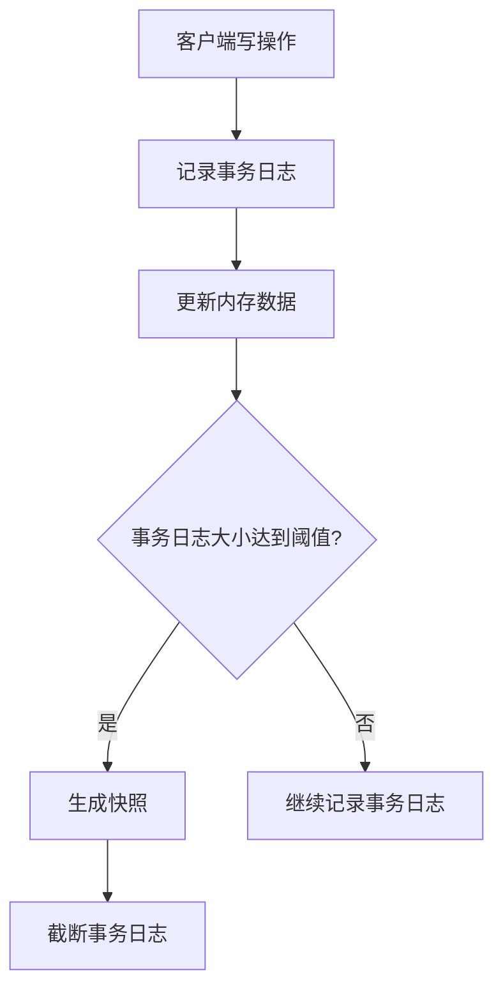

# Zookeeper 数据持久化

Zookeeper是一个分布式协调服务，广泛应用于分布式系统中。为了确保数据的高可用性和一致性，Zookeeper采用了数据持久化机制。本文将详细介绍Zookeeper的数据持久化机制，包括其工作原理、实现方式以及实际应用场景。

## 什么是Zookeeper数据持久化？

Zookeeper数据持久化是指将Zookeeper中的数据存储到磁盘上，以便在系统重启或崩溃后能够恢复数据。Zookeeper通过两种主要方式实现数据持久化：**事务日志（Transaction Log）**和**快照（Snapshot）**。

### 事务日志（Transaction Log）

事务日志记录了Zookeeper中所有的写操作（如创建、删除、更新节点等）。每次写操作都会被追加到事务日志中，确保数据的持久性。事务日志是顺序写入的，因此具有较高的写入性能。

### 快照（Snapshot）

快照是Zookeeper在某一时刻的内存数据状态的镜像。快照是定期生成的，通常是在事务日志达到一定大小时触发。快照的生成不会阻塞Zookeeper的正常操作，因此对系统性能影响较小。

## Zookeeper 数据持久化的工作原理

Zookeeper的数据持久化机制可以分为以下几个步骤：

1. **写操作记录**：当客户端发起写操作时，Zookeeper会将该操作记录到事务日志中。
2. **内存更新**：在记录事务日志的同时，Zookeeper会更新内存中的数据。
3. **快照生成**：当事务日志达到一定大小时，Zookeeper会生成一个快照，并将当前内存中的数据状态保存到磁盘上。
4. **日志截断**：生成快照后，Zookeeper会截断事务日志，删除已经生成快照的部分日志。



## 代码示例

以下是一个简单的Zookeeper客户端代码示例，展示了如何创建一个节点并观察其持久化过程。

```java
import org.apache.zookeeper.ZooKeeper;
import org.apache.zookeeper.CreateMode;
import org.apache.zookeeper.ZooDefs.Ids;

public class ZookeeperExample {
    public static void main(String[] args) throws Exception {
        // 连接到Zookeeper服务器
        ZooKeeper zk = new ZooKeeper("localhost:2181", 3000, null);

        // 创建一个持久化节点
        String path = zk.create("/myNode", "data".getBytes(), Ids.OPEN_ACL_UNSAFE, CreateMode.PERSISTENT);
        System.out.println("Node created: " + path);

        // 关闭连接
        zk.close();
    }
}
```

**输出：**
```
Node created: /myNode
```

在这个示例中，我们创建了一个持久化节点 `/myNode`，并将其数据存储在Zookeeper中。即使Zookeeper服务器重启，该节点及其数据仍然存在。

## 实际应用场景

Zookeeper的数据持久化机制在分布式系统中有着广泛的应用。以下是一些常见的应用场景：

1. **分布式锁**：Zookeeper可以用于实现分布式锁，确保在多个节点之间协调资源的访问。
2. **配置管理**：Zookeeper可以存储分布式系统的配置信息，并在配置发生变化时通知所有相关节点。
3. **服务发现**：Zookeeper可以用于服务发现，帮助客户端动态地找到可用的服务实例。

:::tip
在实际应用中，Zookeeper的数据持久化机制确保了系统的高可用性和数据一致性，是构建可靠分布式系统的关键组件。
:::

## 总结

Zookeeper通过事务日志和快照机制实现了数据的持久化，确保了在系统崩溃或重启后能够恢复数据。本文详细介绍了Zookeeper数据持久化的工作原理，并提供了代码示例和实际应用场景。希望通过本文的学习，您能够更好地理解Zookeeper的数据持久化机制，并在实际项目中加以应用。

## 附加资源

- [Zookeeper官方文档](https://zookeeper.apache.org/doc/current/)
- [Zookeeper源码分析](https://github.com/apache/zookeeper)
- [分布式系统设计与实践](https://www.oreilly.com/library/view/designing-distributed-systems/9781491983638/)

## 练习

1. 尝试在本地搭建一个Zookeeper集群，并观察事务日志和快照的生成过程。
2. 编写一个Zookeeper客户端程序，实现分布式锁功能，并测试其持久化特性。
3. 研究Zookeeper的源码，深入理解其数据持久化机制的实现细节。
