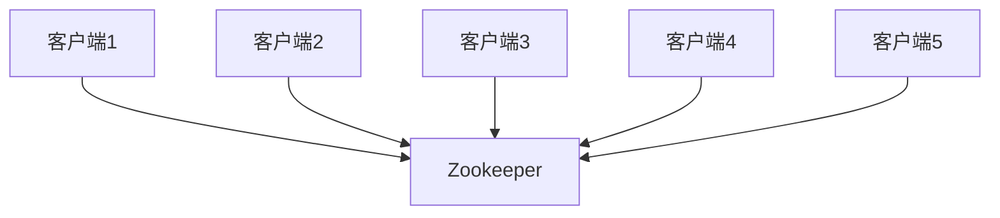

# Zookeeper 客户端监控

Zookeeper是一个分布式协调服务，广泛应用于分布式系统中。为了确保Zookeeper客户端的稳定性和性能，监控是至关重要的。本文将详细介绍Zookeeper客户端监控的概念、实现方法以及实际应用场景。

## 什么是Zookeeper客户端监控？

Zookeeper客户端监控是指通过收集和分析Zookeeper客户端的运行数据，来评估其健康状况、性能表现以及潜在问题。监控可以帮助开发者及时发现和解决问题，确保系统的稳定性和可靠性。

## 为什么需要监控Zookeeper客户端？

1. **性能优化**：通过监控可以了解客户端的性能瓶颈，从而进行优化。
2. **故障排查**：监控数据可以帮助快速定位和解决故障。
3. **资源管理**：监控可以帮助合理分配和管理资源，避免资源浪费。

## 如何监控Zookeeper客户端？

### 1. 使用Zookeeper自带的监控工具

Zookeeper提供了多种监控工具，如`zkCli.sh`、`zkServer.sh`等。这些工具可以帮助你查看Zookeeper的运行状态、连接数、节点信息等。

```bash
# 使用zkCli.sh查看Zookeeper节点信息
./zkCli.sh -server localhost:2181
```

### 2. 使用JMX监控

Zookeeper支持JMX（Java Management Extensions），可以通过JMX监控Zookeeper的运行状态。

```java
// 示例：通过JMX获取Zookeeper的MBean信息
MBeanServer mBeanServer = ManagementFactory.getPlatformMBeanServer();
ObjectName objectName = new ObjectName("org.apache.ZooKeeperService:name=0,type=Server");
mBeanServer.getAttribute(objectName, "State");
```

### 3. 使用第三方监控工具

除了Zookeeper自带的工具，还可以使用第三方监控工具，如Prometheus、Grafana等。这些工具可以提供更丰富的监控指标和可视化界面。

```yaml
# Prometheus配置文件示例
scrape_configs:
  - job_name: 'zookeeper'
    static_configs:
      - targets: ['localhost:2181']
```

## 实际应用场景

### 场景1：监控Zookeeper客户端的连接数

在高并发的分布式系统中，Zookeeper客户端的连接数可能会急剧增加。通过监控连接数，可以及时发现并解决连接数过高的问题。



### 场景2：监控Zookeeper客户端的响应时间

响应时间是衡量Zookeeper客户端性能的重要指标。通过监控响应时间，可以及时发现性能瓶颈并进行优化。


## 总结

Zookeeper客户端监控是确保分布式系统稳定性和性能的重要手段。通过使用Zookeeper自带的监控工具、JMX以及第三方监控工具，可以全面了解Zookeeper客户端的运行状态，及时发现和解决问题。

## 附加资源

- [Zookeeper官方文档](https://zookeeper.apache.org/doc/current/)
- [Prometheus官方文档](https://prometheus.io/docs/)
- [Grafana官方文档](https://grafana.com/docs/)

## 练习

1. 使用`zkCli.sh`查看Zookeeper的节点信息，并记录结果。
2. 配置Prometheus监控Zookeeper，并在Grafana中创建仪表盘。
3. 编写一个简单的Java程序，通过JMX获取Zookeeper的运行状态。

:::tip
提示：在实际应用中，建议结合多种监控工具，以获得更全面的监控数据。
:::