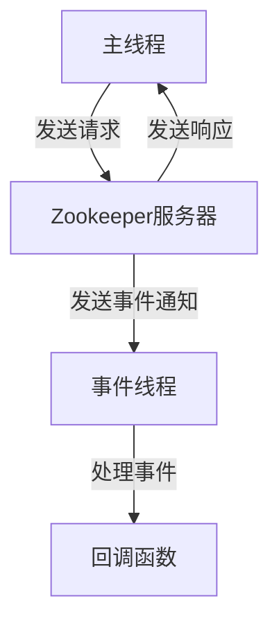

# Zookeeper 客户端线程模型

Zookeeper是一个分布式协调服务，广泛用于分布式系统中的配置管理、命名服务、分布式锁等场景。Zookeeper客户端是与Zookeeper服务器进行通信的关键组件，理解其线程模型对于高效使用Zookeeper至关重要。

## 介绍

Zookeeper客户端的线程模型主要涉及两个线程：**主线程**和**事件线程**。主线程负责与Zookeeper服务器进行通信，而事件线程则负责处理Zookeeper服务器发送的事件通知。

### 主线程

主线程是Zookeeper客户端的核心线程，负责与Zookeeper服务器进行通信。它负责发送请求（如创建节点、读取数据等）并接收服务器的响应。主线程通常是一个阻塞线程，意味着它会等待服务器的响应。

### 事件线程

事件线程负责处理Zookeeper服务器发送的事件通知。这些事件包括节点创建、节点删除、数据变更等。事件线程是一个非阻塞线程，它会立即处理这些事件并调用相应的回调函数。

## 线程模型的工作原理

Zookeeper客户端的线程模型可以简单描述为：

1. **主线程**发送请求到Zookeeper服务器。
2. **主线程**等待服务器的响应。
3. **事件线程**接收服务器的事件通知并处理。



## 代码示例

以下是一个简单的Zookeeper客户端代码示例，展示了如何使用主线程和事件线程。

```java
import org.apache.zookeeper.WatchedEvent;
import org.apache.zookeeper.Watcher;
import org.apache.zookeeper.ZooKeeper;

public class ZookeeperClientExample implements Watcher {
    private ZooKeeper zooKeeper;

    public ZookeeperClientExample(String host) throws Exception {
        this.zooKeeper = new ZooKeeper(host, 3000, this);
    }

    @Override
    public void process(WatchedEvent event) {
        // 事件线程处理事件
        System.out.println("Event received: " + event);
    }

    public void createNode(String path, byte[] data) throws Exception {
        // 主线程发送请求
        zooKeeper.create(path, data, ZooDefs.Ids.OPEN_ACL_UNSAFE, CreateMode.PERSISTENT);
    }

    public static void main(String[] args) throws Exception {
        ZookeeperClientExample client = new ZookeeperClientExample("localhost:2181");
        client.createNode("/example", "Hello Zookeeper".getBytes());
    }
}
```

### 输入与输出

- **输入**: 连接到Zookeeper服务器并创建一个节点。
- **输出**: 在控制台输出事件通知。

## 实际应用场景

Zookeeper客户端的线程模型在以下场景中非常有用：

1. **配置管理**: 当配置发生变化时，Zookeeper会通知客户端，客户端可以立即更新配置。
2. **分布式锁**: 客户端可以监听锁节点的变化，当锁被释放时，客户端可以立即尝试获取锁。
3. **命名服务**: 客户端可以监听命名节点的变化，当节点被删除或创建时，客户端可以立即更新命名服务。

## 总结

Zookeeper客户端的线程模型是其高效处理分布式协调任务的关键。通过主线程和事件线程的协作，Zookeeper客户端能够高效地与服务器通信并处理事件通知。理解这一模型有助于开发者更好地使用Zookeeper构建分布式系统。

## 附加资源与练习

- **资源**:
  - [Zookeeper官方文档](https://zookeeper.apache.org/doc/current/)
  - [Zookeeper Java API文档](https://zookeeper.apache.org/doc/current/api/index.html)

- **练习**:
  - 尝试修改上述代码示例，使其能够监听节点的数据变化并输出变化后的数据。
  - 实现一个简单的分布式锁，使用Zookeeper客户端的线程模型来处理锁的获取与释放。

:::tip
在实际开发中，确保正确处理Zookeeper客户端的事件通知，以避免潜在的性能问题。
:::