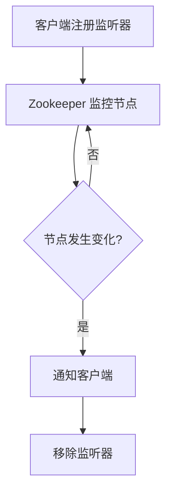

# Zookeeper 监听最佳实践

Zookeeper 是一个分布式协调服务，广泛用于分布式系统中的配置管理、命名服务、分布式锁等场景。Zookeeper 的监听机制（Watcher）是其核心功能之一，允许客户端监控节点的变化。本文将介绍 Zookeeper 监听机制的最佳实践，帮助初学者更好地理解和使用这一功能。

## 什么是 Zookeeper 监听机制？

Zookeeper 的监听机制允许客户端在特定节点上注册监听器（Watcher），当该节点或其子节点发生变化时，Zookeeper 会通知客户端。这种机制非常适合用于实现分布式系统中的事件驱动模型。

### 监听器的类型

Zookeeper 提供了多种监听器类型，主要包括：

- **NodeCreated**：节点被创建时触发。
- **NodeDeleted**：节点被删除时触发。
- **NodeDataChanged**：节点数据发生变化时触发。
- **NodeChildrenChanged**：节点的子节点发生变化时触发。

## 监听器的工作流程

Zookeeper 的监听器是一次性的，这意味着一旦触发，监听器就会被移除。如果需要继续监听，客户端需要重新注册监听器。



## 最佳实践

### 1. 合理使用一次性监听器

由于 Zookeeper 的监听器是一次性的，客户端需要在每次收到通知后重新注册监听器。为了避免遗漏事件，建议在每次处理完事件后立即重新注册监听器。

```java
public void process(WatchedEvent event) {
    // 处理事件
    if (event.getType() == Event.EventType.NodeDataChanged) {
        // 重新注册监听器
        zk.getData("/myNode", this, null);
    }
}
```

### 2. 避免监听风暴

在高并发场景下，频繁的节点变化可能导致大量的监听器被触发，从而引发监听风暴。为了避免这种情况，可以采用以下策略：

- **批量处理**：将多个事件合并处理，减少监听器的触发频率。
- **延迟处理**：在收到事件后，延迟一段时间再处理，避免短时间内处理大量事件。

### 3. 监听器的幂等性

由于网络延迟或其他原因，客户端可能会收到重复的事件通知。因此，监听器的处理逻辑应该是幂等的，即多次处理同一事件不会产生副作用。

```java
public void process(WatchedEvent event) {
    // 幂等处理逻辑
    if (event.getType() == Event.EventType.NodeDataChanged) {
        // 确保多次处理不会产生副作用
        handleNodeDataChange();
    }
}
```

### 4. 监听器的超时处理

在某些情况下，Zookeeper 可能无法及时通知客户端，导致监听器超时。为了避免这种情况，客户端可以设置超时时间，并在超时后重新注册监听器。

```java
public void process(WatchedEvent event) {
    // 处理事件
    if (event.getType() == Event.EventType.NodeDataChanged) {
        // 设置超时时间
        zk.getData("/myNode", this, null, 5000); // 5秒超时
    }
}
```

## 实际案例

### 分布式配置管理

在分布式系统中，配置管理是一个常见的需求。通过 Zookeeper 的监听机制，可以实现配置的动态更新。例如，当配置文件发生变化时，Zookeeper 会通知所有监听该配置节点的客户端，客户端可以立即获取最新的配置。

```java
public void process(WatchedEvent event) {
    if (event.getType() == Event.EventType.NodeDataChanged) {
        // 获取最新配置
        byte[] data = zk.getData("/config", this, null);
        updateConfig(new String(data));
        // 重新注册监听器
        zk.getData("/config", this, null);
    }
}
```

## 总结

Zookeeper 的监听机制是分布式系统中非常重要的功能，合理使用监听器可以大大提高系统的可靠性和响应速度。通过本文的介绍，你应该已经掌握了 Zookeeper 监听机制的最佳实践，包括如何合理使用一次性监听器、避免监听风暴、确保监听器的幂等性以及处理监听器的超时问题。

## 附加资源

- [Zookeeper 官方文档](https://zookeeper.apache.org/doc/current/)
- [Zookeeper 监听器示例代码](https://github.com/apache/zookeeper/tree/master/src/recipes)

## 练习

1. 编写一个简单的 Zookeeper 客户端程序，监听一个节点的变化，并在节点数据发生变化时打印出最新的数据。
2. 修改上述程序，使其在收到事件后延迟 1 秒再处理，观察系统的行为变化。

:::tip
在编写 Zookeeper 客户端程序时，务必确保你的 Zookeeper 服务器已经启动并运行。
:::