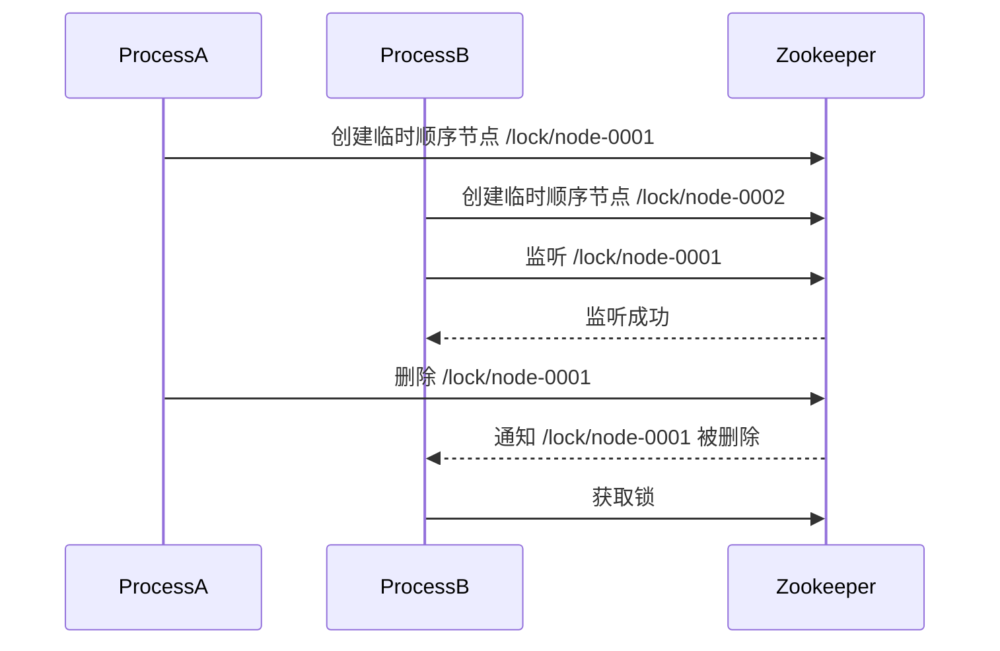

# Zookeeper 事件通知机制

Zookeeper 是一个分布式协调服务，广泛应用于分布式系统中。它通过提供一种高效的事件通知机制，帮助开发者实现分布式系统中的协调与同步。本文将详细介绍 Zookeeper 的事件通知机制，并通过代码示例和实际案例帮助你更好地理解这一概念。

## 什么是 Zookeeper 事件通知机制？

Zookeeper 的事件通知机制允许客户端监听 Zookeeper 节点（ZNode）的变化。当被监听的节点发生变化时（例如节点被创建、删除或数据被修改），Zookeeper 会向客户端发送一个事件通知。客户端可以根据这些事件执行相应的操作，从而实现分布式系统中的协调与同步。

Zookeeper 的事件通知机制是**一次性**的，这意味着客户端在接收到事件通知后，需要重新注册监听器以继续监听节点的变化。

## Zookeeper 事件类型

Zookeeper 支持多种事件类型，常见的事件类型包括：

- **NodeCreated**：节点被创建时触发。
- **NodeDeleted**：节点被删除时触发。
- **NodeDataChanged**：节点数据被修改时触发。
- **NodeChildrenChanged**：节点的子节点发生变化时触发。

## 如何注册监听器？

在 Zookeeper 中，客户端可以通过 `getData`、`exists` 和 `getChildren` 等方法来注册监听器。以下是一个简单的代码示例，展示如何注册监听器并处理事件通知。

```java
import org.apache.zookeeper.WatchedEvent;
import org.apache.zookeeper.Watcher;
import org.apache.zookeeper.ZooKeeper;

public class ZookeeperWatcherExample implements Watcher {

    private ZooKeeper zooKeeper;

    public ZookeeperWatcherExample(String host, int sessionTimeout) throws Exception {
        this.zooKeeper = new ZooKeeper(host, sessionTimeout, this);
    }

    @Override
    public void process(WatchedEvent event) {
        System.out.println("Received event: " + event.getType());
        // 重新注册监听器
        try {
            zooKeeper.exists("/exampleNode", this);
        } catch (Exception e) {
            e.printStackTrace();
        }
    }

    public static void main(String[] args) throws Exception {
        ZookeeperWatcherExample example = new ZookeeperWatcherExample("localhost:2181", 3000);
        // 注册监听器
        example.zooKeeper.exists("/exampleNode", example);
        // 保持程序运行以接收事件
        Thread.sleep(Long.MAX_VALUE);
    }
}
```

### 代码解释

1. **ZookeeperWatcherExample** 类实现了 `Watcher` 接口，并重写了 `process` 方法。当事件发生时，Zookeeper 会调用 `process` 方法。
2. 在 `main` 方法中，我们创建了一个 `ZookeeperWatcherExample` 实例，并通过 `exists` 方法注册了一个监听器，监听 `/exampleNode` 节点的变化。
3. 当 `/exampleNode` 节点发生变化时，`process` 方法会被调用，并打印出事件类型。为了继续监听节点的变化，我们在 `process` 方法中重新注册了监听器。

:::note
Zookeeper 的事件通知机制是**一次性**的，因此每次接收到事件后，都需要重新注册监听器。
:::

## 实际应用场景

Zookeeper 的事件通知机制在分布式系统中有广泛的应用。以下是一个实际应用场景：

### 分布式锁

在分布式系统中，多个进程可能需要竞争同一个资源。Zookeeper 可以通过事件通知机制实现分布式锁。具体步骤如下：

1. 每个进程在 Zookeeper 中创建一个临时顺序节点。
2. 进程监听比自己序号小的节点。
3. 当比自己序号小的节点被删除时，进程获得锁。
4. 当进程释放锁时，删除自己创建的节点。



:::tip
在实际应用中，Zookeeper 的分布式锁实现需要考虑锁的公平性和死锁问题。
:::

## 总结

Zookeeper 的事件通知机制是分布式系统中实现协调与同步的重要工具。通过监听 Zookeeper 节点的变化，客户端可以及时响应系统中的状态变化，从而实现高效的分布式协调。

本文介绍了 Zookeeper 的事件类型、如何注册监听器以及一个实际应用场景。希望这些内容能帮助你更好地理解 Zookeeper 的事件通知机制。

## 附加资源与练习

- **练习**：尝试在本地搭建一个 Zookeeper 集群，并编写代码实现一个简单的分布式锁。
- **资源**：阅读 Zookeeper 官方文档，了解更多关于事件通知机制的细节。

:::caution
在实际生产环境中，使用 Zookeeper 时需要注意其性能和可靠性问题，确保系统的高可用性。
:::