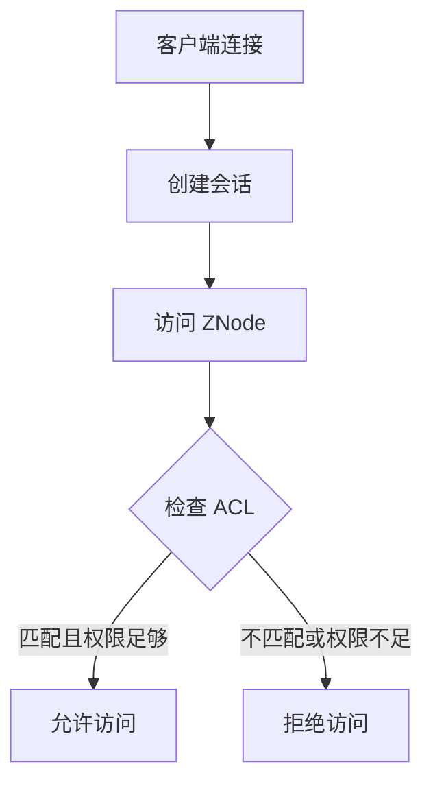

# Zookeeper 权限类型

Zookeeper 是一个分布式协调服务，广泛用于分布式系统中的配置管理、命名服务、分布式锁等场景。为了确保数据的安全性和一致性，Zookeeper 提供了强大的访问控制机制。本文将详细介绍 Zookeeper 中的权限类型，帮助你理解如何在 Zookeeper 中实现细粒度的权限控制。

## 什么是 Zookeeper 权限类型？

在 Zookeeper 中，权限类型（ACL，Access Control List）用于控制客户端对 ZNode（Zookeeper 中的数据节点）的访问权限。每个 ZNode 都可以关联一个或多个 ACL，每个 ACL 定义了哪些用户或组可以执行哪些操作。

Zookeeper 的权限类型基于以下三个要素：
1. **Scheme**：权限验证的机制，例如 `world`、`auth`、`digest`、`ip` 等。
2. **ID**：与 Scheme 相关的标识符，例如用户名、IP 地址等。
3. **Permissions**：具体的权限类型，例如 `READ`、`WRITE`、`CREATE`、`DELETE`、`ADMIN` 等。

## Zookeeper 权限类型详解

### 1. Scheme 类型

Zookeeper 支持多种 Scheme 类型，每种类型定义了不同的权限验证方式：

- **world**：默认的 Scheme，表示任何人都可以访问。ID 固定为 `anyone`。
- **auth**：用于已认证的用户。ID 为空，表示当前会话中已认证的用户。
- **digest**：基于用户名和密码的认证。ID 格式为 `username:password`，其中密码是经过哈希处理的。
- **ip**：基于 IP 地址的认证。ID 为具体的 IP 地址或 IP 段。

### 2. Permissions 类型

Zookeeper 定义了以下权限类型：

- **READ**：允许读取 ZNode 的数据和子节点列表。
- **WRITE**：允许修改 ZNode 的数据。
- **CREATE**：允许在 ZNode 下创建子节点。
- **DELETE**：允许删除 ZNode 的子节点。
- **ADMIN**：允许设置 ZNode 的 ACL。

:::note
`ADMIN` 权限并不允许直接修改 ZNode 的数据，而是允许修改 ZNode 的 ACL。
:::

### 3. 实际应用场景

假设我们有一个分布式系统，需要在 Zookeeper 中存储配置信息。我们希望只有管理员可以修改配置，而其他用户只能读取配置。我们可以通过以下步骤实现这一需求：

1. 创建一个 ZNode，例如 `/config`。
2. 为 `/config` 设置 ACL，允许管理员拥有 `WRITE` 和 `ADMIN` 权限，其他用户只有 `READ` 权限。

```java
// 创建 ZNode 并设置 ACL 的示例代码
ZooKeeper zk = new ZooKeeper("localhost:2181", 3000, null);
List<ACL> acls = new ArrayList<>();
acls.add(new ACL(ZooDefs.Perms.READ, new Id("world", "anyone")));
acls.add(new ACL(ZooDefs.Perms.WRITE | ZooDefs.Perms.ADMIN, new Id("digest", "admin:password")));
zk.create("/config", "configData".getBytes(), acls, CreateMode.PERSISTENT);
```

在上述代码中，我们为 `/config` 设置了两个 ACL：
- 第一个 ACL 允许任何人（`world:anyone`）读取 `/config` 的数据。
- 第二个 ACL 允许管理员（`digest:admin:password`）修改 `/config` 的数据和 ACL。

### 4. 权限验证流程

Zookeeper 的权限验证流程如下：

1. 客户端连接到 Zookeeper 服务器并创建会话。
2. 客户端尝试访问某个 ZNode 时，Zookeeper 会检查该 ZNode 的 ACL。
3. 如果客户端的身份（Scheme 和 ID）与 ACL 中的某个条目匹配，并且具有相应的权限，则允许访问；否则，拒绝访问。



## 总结

Zookeeper 的权限类型提供了灵活的访问控制机制，能够满足分布式系统中对数据安全性和一致性的需求。通过合理设置 ACL，可以确保只有授权的用户或系统能够访问和修改 ZNode 的数据。

在实际应用中，建议根据业务需求选择合适的 Scheme 和 Permissions，并定期审查和更新 ACL，以确保系统的安全性。

## 附加资源与练习

- **官方文档**：阅读 [Zookeeper 官方文档](https://zookeeper.apache.org/doc/current/zookeeperProgrammers.html#sc_ZooKeeperAccessControl) 以了解更多关于 ACL 的详细信息。
- **练习**：尝试在你的本地 Zookeeper 实例中创建 ZNode，并为其设置不同的 ACL。观察不同权限对访问控制的影响。

:::tip
如果你在设置 ACL 时遇到问题，可以尝试使用 `getAcl` 命令查看 ZNode 的当前 ACL，并使用 `setAcl` 命令进行修改。
:::