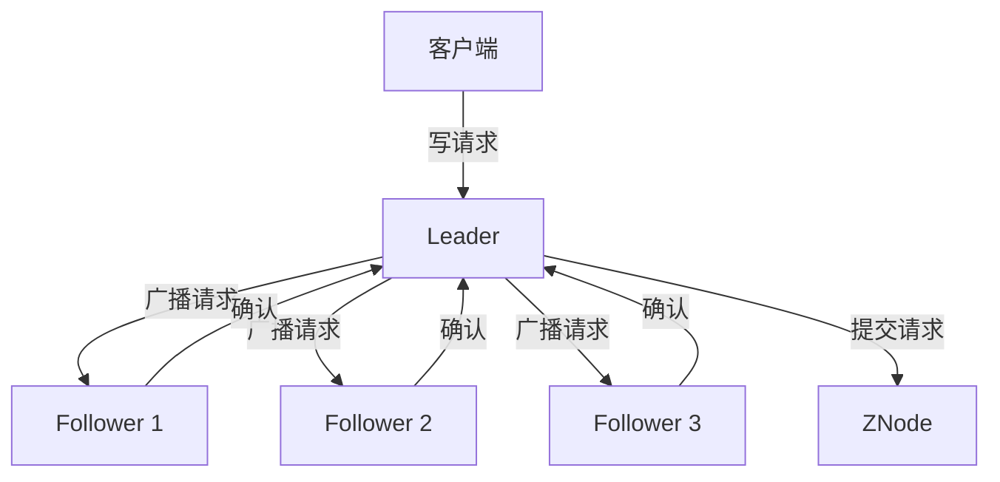

## 介绍

Zookeeper 是一个分布式的、开源的协调服务，广泛用于分布式系统中。它提供了一种简单的方式来管理配置信息、命名服务、分布式同步和组服务。为了更好地理解 Zookeeper 的工作原理，我们需要深入了解其内部架构。

## Zookeeper 的核心组件

Zookeeper 的内部架构主要由以下几个核心组件组成：

1. **ZNode**：Zookeeper 中的数据存储单元，类似于文件系统中的文件或目录。
2. **Zab 协议**：Zookeeper 原子广播协议，用于保证数据的一致性和可靠性。
3. **Session**：客户端与 Zookeeper 服务器之间的连接会话。
4. **Watcher**：用于监听 ZNode 的变化，当 ZNode 发生变化时，Watcher 会触发相应的事件。

## Zookeeper 的工作原理

### ZNode

ZNode 是 Zookeeper 中的数据存储单元，类似于文件系统中的文件或目录。每个 ZNode 可以存储数据，并且可以有子节点。ZNode 有两种类型：

- **持久节点（Persistent Node）**：一旦创建，除非显式删除，否则一直存在。
- **临时节点（Ephemeral Node）**：与客户端会话绑定，会话结束时自动删除。

```bash
# 创建一个持久节点
create /myapp/config "config_data"
# 创建一个临时节点
create -e /myapp/lock "lock_data"
```

### Zab 协议

Zab 协议是 Zookeeper 的核心协议，用于保证数据的一致性和可靠性。Zab 协议分为两个阶段：

1. **Leader 选举**：在 Zookeeper 集群中，所有服务器通过投票选举出一个 Leader，负责处理所有写请求。
2. **原子广播**：Leader 将写请求广播给所有 Follower，Follower 收到请求后进行日志记录并返回确认。当 Leader 收到大多数 Follower 的确认后，提交该请求。



### Session

Session 是客户端与 Zookeeper 服务器之间的连接会话。每个 Session 都有一个唯一的 Session ID，并且可以设置超时时间。如果客户端在超时时间内没有发送心跳，Session 将过期，所有与该 Session 相关的临时节点将被删除。

```java
ZooKeeper zk = new ZooKeeper("localhost:2181", 3000, new Watcher() {
    public void process(WatchedEvent event) {
        // 处理事件
    }
});
```

### Watcher

Watcher 用于监听 ZNode 的变化。当 ZNode 发生变化时，Watcher 会触发相应的事件。Watcher 是一次性的，触发后需要重新注册。

```java
zk.exists("/myapp/config", new Watcher() {
    public void process(WatchedEvent event) {
        if (event.getType() == Event.EventType.NodeDataChanged) {
            // 处理节点数据变化事件
        }
    }
});
```

## 实际应用场景

### 分布式锁

Zookeeper 可以用于实现分布式锁。通过创建一个临时节点，客户端可以获取锁。当客户端释放锁或会话结束时，临时节点被删除，其他客户端可以获取锁。

```java
String lockPath = "/myapp/lock";
zk.create(lockPath, "lock_data".getBytes(), ZooDefs.Ids.OPEN_ACL_UNSAFE, CreateMode.EPHEMERAL);
// 获取锁成功
// 执行业务逻辑
zk.delete(lockPath, -1);
// 释放锁
```

### 配置管理

Zookeeper 可以用于管理分布式系统的配置信息。通过将配置信息存储在 ZNode 中，客户端可以监听 ZNode 的变化，实时获取最新的配置。

```java
String configPath = "/myapp/config";
byte[] configData = zk.getData(configPath, new Watcher() {
    public void process(WatchedEvent event) {
        if (event.getType() == Event.EventType.NodeDataChanged) {
            // 配置发生变化，重新获取配置
            byte[] newConfigData = zk.getData(configPath, this, null);
            // 处理新的配置
        }
    }
}, null);
// 使用配置数据
```

## 总结

Zookeeper 的内部架构由 ZNode、Zab 协议、Session 和 Watcher 等核心组件组成。通过理解这些组件的工作原理，我们可以更好地利用 Zookeeper 来实现分布式系统中的协调服务。Zookeeper 在分布式锁、配置管理等场景中有着广泛的应用。

## 附加资源

- [Zookeeper 官方文档](https://zookeeper.apache.org/doc/current/)
- [Zookeeper 源码解析](https://github.com/apache/zookeeper)
- [Zookeeper 实战教程](https://www.oreilly.com/library/view/zookeeper/9781449361297/)

## 练习

1. 使用 Zookeeper 实现一个简单的分布式锁。
2. 使用 Zookeeper 管理一个分布式系统的配置信息，并实现配置的动态更新。