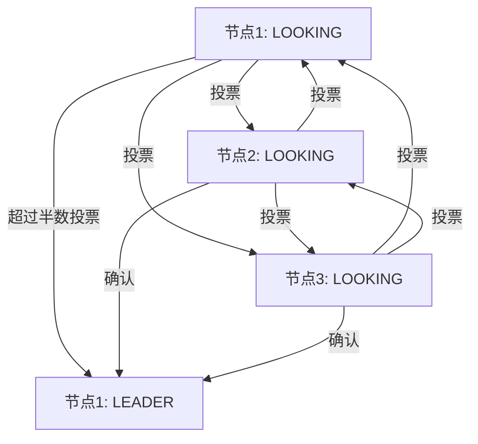

# Zookeeper Leader选举

Zookeeper是一个分布式协调服务，广泛应用于分布式系统中。在Zookeeper集群中，Leader选举是一个核心机制，它确保了集群的高可用性和一致性。本文将详细介绍Zookeeper Leader选举的工作原理、实现方式以及实际应用场景。

## 什么是Leader选举？

在Zookeeper集群中，所有的节点（也称为服务器）都是对等的，但在某些情况下，需要一个节点来充当Leader，负责协调其他节点的工作。Leader选举就是在这个过程中，通过一定的算法和协议，选出一个节点作为Leader的过程。

:::note
Leader选举是Zookeeper实现分布式一致性的关键机制之一。它确保了在集群中只有一个节点能够执行写操作，从而避免了数据不一致的问题。
:::

## Leader选举的工作原理

Zookeeper使用ZAB（Zookeeper Atomic Broadcast）协议来实现Leader选举。ZAB协议的核心思想是通过投票机制选出一个Leader，并确保所有节点都认可这个Leader。

### 选举过程

1. **初始化阶段**：当Zookeeper集群启动时，所有的节点都处于`LOOKING`状态，表示它们正在寻找Leader。

2. **投票阶段**：每个节点会向其他节点发送投票信息，投票信息包含节点的ID和事务ID（ZXID）。节点会根据一定的规则（如ZXID的大小和节点ID的大小）来决定投票给哪个节点。

3. **选举结果**：当一个节点收到超过半数的投票时，它就会成为Leader，并通知其他节点。其他节点会进入`FOLLOWING`状态，成为Follower。

4. **同步阶段**：Leader会与Follower进行数据同步，确保所有节点的数据一致。

:::tip
在实际应用中，Zookeeper的Leader选举过程非常快速，通常在几毫秒内就能完成。
:::

## 实际应用场景

### 分布式锁

在分布式系统中，经常需要使用分布式锁来协调多个节点的操作。Zookeeper的Leader选举机制可以用来实现分布式锁。例如，当一个节点需要获取锁时，它可以尝试成为Leader，只有成为Leader的节点才能执行关键操作。

### 主从切换

在一些主从架构的系统中，主节点负责处理所有的写操作，而从节点负责处理读操作。如果主节点发生故障，Zookeeper的Leader选举机制可以快速选出一个新的主节点，确保系统的高可用性。

## 总结

Zookeeper的Leader选举机制是分布式系统中的重要组成部分，它通过ZAB协议实现了快速、可靠的Leader选举。了解Leader选举的工作原理和应用场景，有助于更好地设计和实现分布式系统。

## 附加资源

- [Zookeeper官方文档](https://zookeeper.apache.org/doc/current/)
- 《从Paxos到Zookeeper：分布式一致性原理与实践》

## 练习

1. 尝试在一个Zookeeper集群中手动触发Leader选举，观察选举过程。
2. 使用Zookeeper实现一个简单的分布式锁，并测试其在高并发场景下的表现。