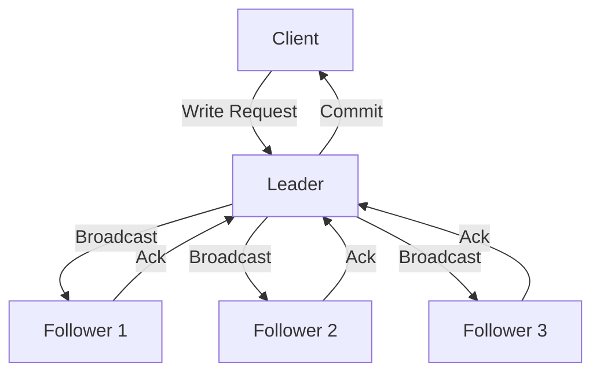

# Zookeeper 数据一致性保证

Zookeeper 是一个分布式协调服务，广泛应用于分布式系统中。它的核心功能之一是保证数据的一致性。本文将深入探讨 Zookeeper 如何通过其内部机制实现数据一致性，并通过实际案例帮助你更好地理解这一概念。

## 什么是数据一致性？

在分布式系统中，数据一致性指的是多个节点之间的数据保持一致的状态。Zookeeper 通过一系列机制确保所有客户端在任何时刻都能看到相同的数据视图。

## Zookeeper 的一致性模型

Zookeeper 采用了一种称为 **ZAB（Zookeeper Atomic Broadcast）** 的协议来保证数据一致性。ZAB 协议确保所有更新操作按顺序广播到所有节点，并且只有在大多数节点确认后，更新才会被提交。

### ZAB 协议的关键点

1. **Leader 选举**：Zookeeper 集群中有一个 Leader 节点，负责处理所有写请求。
2. **原子广播**：Leader 将写请求广播给所有 Follower 节点。
3. **顺序一致性**：所有写请求按顺序处理，确保数据的一致性。



## 实际案例

假设我们有一个分布式系统，需要维护一个全局的配置信息。我们可以使用 Zookeeper 来存储这些配置信息，并确保所有节点都能看到最新的配置。

### 代码示例

以下是一个简单的 Python 示例，展示如何使用 Zookeeper 客户端库（`kazoo`）来读取和写入配置信息。

```python
from kazoo.client import KazooClient

# 连接到 Zookeeper 服务器
zk = KazooClient(hosts='127.0.0.1:2181')
zk.start()

# 创建一个节点并设置数据
zk.ensure_path("/config")
zk.set("/config", b"value1")

# 读取数据
data, stat = zk.get("/config")
print(f"Data: {data}, Version: {stat.version}")

# 关闭连接
zk.stop()
```

**输出**:
```
Data: b'value1', Version: 0
```

:::note
在实际应用中，Zookeeper 通常用于存储小量的元数据或配置信息，而不是大规模的数据存储。
:::

## 总结

Zookeeper 通过 ZAB 协议和 Leader 选举机制，确保了分布式系统中的数据一致性。理解这些机制对于设计和维护分布式系统至关重要。

## 附加资源

- [Zookeeper 官方文档](https://zookeeper.apache.org/doc/current/)
- [分布式系统一致性模型](https://en.wikipedia.org/wiki/Consistency_model)
- [Kazoo 客户端库文档](https://kazoo.readthedocs.io/en/latest/)

## 练习

1. 尝试在本地搭建一个 Zookeeper 集群，并使用 `kazoo` 客户端库进行读写操作。
2. 修改上面的代码示例，使其能够处理多个客户端的并发写请求，并观察 Zookeeper 如何处理这些请求。

通过本文的学习，你应该对 Zookeeper 的数据一致性保证有了初步的了解。继续深入学习 Zookeeper 的其他特性，将有助于你更好地掌握分布式系统的设计与实现。