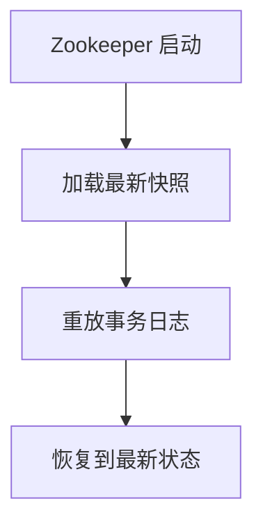

## 介绍

Zookeeper 是一个分布式协调服务，广泛用于分布式系统中的配置管理、命名服务、分布式锁等场景。为了确保数据的一致性和持久性，Zookeeper 使用了**快照（Snapshot）**和**事务日志（Transaction Log）**两种机制。本文将详细介绍这两种机制的工作原理及其在 Zookeeper 中的应用。

## 快照（Snapshot）

### 什么是快照？

快照是 Zookeeper 在某一时刻对内存中数据树（Data Tree）的完整拷贝。它包含了当前所有节点的状态信息。快照的主要作用是减少恢复时间，因为 Zookeeper 可以通过加载快照文件快速恢复到某个已知状态。

### 快照的生成

Zookeeper 会在以下情况下生成快照：

1. **定期生成**：Zookeeper 会定期（默认情况下每 100,000 次事务）生成快照。
2. **手动触发**：管理员可以通过命令手动触发快照生成。

快照文件通常以 `snapshot.<zxid>` 的形式命名，其中 `zxid` 是 Zookeeper 事务 ID。

### 快照的加载

当 Zookeeper 启动时，它会加载最新的快照文件，然后通过重放事务日志来恢复到最新的状态。

:::note
快照文件是二进制的，通常不建议手动编辑或修改。
:::

## 事务日志（Transaction Log）

### 什么是事务日志？

事务日志记录了 Zookeeper 中所有的写操作（如创建、删除、更新节点等）。每个事务日志条目包含一个事务 ID（`zxid`）和相应的操作数据。事务日志的主要作用是确保数据的持久性和一致性。

### 事务日志的生成

每当 Zookeeper 接收到一个写请求时，它都会将该请求记录到事务日志中。事务日志文件通常以 `log.<zxid>` 的形式命名。

### 事务日志的重放

在 Zookeeper 启动时，如果快照文件不是最新的，Zookeeper 会通过重放事务日志来恢复到最新的状态。重放过程会从快照文件对应的 `zxid` 开始，依次应用每个事务日志条目。

:::tip
事务日志是顺序写入的，因此 Zookeeper 的写性能非常高。
:::

## 快照与事务日志的关系

快照和事务日志是 Zookeeper 数据持久化的两个关键组成部分。快照提供了数据的完整拷贝，而事务日志则记录了自快照生成以来的所有变更。通过结合使用快照和事务日志，Zookeeper 能够在系统崩溃或重启后快速恢复到最新的状态。

## 实际应用场景

### 场景 1：数据恢复

假设 Zookeeper 集群中的某个节点崩溃，重启后需要恢复数据。Zookeeper 会首先加载最新的快照文件，然后重放事务日志，确保数据恢复到崩溃前的状态。

### 场景 2：数据备份

管理员可以定期备份快照文件和事务日志文件，以防止数据丢失。在发生灾难性故障时，可以通过这些备份文件恢复数据。

## 总结

Zookeeper 的快照和事务日志机制确保了数据的持久性和一致性。快照提供了数据的完整拷贝，而事务日志记录了所有的变更。通过结合使用这两种机制，Zookeeper 能够在系统崩溃或重启后快速恢复到最新的状态。

## 附加资源与练习

- **练习 1**：尝试手动触发 Zookeeper 的快照生成，并观察生成的快照文件。
- **练习 2**：模拟 Zookeeper 崩溃场景，通过快照和事务日志恢复数据。
- **附加资源**：阅读 Zookeeper 官方文档，了解更多关于快照和事务日志的配置选项。

:::caution
在实际生产环境中，务必定期备份快照和事务日志文件，以防止数据丢失。
:::