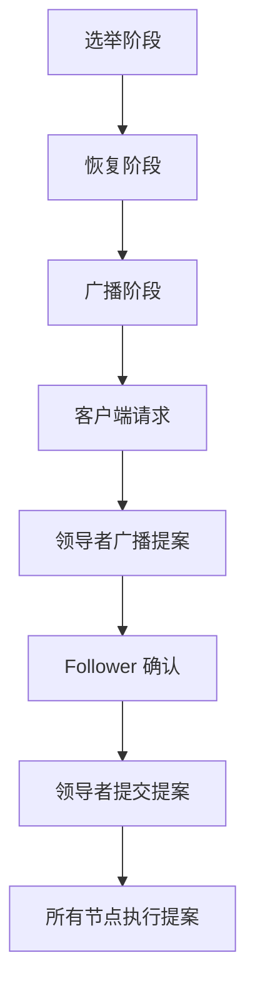

# Zookeeper ZAB 协议

Zookeeper Atomic Broadcast (ZAB) 协议是 Apache Zookeeper 的核心协议之一，用于在分布式系统中实现数据一致性和高可用性。ZAB 协议确保了 Zookeeper 集群中的所有节点能够以一致的方式处理客户端请求，并在节点故障时快速恢复。

## 什么是 ZAB 协议？

ZAB 协议是一种原子广播协议，专门为 Zookeeper 设计，用于在分布式系统中实现数据一致性。它的主要目标是确保所有节点在接收到客户端请求后，能够以相同的顺序处理这些请求，从而保证数据的一致性。

ZAB 协议的核心思想是通过选举一个领导者（Leader）来协调所有节点的操作。领导者负责接收客户端的请求，并将这些请求广播给其他节点（Follower）。所有节点按照相同的顺序执行这些请求，从而保证数据的一致性。

## ZAB 协议的工作机制

ZAB 协议的工作机制可以分为以下几个阶段：

1. **选举阶段（Leader Election）**：在 Zookeeper 集群启动或领导者失效时，集群中的节点会进入选举阶段，选出一个新的领导者。选举过程基于 ZAB 协议的快速领导者选举算法，确保在短时间内选出新的领导者。

2. **恢复阶段（Recovery Phase）**：在选举出新的领导者后，集群进入恢复阶段。领导者会与所有 Follower 节点同步数据，确保所有节点都拥有最新的数据状态。

3. **广播阶段（Broadcast Phase）**：在恢复阶段完成后，集群进入广播阶段。领导者接收客户端的请求，并将这些请求以提案（Proposal）的形式广播给所有 Follower 节点。Follower 节点在接收到提案后，会将其写入本地日志，并向领导者发送确认（ACK）消息。当领导者收到大多数节点的确认后，会将提案提交（Commit），并通知所有节点执行该提案。



## ZAB 协议的实际应用

ZAB 协议在 Zookeeper 中的应用非常广泛，特别是在需要高可用性和强一致性的分布式系统中。以下是一个实际应用场景：

### 分布式锁服务

在分布式系统中，多个节点可能需要竞争同一个资源。为了保证资源的独占性，可以使用 Zookeeper 实现分布式锁。Zookeeper 通过 ZAB 协议确保所有节点在获取锁时能够以一致的顺序执行操作，从而避免死锁和资源冲突。

```java
// 示例：使用 Zookeeper 实现分布式锁
public class DistributedLock {
    private ZooKeeper zooKeeper;
    private String lockPath;

    public DistributedLock(ZooKeeper zooKeeper, String lockPath) {
        this.zooKeeper = zooKeeper;
        this.lockPath = lockPath;
    }

    public void acquireLock() throws KeeperException, InterruptedException {
        while (true) {
            try {
                zooKeeper.create(lockPath, new byte[0], ZooDefs.Ids.OPEN_ACL_UNSAFE, CreateMode.EPHEMERAL);
                return; // 成功获取锁
            } catch (KeeperException.NodeExistsException e) {
                // 锁已被其他节点持有，等待
                Thread.sleep(100);
            }
        }
    }

    public void releaseLock() throws KeeperException, InterruptedException {
        zooKeeper.delete(lockPath, -1);
    }
}
```

:::note
在上面的代码示例中，`acquireLock` 方法会尝试在 Zookeeper 中创建一个临时节点。如果节点创建成功，则表示当前节点成功获取了锁；如果节点已存在，则表示锁已被其他节点持有，当前节点需要等待。
:::

## 总结

ZAB 协议是 Zookeeper 实现数据一致性和高可用性的核心机制。通过选举领导者、数据恢复和原子广播，ZAB 协议确保了 Zookeeper 集群中的所有节点能够以一致的顺序处理客户端请求，并在节点故障时快速恢复。

## 附加资源与练习

- **练习**：尝试在本地搭建一个 Zookeeper 集群，并使用 ZAB 协议实现一个简单的分布式锁服务。
- **资源**：阅读 [Zookeeper 官方文档](https://zookeeper.apache.org/doc/current/zookeeperOver.html) 了解更多关于 ZAB 协议的详细信息。

:::tip
如果你对 ZAB 协议的工作原理还有疑问，建议阅读相关论文或深入分析 Zookeeper 的源码，这将帮助你更好地理解其内部机制。
:::