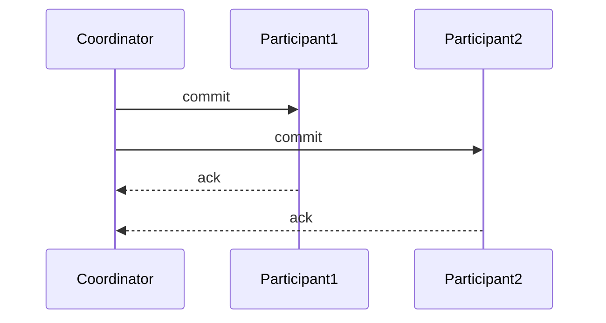

# Zookeeper 两阶段提交

在分布式系统中，确保多个节点之间的数据一致性是一个重要的挑战。Zookeeper 作为一个分布式协调服务，提供了多种机制来帮助实现一致性，其中**两阶段提交（Two-Phase Commit, 2PC）**是一个关键协议。本文将详细介绍 Zookeeper 中的两阶段提交协议，帮助你理解其工作原理和应用场景。

## 什么是两阶段提交？

两阶段提交是一种分布式事务协议，用于确保在多个分布式节点上执行的事务要么全部提交，要么全部回滚。它通过两个阶段来实现这一目标：

1. **准备阶段（Prepare Phase）**：协调者（Coordinator）向所有参与者（Participants）发送准备请求，询问它们是否可以提交事务。
2. **提交阶段（Commit Phase）**：如果所有参与者都同意提交，协调者将发送提交请求；如果有任何一个参与者不同意，协调者将发送回滚请求。

两阶段提交的核心思想是通过协调者和参与者之间的协作，确保所有节点在事务提交或回滚时保持一致。

## 两阶段提交的工作原理

### 1. 准备阶段

在准备阶段，协调者向所有参与者发送一个 `prepare` 请求，询问它们是否可以提交事务。每个参与者会执行以下操作：

- 检查本地事务是否可以提交。
- 如果可以提交，参与者会将事务日志写入磁盘，并进入“准备就绪”状态。
- 如果无法提交，参与者会返回“中止”状态。


### 2. 提交阶段

在提交阶段，协调者根据参与者的响应决定是否提交事务：

- 如果所有参与者都返回“准备就绪”，协调者会发送 `commit` 请求，所有参与者将提交事务。
- 如果有任何一个参与者返回“中止”，协调者会发送 `rollback` 请求，所有参与者将回滚事务。



## 实际应用场景

两阶段提交在分布式系统中广泛应用于需要强一致性的场景，例如：

- **分布式数据库**：在多个数据库节点之间同步数据时，确保所有节点要么同时提交事务，要么同时回滚。
- **分布式事务**：在微服务架构中，多个服务需要协同完成一个业务操作时，使用两阶段提交来确保事务的一致性。

:::note
**注意**：两阶段提交虽然能保证强一致性，但由于其同步阻塞的特性，可能会导致性能瓶颈。因此，在实际应用中需要权衡一致性和性能。
:::

## 代码示例

以下是一个简单的伪代码示例，展示了两阶段提交的基本流程：

```python
class Coordinator:
    def prepare(self, participants):
        responses = []
        for participant in participants:
            response = participant.prepare()
            responses.append(response)
        return all(responses)

    def commit(self, participants):
        for participant in participants:
            participant.commit()

    def rollback(self, participants):
        for participant in participants:
            participant.rollback()

class Participant:
    def prepare(self):
        # 检查是否可以提交事务
        if self.can_commit():
            self.write_log()
            return True
        else:
            return False

    def commit(self):
        # 提交事务
        self.apply_changes()

    def rollback(self):
        # 回滚事务
        self.undo_changes()
```

## 总结

两阶段提交是分布式系统中实现事务一致性的重要协议。通过准备阶段和提交阶段的协作，它确保了所有参与者在事务提交或回滚时保持一致。尽管两阶段提交在强一致性场景中非常有用，但其同步阻塞的特性可能会影响性能，因此在设计分布式系统时需要谨慎使用。

## 附加资源

- [Zookeeper 官方文档](https://zookeeper.apache.org/doc/current/)
- [分布式系统：概念与设计](https://www.amazon.com/Distributed-Systems-Concepts-Design-5th/dp/0132143011)

:::tip
**练习**：尝试在一个简单的分布式系统中实现两阶段提交协议，观察其在不同故障情况下的行为。
:::