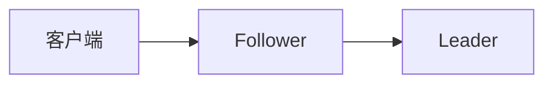
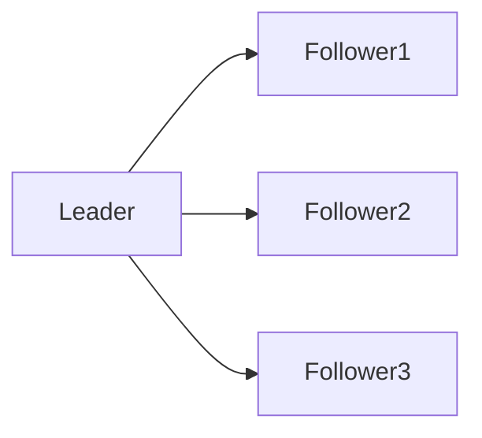

# Zookeeper 请求处理流程

Zookeeper 是一个分布式协调服务，广泛用于分布式系统中的配置管理、命名服务、分布式锁等场景。理解 Zookeeper 的请求处理流程对于掌握其工作原理至关重要。本文将逐步讲解 Zookeeper 如何处理客户端请求，并通过实际案例展示其应用场景。

## 1. 概述

Zookeeper 的请求处理流程可以分为以下几个主要步骤：

1. **客户端请求提交**：客户端向 Zookeeper 服务器发送请求。
2. **请求预处理**：服务器对请求进行预处理，包括验证和日志记录。
3. **请求转发**：如果当前服务器不是 Leader，请求会被转发到 Leader 服务器。
4. **请求处理**：Leader 服务器处理请求并生成事务。
5. **事务提交**：事务被提交到 Zookeeper 集群中的所有服务器。
6. **响应返回**：处理结果返回给客户端。

## 2. 详细流程

### 2.1 客户端请求提交

客户端通过 Zookeeper 客户端库向 Zookeeper 服务器发送请求。请求可以是读请求（如 `getData`）或写请求（如 `create`）。

```java
ZooKeeper zk = new ZooKeeper("localhost:2181", 3000, null);
String path = zk.create("/myNode", "data".getBytes(), ZooDefs.Ids.OPEN_ACL_UNSAFE, CreateMode.PERSISTENT);
```

### 2.2 请求预处理

当 Zookeeper 服务器接收到请求后，首先会进行预处理。预处理包括：

- **验证**：检查客户端是否有权限执行该操作。
- **日志记录**：将请求记录到事务日志中，以便在故障恢复时使用。

### 2.3 请求转发

如果当前服务器不是 Leader，请求会被转发到 Leader 服务器。Zookeeper 使用 ZAB（Zookeeper Atomic Broadcast）协议来确保所有服务器的一致性。



### 2.4 请求处理

Leader 服务器接收到请求后，会进行处理并生成一个事务。事务包括对 Zookeeper 数据树的修改操作。

```java
// 伪代码
Transaction txn = new Transaction();
txn.create("/myNode", "data".getBytes());
```

### 2.5 事务提交

Leader 将事务广播给所有 Follower 服务器。Follower 服务器接收到事务后，会将其应用到本地数据树中，并返回确认消息。



### 2.6 响应返回

一旦事务被大多数服务器确认，Leader 会将处理结果返回给客户端。

```java
Stat stat = zk.exists("/myNode", false);
System.out.println("Node exists: " + (stat != null));
```

## 3. 实际案例

假设我们有一个分布式系统，需要在多个节点之间同步配置信息。我们可以使用 Zookeeper 来实现这一功能。

1. **配置更新**：当某个节点更新配置时，它会向 Zookeeper 发送写请求。
2. **配置同步**：Zookeeper 将配置更新广播给所有节点。
3. **配置读取**：其他节点可以从 Zookeeper 读取最新的配置信息。

```java
// 更新配置
zk.setData("/config", "newConfig".getBytes(), -1);

// 读取配置
byte[] data = zk.getData("/config", false, null);
System.out.println("Config: " + new String(data));
```

## 4. 总结

Zookeeper 的请求处理流程确保了分布式系统中的数据一致性和可靠性。通过理解这一流程，我们可以更好地设计和实现分布式应用。

## 5. 附加资源

- [Zookeeper 官方文档](https://zookeeper.apache.org/doc/current/)
- [Zookeeper 源码分析](https://github.com/apache/zookeeper)

## 6. 练习

1. 编写一个简单的 Zookeeper 客户端程序，实现节点的创建、读取和删除操作。
2. 在分布式环境中部署 Zookeeper 集群，并测试其高可用性。

:::tip
建议初学者在本地搭建 Zookeeper 环境，通过实际操作加深对请求处理流程的理解。
:::