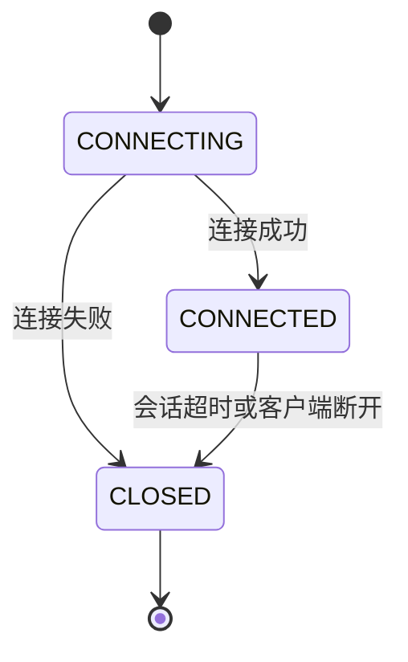

# Zookeeper 会话管理机制

Zookeeper 是一个分布式协调服务，广泛应用于分布式系统中。会话管理是 Zookeeper 的核心机制之一，它确保了客户端与服务器之间的连接状态和一致性。本文将详细介绍 Zookeeper 的会话管理机制，帮助初学者理解其工作原理和应用场景。

## 什么是 Zookeeper 会话？

在 Zookeeper 中，会话（Session）是指客户端与服务器之间的连接。每个客户端在连接到 Zookeeper 服务器时，都会创建一个会话。会话的生命周期从客户端连接到服务器开始，直到会话超时或客户端主动断开连接为止。

会话的主要作用是维护客户端与服务器之间的状态，确保在分布式环境中的一致性和可靠性。

## 会话的生命周期

Zookeeper 会话的生命周期可以分为以下几个阶段：

1. **创建会话**：客户端通过调用 `ZooKeeper` 构造函数连接到 Zookeeper 服务器，创建一个新的会话。
2. **会话激活**：会话创建后，客户端与服务器之间的连接处于激活状态，客户端可以发送请求并接收响应。
3. **会话超时**：如果客户端在指定的超时时间内没有与服务器通信，会话将进入超时状态。
4. **会话关闭**：会话超时或客户端主动断开连接后，会话将被关闭。

### 代码示例

以下是一个简单的 Java 代码示例，展示了如何创建和管理 Zookeeper 会话：

```java
import org.apache.zookeeper.ZooKeeper;
import org.apache.zookeeper.WatchedEvent;
import org.apache.zookeeper.Watcher;

public class ZookeeperSessionExample {
    public static void main(String[] args) throws Exception {
        // 创建 Zookeeper 客户端并连接到服务器
        ZooKeeper zk = new ZooKeeper("localhost:2181", 3000, new Watcher() {
            @Override
            public void process(WatchedEvent event) {
                System.out.println("Received event: " + event);
            }
        });

        // 模拟客户端操作
        Thread.sleep(5000);

        // 关闭会话
        zk.close();
    }
}
```

### 输出示例

```
Received event: WatchedEvent state:SyncConnected type:None path:null
```

## 会话超时处理

Zookeeper 使用会话超时机制来检测客户端是否仍然活跃。如果客户端在指定的超时时间内没有发送心跳包（ping），服务器将认为该客户端已经断开连接，并关闭会话。

会话超时时间由客户端在创建会话时指定，通常以毫秒为单位。服务器会根据客户端的心跳包来延长会话的存活时间。

:::note
**注意**：会话超时时间不宜设置过短，否则可能导致频繁的会话断开和重连，影响系统性能。
:::

## 会话状态管理

Zookeeper 会话的状态可以分为以下几种：

1. **CONNECTING**：客户端正在尝试连接到服务器。
2. **CONNECTED**：客户端已成功连接到服务器，会话处于激活状态。
3. **CLOSED**：会话已关闭，客户端与服务器之间的连接已断开。

### 状态转换图

以下是一个使用 Mermaid 绘制的会话状态转换图：



## 实际应用场景

Zookeeper 的会话管理机制在分布式系统中有着广泛的应用。以下是一些常见的应用场景：

1. **分布式锁**：通过 Zookeeper 的临时节点（Ephemeral Node）和会话管理机制，可以实现分布式锁。当客户端会话关闭时，临时节点会自动删除，释放锁资源。
2. **服务发现**：在微服务架构中，服务提供者可以通过 Zookeeper 注册临时节点，服务消费者通过监听这些节点来发现可用的服务实例。
3. **配置管理**：Zookeeper 可以用于存储和管理分布式系统的配置信息。当配置发生变化时，客户端可以通过会话机制实时获取最新的配置。

## 总结

Zookeeper 的会话管理机制是确保分布式系统一致性和可靠性的重要组成部分。通过理解会话的生命周期、超时处理和状态管理，开发者可以更好地利用 Zookeeper 构建高可用的分布式应用。

## 附加资源与练习

- **官方文档**：[Zookeeper 官方文档](https://zookeeper.apache.org/doc/current/)
- **练习**：尝试编写一个简单的 Zookeeper 客户端程序，模拟会话的创建、超时和关闭过程，并观察会话状态的变化。

:::tip
**提示**：在实际开发中，建议使用 Zookeeper 的客户端库（如 Curator）来简化会话管理和操作。
:::