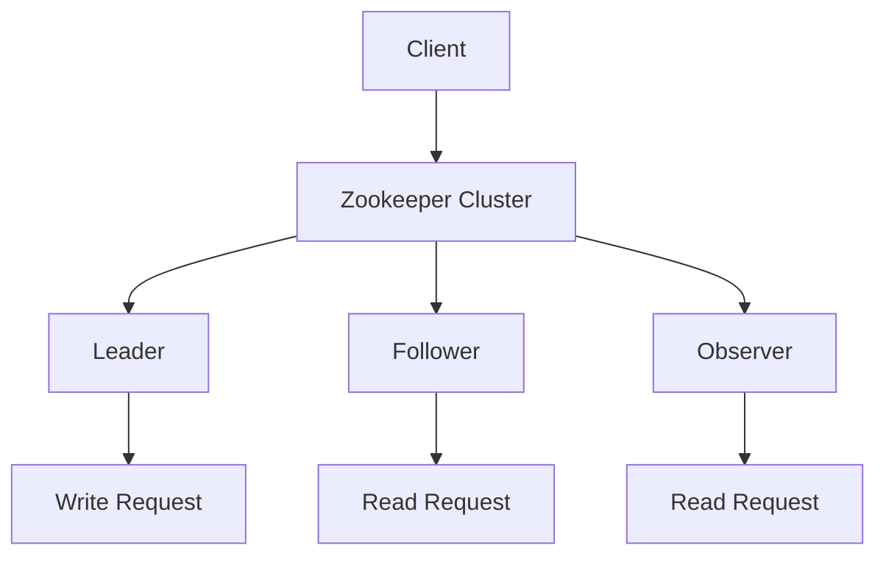

## 介绍

Zookeeper 是一个分布式协调服务，广泛用于管理分布式系统中的配置信息、命名服务、分布式同步和组服务。Zookeeper 集群架构是 Zookeeper 实现高可用性和一致性的核心。本文将详细介绍 Zookeeper 集群的架构、工作原理以及实际应用场景。

## Zookeeper 集群架构概述

Zookeeper 集群由多个节点组成，这些节点共同协作以提供高可用性和一致性的服务。每个节点在集群中扮演不同的角色，主要包括以下三种角色：

1. **Leader**：负责处理所有写请求，并将写操作广播给其他节点。
2. **Follower**：处理读请求，并将写请求转发给 Leader。
3. **Observer**：类似于 Follower，但不参与选举过程，主要用于扩展读性能。

:::note
Zookeeper 集群中的节点数量通常为奇数，以确保在选举过程中能够达成多数共识。
:::

### Zookeeper 集群架构图



## Zookeeper 集群的工作原理

### 1. 选举过程

当 Zookeeper 集群启动时，节点会通过选举过程选出一个 Leader。选举过程基于 ZAB（Zookeeper Atomic Broadcast）协议，确保集群中只有一个 Leader。

:::tip
选举过程中，节点会交换投票信息，最终获得多数票的节点将成为 Leader。
:::

### 2. 数据同步

Leader 负责将写操作广播给所有 Follower 节点。Follower 节点在接收到写操作后，会将其应用到本地存储中，并向 Leader 发送确认消息。当 Leader 收到多数节点的确认后，写操作才会被提交。

### 3. 读操作

读操作可以由 Leader 或 Follower 处理。由于 Zookeeper 保证一致性，客户端可以从任何节点读取数据，并且读取到的数据都是最新的。

## 实际应用场景

### 1. 分布式锁

Zookeeper 可以用于实现分布式锁，确保在分布式系统中同一时间只有一个客户端能够执行某个操作。

```java
// 示例：使用 Zookeeper 实现分布式锁
public class DistributedLock {
    private ZooKeeper zooKeeper;
    private String lockPath;

    public DistributedLock(ZooKeeper zooKeeper, String lockPath) {
        this.zooKeeper = zooKeeper;
        this.lockPath = lockPath;
    }

    public void acquireLock() throws KeeperException, InterruptedException {
        zooKeeper.create(lockPath, new byte[0], ZooDefs.Ids.OPEN_ACL_UNSAFE, CreateMode.EPHEMERAL);
    }

    public void releaseLock() throws KeeperException, InterruptedException {
        zooKeeper.delete(lockPath, -1);
    }
}
```

### 2. 配置管理

Zookeeper 可以用于存储和管理分布式系统的配置信息。当配置发生变化时，Zookeeper 会通知所有订阅了该配置的客户端。

```java
// 示例：使用 Zookeeper 管理配置
public class ConfigManager {
    private ZooKeeper zooKeeper;
    private String configPath;

    public ConfigManager(ZooKeeper zooKeeper, String configPath) {
        this.zooKeeper = zooKeeper;
        this.configPath = configPath;
    }

    public void updateConfig(String newConfig) throws KeeperException, InterruptedException {
        zooKeeper.setData(configPath, newConfig.getBytes(), -1);
    }

    public String getConfig() throws KeeperException, InterruptedException {
        byte[] data = zooKeeper.getData(configPath, false, null);
        return new String(data);
    }
}
```

## 总结

Zookeeper 集群架构是 Zookeeper 实现高可用性和一致性的核心。通过 Leader、Follower 和 Observer 的协作，Zookeeper 能够有效地管理分布式系统中的配置信息、命名服务、分布式同步和组服务。本文介绍了 Zookeeper 集群的架构、工作原理以及实际应用场景，希望能够帮助初学者更好地理解 Zookeeper 的核心概念。

## 附加资源与练习

- **练习**：尝试在本地搭建一个 Zookeeper 集群，并实现一个简单的分布式锁。
- **资源**：阅读 Zookeeper 官方文档，了解更多关于 Zookeeper 的详细信息和高级用法。

:::caution
在搭建 Zookeeper 集群时，请确保节点之间的网络连接稳定，以避免选举过程中出现网络分区问题。
:::