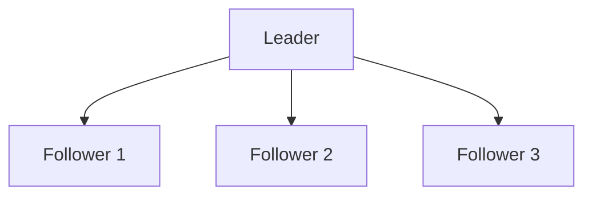
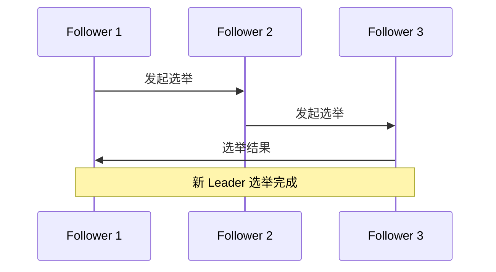

## 介绍

Zookeeper 是一个分布式协调服务，广泛用于分布式系统中的配置管理、命名服务、分布式锁等场景。由于其重要性，Zookeeper 集群的高可用性和灾备策略显得尤为关键。灾备策略的目标是确保在集群中的某些节点发生故障时，系统仍能正常运行，数据不会丢失，服务不会中断。

本文将详细介绍 Zookeeper 集群的灾备策略，包括数据备份、故障转移、集群恢复等内容，并通过实际案例帮助初学者理解这些概念。

## Zookeeper 集群的基本架构

在深入灾备策略之前，我们需要了解 Zookeeper 集群的基本架构。一个典型的 Zookeeper 集群由多个节点组成，这些节点分为两种角色：

1. **Leader**：负责处理所有写请求，并将写操作广播给其他节点。
2. **Follower**：负责处理读请求，并参与 Leader 选举。

Zookeeper 集群通常由奇数个节点组成（如 3、5、7 等），以确保在 Leader 选举时能够达成多数共识。



## 灾备策略的核心概念

### 1. 数据备份

Zookeeper 的数据存储在内存和磁盘中。为了确保数据的安全性，Zookeeper 提供了两种数据备份机制：

- **事务日志（Transaction Log）**：记录所有的写操作，确保在系统崩溃后可以通过日志恢复数据。
- **快照（Snapshot）**：定期将内存中的数据状态保存到磁盘中，减少恢复时需要重放的日志量。

:::tip
建议将事务日志和快照存储在不同的磁盘上，以避免单点故障。
:::

### 2. 故障转移

当 Zookeeper 集群中的 Leader 节点发生故障时，集群会自动进行 Leader 选举，选出新的 Leader。这个过程是自动的，通常只需要几秒钟。



### 3. 集群恢复

当 Zookeeper 集群中的部分节点发生故障时，可以通过以下步骤恢复集群：

1. **重启故障节点**：尝试重启故障节点，使其重新加入集群。
2. **数据同步**：故障节点重新加入集群后，会自动从 Leader 节点同步最新的数据。
3. **重新选举**：如果 Leader 节点故障，集群会自动进行 Leader 选举。

## 实际案例

假设我们有一个由 3 个节点组成的 Zookeeper 集群，节点分别为 `zk1`、`zk2` 和 `zk3`。`zk1` 是当前的 Leader 节点。

### 场景 1：Leader 节点故障

1. **故障发生**：`zk1` 节点由于硬件故障宕机。
2. **故障检测**：`zk2` 和 `zk3` 检测到 `zk1` 无法响应。
3. **Leader 选举**：`zk2` 和 `zk3` 开始选举新的 Leader，假设 `zk2` 被选为新的 Leader。
4. **服务恢复**：集群继续正常运行，客户端请求由 `zk2` 处理。

### 场景 2：Follower 节点故障

1. **故障发生**：`zk3` 节点由于网络问题无法与集群通信。
2. **故障检测**：`zk1` 和 `zk2` 检测到 `zk3` 无法响应。
3. **服务恢复**：由于集群中仍有 `zk1` 和 `zk2` 两个节点，集群继续正常运行。
4. **节点恢复**：`zk3` 网络恢复后，重新加入集群并同步数据。

## 代码示例

以下是一个简单的 Zookeeper 客户端代码示例，展示了如何在 Java 中连接到 Zookeeper 集群并处理节点故障。

```java
import org.apache.zookeeper.ZooKeeper;
import org.apache.zookeeper.Watcher;
import org.apache.zookeeper.WatchedEvent;
import org.apache.zookeeper.CreateMode;
import org.apache.zookeeper.ZooDefs;

public class ZookeeperClient {
    private static final String ZOOKEEPER_ADDRESS = "zk1:2181,zk2:2181,zk3:2181";
    private static final int SESSION_TIMEOUT = 3000;
    private ZooKeeper zooKeeper;

    public void connect() throws Exception {
        zooKeeper = new ZooKeeper(ZOOKEEPER_ADDRESS, SESSION_TIMEOUT, new Watcher() {
            @Override
            public void process(WatchedEvent event) {
                if (event.getState() == Event.KeeperState.Disconnected) {
                    System.out.println("Disconnected from Zookeeper cluster");
                } else if (event.getState() == Event.KeeperState.SyncConnected) {
                    System.out.println("Connected to Zookeeper cluster");
                }
            }
        });
    }

    public void createNode(String path, byte[] data) throws Exception {
        zooKeeper.create(path, data, ZooDefs.Ids.OPEN_ACL_UNSAFE, CreateMode.PERSISTENT);
    }

    public static void main(String[] args) throws Exception {
        ZookeeperClient client = new ZookeeperClient();
        client.connect();
        client.createNode("/example", "Hello Zookeeper".getBytes());
    }
}
```

:::note
在实际生产环境中，建议使用更复杂的错误处理和重试机制，以应对网络波动和节点故障。
:::

## 总结

Zookeeper 集群的灾备策略是确保分布式系统高可用性的关键。通过数据备份、故障转移和集群恢复等机制，Zookeeper 能够在节点故障时保持服务的连续性。本文通过实际案例和代码示例，帮助初学者理解这些概念，并提供了实现灾备策略的基本方法。

## 附加资源

- [Zookeeper 官方文档](https://zookeeper.apache.org/doc/current/)
- [Zookeeper 集群配置指南](https://zookeeper.apache.org/doc/current/zookeeperAdmin.html)
- [分布式系统设计与实现](https://www.oreilly.com/library/view/designing-distributed-systems/9781491983638/)

## 练习

1. 尝试搭建一个由 3 个节点组成的 Zookeeper 集群，并模拟 Leader 节点故障，观察集群的恢复过程。
2. 修改上述代码示例，增加错误处理和重试机制，确保在节点故障时客户端能够自动重连。