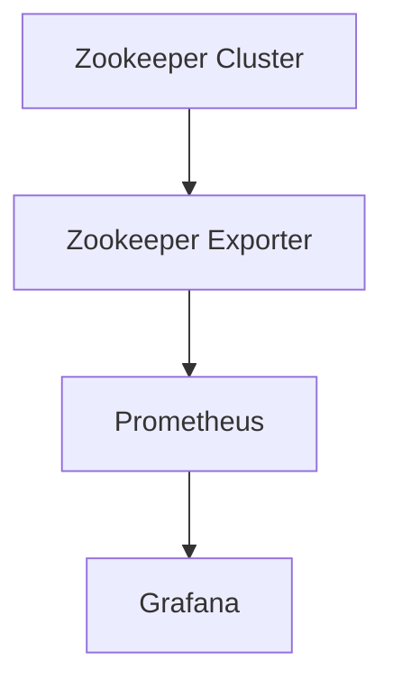

# Zookeeper 集群运维工具

Zookeeper 是一个分布式协调服务，广泛用于分布式系统中的配置管理、命名服务、分布式锁和集群管理。为了确保 Zookeeper 集群的稳定运行，运维人员需要使用一些工具来监控和管理集群。本文将介绍几种常用的 Zookeeper 集群运维工具，并通过实际案例展示它们的使用方法。

## 1. 介绍

Zookeeper 集群的运维工作包括监控集群状态、管理节点、处理故障等。为了简化这些任务，社区和官方提供了一些工具，帮助运维人员更高效地管理 Zookeeper 集群。这些工具可以帮助你查看集群状态、监控性能、处理故障等。

## 2. Zookeeper 自带的运维工具

Zookeeper 自带了一些命令行工具，可以帮助你管理和监控集群。以下是一些常用的工具：

### 2.1 `zkCli.sh`

`zkCli.sh` 是 Zookeeper 自带的命令行客户端工具，可以连接到 Zookeeper 集群并执行各种操作。你可以使用它来查看和修改 Zookeeper 中的数据节点。

```bash
# 连接到 Zookeeper 集群
./zkCli.sh -server localhost:2181

# 查看根节点下的所有子节点
ls /

# 创建一个新的节点
create /myNode "myData"

# 获取节点的数据
get /myNode
```

### 2.2 `zkServer.sh`

`zkServer.sh` 是 Zookeeper 的服务管理工具，可以用来启动、停止和查看 Zookeeper 服务器的状态。

```bash
# 启动 Zookeeper 服务器
./zkServer.sh start

# 停止 Zookeeper 服务器
./zkServer.sh stop

# 查看 Zookeeper 服务器状态
./zkServer.sh status
```

## 3. 第三方运维工具

除了 Zookeeper 自带的工具，还有一些第三方工具可以帮助你更好地管理和监控 Zookeeper 集群。

### 3.1 Zookeeper 可视化工具：ZooInspector

ZooInspector 是一个图形化的 Zookeeper 数据查看工具，可以帮助你更直观地查看和管理 Zookeeper 中的数据节点。

```bash
# 下载并运行 ZooInspector
java -jar zookeeper-dev-ZooInspector.jar
```

### 3.2 监控工具：Zookeeper Exporter + Prometheus + Grafana

Zookeeper Exporter 是一个 Prometheus 的 Exporter，可以将 Zookeeper 的监控数据暴露给 Prometheus，然后通过 Grafana 进行可视化展示。

```bash
# 启动 Zookeeper Exporter
./zookeeper_exporter --zookeeper localhost:2181
```

在 Prometheus 中配置 Zookeeper Exporter 的地址，然后在 Grafana 中导入 Zookeeper 的监控面板，即可实时监控 Zookeeper 集群的状态。

## 4. 实际案例

假设你正在管理一个由 3 个节点组成的 Zookeeper 集群，你需要监控集群的状态，并在某个节点出现故障时及时处理。

### 4.1 使用 `zkServer.sh` 查看集群状态

首先，你可以使用 `zkServer.sh` 查看每个节点的状态：

```bash
# 查看节点1的状态
./zkServer.sh status

# 查看节点2的状态
./zkServer.sh status

# 查看节点3的状态
./zkServer.sh status
```

如果某个节点的状态显示为 `follower` 或 `leader`，则表示该节点正常运行。如果状态显示为 `Error`，则需要进一步排查问题。

### 4.2 使用 ZooInspector 查看数据节点

如果某个节点的状态异常，你可以使用 ZooInspector 连接到该节点，查看数据节点是否正常。

```bash
# 启动 ZooInspector 并连接到异常节点
java -jar zookeeper-dev-ZooInspector.jar
```

### 4.3 使用 Prometheus + Grafana 监控集群

为了实时监控集群的状态，你可以配置 Zookeeper Exporter，并在 Grafana 中查看集群的监控数据。



通过 Grafana 的监控面板，你可以实时查看集群的节点状态、请求延迟、连接数等关键指标。

## 5. 总结

Zookeeper 集群的运维工作对于确保分布式系统的稳定运行至关重要。通过使用 Zookeeper 自带的工具和第三方工具，你可以更高效地管理和监控 Zookeeper 集群。本文介绍了 `zkCli.sh`、`zkServer.sh`、ZooInspector 以及 Zookeeper Exporter + Prometheus + Grafana 等工具的使用方法，并通过实际案例展示了如何应用这些工具来管理 Zookeeper 集群。

## 6. 附加资源与练习

- **练习 1**：使用 `zkCli.sh` 连接到你的 Zookeeper 集群，并创建一个新的数据节点。
- **练习 2**：配置 Zookeeper Exporter 和 Prometheus，并在 Grafana 中导入 Zookeeper 的监控面板。
- **附加资源**：
  - [Zookeeper 官方文档](https://zookeeper.apache.org/doc/current/)
  - [Prometheus 官方文档](https://prometheus.io/docs/)
  - [Grafana 官方文档](https://grafana.com/docs/)

:::tip
在实际生产环境中，建议定期备份 Zookeeper 的数据，并设置自动化的监控告警，以便在集群出现问题时能够及时处理。
:::