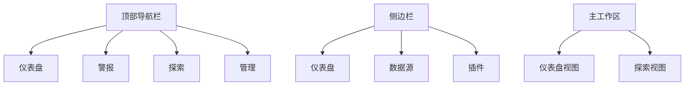

# Grafana Alloy 界面导航

Grafana Alloy 是一个强大的监控和可视化工具，广泛应用于 DevOps 和系统监控领域。对于初学者来说，熟悉其界面导航是掌握其功能的第一步。本文将带你逐步了解 Grafana Alloy 的界面布局、核心功能以及如何高效地使用它。

## 1. 界面概览

Grafana Alloy 的界面主要分为以下几个部分：

- **顶部导航栏**：包含仪表盘、警报、探索、管理等主要功能入口。
- **侧边栏**：提供快速访问仪表盘、数据源、插件等功能的快捷方式。
- **主工作区**：显示当前选中的仪表盘或探索视图，是数据可视化的核心区域。

## 2. 顶部导航栏

### 2.1 仪表盘

仪表盘是 Grafana Alloy 的核心功能之一，用于展示监控数据的可视化图表。你可以通过顶部导航栏的 "仪表盘" 按钮快速访问已创建的仪表盘。

:::tip
你可以通过点击 "新建仪表盘" 按钮来创建一个全新的仪表盘，并根据需要添加各种图表和面板。
:::

### 2.2 警报

警报功能允许你设置监控指标的阈值，并在达到或超过这些阈值时触发通知。通过顶部导航栏的 "警报" 按钮，你可以查看和管理所有警报规则。

### 2.3 探索

探索功能提供了一个灵活的环境，用于查询和可视化数据。你可以通过顶部导航栏的 "探索" 按钮进入探索视图，使用 PromQL 或其他查询语言来查询数据。

### 2.4 管理

管理功能提供了对数据源、用户、插件等的配置和管理。通过顶部导航栏的 "管理" 按钮，你可以访问这些设置并进行必要的调整。

## 3. 侧边栏

### 3.1 仪表盘

侧边栏中的 "仪表盘" 选项提供了一个快速访问仪表盘的途径。你可以在这里查看所有已创建的仪表盘，并通过点击仪表盘名称来快速切换。

### 3.2 数据源

数据源是 Grafana Alloy 连接外部数据的关键。通过侧边栏的 "数据源" 选项，你可以添加、配置和管理各种数据源，如 Prometheus、InfluxDB 等。

### 3.3 插件

插件功能允许你扩展 Grafana Alloy 的功能。通过侧边栏的 "插件" 选项，你可以浏览、安装和管理各种插件，以增强 Grafana Alloy 的能力。

## 4. 主工作区

主工作区是 Grafana Alloy 的核心区域，用于展示仪表盘和探索视图。你可以在这里查看和编辑仪表盘，或者使用探索功能来查询和可视化数据。

### 4.1 仪表盘视图

在仪表盘视图中，你可以查看和编辑仪表盘中的各种图表和面板。你可以通过拖拽来调整面板的大小和位置，或者通过点击面板右上角的编辑按钮来修改面板的配置。

### 4.2 探索视图

探索视图提供了一个灵活的环境，用于查询和可视化数据。你可以在这里使用 PromQL 或其他查询语言来查询数据，并通过图表来展示查询结果。

## 5. 实际案例

假设你正在监控一个 Kubernetes 集群，并希望创建一个仪表盘来展示集群的 CPU 使用率。你可以按照以下步骤操作：

1. 点击顶部导航栏的 "仪表盘" 按钮，然后点击 "新建仪表盘"。
2. 在仪表盘视图中，点击 "添加面板" 按钮，然后选择 "图表"。
3. 在图表面板中，选择数据源为 Prometheus，然后输入查询语句 `sum(rate(container_cpu_usage_seconds_total{job="kubernetes-nodes"}[1m])) by (pod)`。
4. 调整图表的样式和布局，然后保存仪表盘。

通过以上步骤，你可以创建一个展示 Kubernetes 集群 CPU 使用率的仪表盘，并实时监控集群的性能。

## 6. 总结

通过本文，你已经了解了 Grafana Alloy 的界面布局和核心功能。掌握这些基础知识将帮助你更高效地使用 Grafana Alloy 进行监控和可视化。接下来，你可以尝试创建自己的仪表盘，或者探索更多高级功能。

## 7. 附加资源

- [Grafana 官方文档](https://grafana.com/docs/)
- [Prometheus 查询语言 (PromQL) 指南](https://prometheus.io/docs/prometheus/latest/querying/basics/)
- [Kubernetes 监控最佳实践](https://kubernetes.io/docs/tasks/debug-application-cluster/resource-usage-monitoring/)

## 8. 练习

1. 创建一个新的仪表盘，并添加一个展示内存使用率的图表。
2. 设置一个警报规则，当 CPU 使用率超过 80% 时触发通知。
3. 使用探索功能查询 Kubernetes 集群的网络流量数据，并可视化结果。

通过这些练习，你将进一步巩固对 Grafana Alloy 界面导航的理解，并提升你的监控和可视化技能。